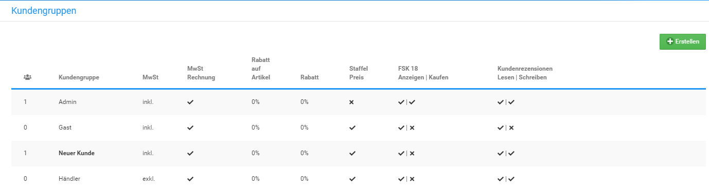

# Kundengruppen 

Mit Kundengruppen organisierst du deine Kunden nach beliebigen Kriterien. Jeder Kunde ist Mitglied einer Kundengruppe und kann nicht mehreren Kundengruppen zugewiesen sein. Mit Kundengruppenpreisen kannst du Sonderpreise erstellen, die ausschließlich für spezielle Kundenkreise gelten.

  

  

  

  

