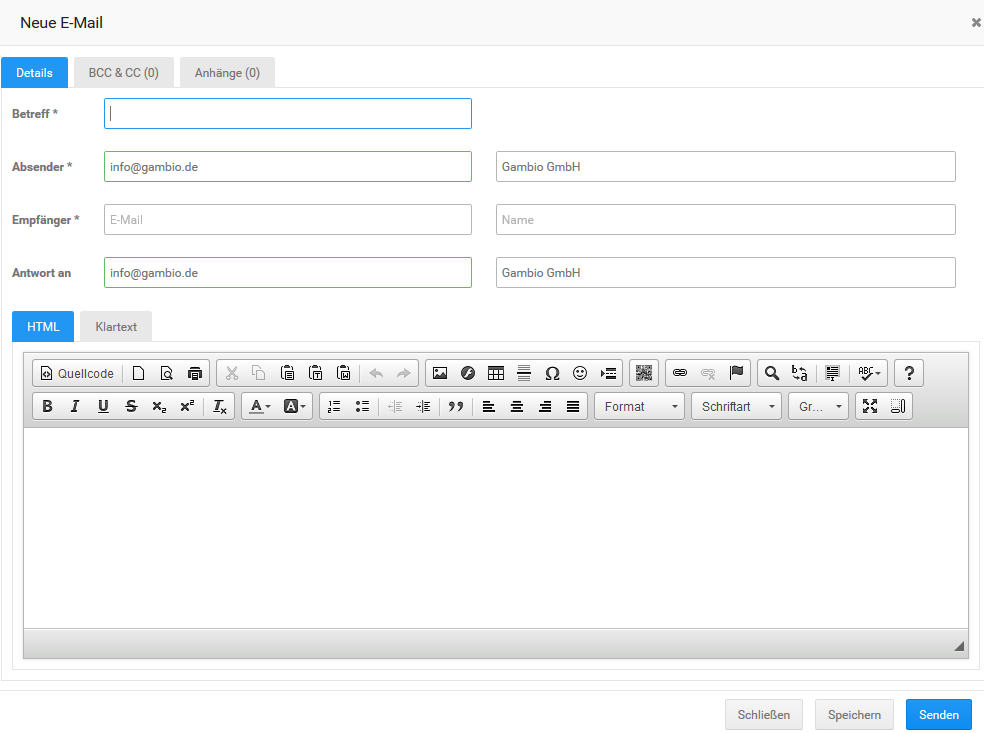
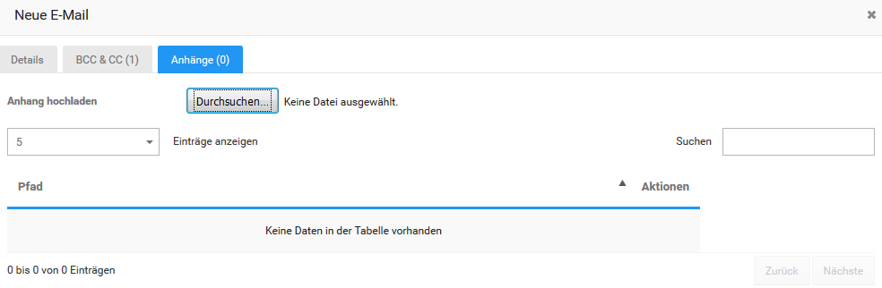
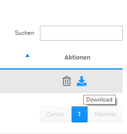

# Schreiben, Bearbeiten und Weiterleiten von E-Mails 

Mit einem Klick auf Neue E-Mail kannst du eine E-Mail schreiben. Es öffnet sich ein neues Fenster im Reiter Details. Das gleiche Fenster steht dir zur Verfügung, wenn du eine bestehende E-Mail bearbeitest bzw. weiterleitest. Genaueres hierzu findest du im Kapitel Verwalten von E-Mails.

## Details 

Im oberen Abschnitt können Betreff, Absender, Empfänger sowie eine optionale Antwortadresse \(Antwort an\) eingetragen werden.

Im unteren Abschnitt des Fensters kann der eigentliche Mail-Text eingegeben werden. Über die Reiter HTML und Klartext kann die Mail wahlweise als HTML \(standard\) oder als reiner Text, ohne Formatierungen, geschrieben werden.

Im Reiter HTML ist der sogenannte CK-Editor eingebunden. Hierüber kann der Text formatiert und wahlweise mit Links und Bildern versehen werden. Eine genaue Übersicht über die möglichen Funktionen findest du im Kapitel CK-Editor.

Mit einem Klick auf Senden wird die E-Mail verschickt. Über Speichern wird die Mail gespeichert, um später verschickt zu werden \(siehe Verwalten von E-Mails\). Wurde eine Mail bereits versendet, wird beim Speichern eine neue Mail angelegt.

## BCC & CC 

Über den Reiter BCC & CC können weitere Empfänger, sowohl als Carbon Copy als auch als Blind Carbon Copy hinzugefügt werde. Trage hierzu die Adresse im Feld E-Mail ein und wähle über das Dropdown-Menü Typ aus, ob du BCC oder CC verwenden möchtest. Mit einem Klick auf Hinzufügen wird die Adresse als Empfänger hinzugefügt. Über das Mülltonnen-Symbol in der Spalte Aktionen kann ein Adressat wieder gelöscht werden.

Über das Dropdown-Menü Einträge anzeigen kann die Anzahl der angezeigten Empfäger pro Seite festgelegt werden, wahlweise werden 5 oder 10 Einträge pro Seite aufgelistet. Über das Eingabefeld Suchen lassen sich die Einträge filtern, sowohl nach E-Mail als auch nach Name, die Eingrenzung der Einträge erfolgt direkt bei der Eingabe. Zudem können über die Spaltenüberschriften der Tabelle die Empfänger wahlweise aufsteigend und absteigend sortiert werden.

Unterhalb der Tabelle kann zwischen den einzelnen Seiten gewechselt werden, wenn nicht alle Einträge auf einer Seite angezeigt werden.

## Anhänge 

Über den Reiter Anhänge kann die Mail mit Datei-Anhängen versehen werden. Klicke hierzu unter Anhang hochladen auf den Button Durchsuchen. Nach der Auswahl der Datei über den Dialog wird diese hochgeladen und der E-Mail hinzugefügt. Die Datei wird mit dem Server-Pfad in der darunterstehenden Tabelle angezeigt. Über den Klick auf das Mülltonnen-Symbol in der Spalte Aktionen kann der Anhang wieder entfernt werden. Über das Download-Symbol kann die Datei vom Server heruntergeladen werden.

Über das Dropdown-Menü Einträge anzeigen kann die Anzahl der angezeigten Anhänge pro Seite festgelegt werden, wahlweise werden 5 oder 10 Einträge pro Seite aufgelistet. Über das Eingabefeld Suchen lassen sich die Einträge nach dem Dateinamen im Pfad filtern, die Eingrenzung der Einträge erfolgt direkt bei der Eingabe. Zudem können über die Spaltenüberschrift der Tabelle die Anhänge nach Dateiname sortiert werden.

Unterhalb der Tabelle kann zwischen den einzelnen Seiten gewechselt werden, wenn nicht alle Einträge auf einer Seite angezeigt werden.

