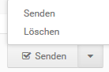

# Verwalten von E-Mails {#verwalten_von_e_mails}

Versendete und gespeicherte Mails werden in einer Tabelle aufgeführt. Mit Hilfe des Dropdown- Menüs ...pro Seite kann die Anzahl der E-Mails pro Seite wahlweise auf 20, 30, 50 oder 100 Einträge festgelegt werden.

Über das Eingabefeld Suchen lassen sich die E-Mails nach Absender, Empfänger oder Betreff filtern, die Eingrenzung der Einträge erfolgt direkt bei der Eingabe.

Die Mails können durch einen Klick auf die Spaltenüberschriften sortiert werden. Unterhalb der Tabelle kann zwischen den einzelnen Seiten gewechselt werden, wenn nicht alle Einträge auf einer Seite angezeigt werden.

Für jede E-Mail stehen in der Spalte Aktionen von links nach rechts folgende Möglichkeiten zur Verfügung:

-   Senden: E-Mail wird an die eingetragenen Empfänger versendet
-   Weiterleiten: E-Mail wird weitergeleitet, es öffnet sich ein neues Fenster \(siehe Schreiben, Bearbeiten und Weiterleiten von E-Mails\)
-   Löschen: E-Mail wird gelöscht
-   Ansehen: E-Mail wird angezeigt und kann bearbeitet werden \(siehe Schreiben, Bearbeiten und Weiterleiten von E-Mails\)

Das Versenden und Löschen von E-Mails ist zudem gesammelt möglich. Setze hierzu die jeweiligen Haken für jede E-Mail, die du löschen oder versenden möchtest, in der ersten Spalte. Wahlweise können auch alle Mails gleichzeitig an- bzw. abgehakt werden, verwende hierzu bitte das Kästchen in der linken, oberen Ecke der Tabelle. Wähle anschließend über die Dropdown-Schaltfläche aus, ob du die E-Mails Senden oder Löschen möchtest.

Zudem können alte Anlagen bis einschließlich einem bestimmten Datum gelöscht werden. Der Shop bezieht sich hierbei auf das Datum in der Spalte Erstellt. Klicke hierzu zunächst auf Alte Anhänge löschen und stelle in dem sich öffnenden Feld das Datum ein, bis zu dem du die Anlagen löschen möchtest. In den Klammern links neben dem Datum wird nun die zu löschende Datenmenge angezeigt. Klicke auf Alte Anhänge löschen, um die Anhänge zu löschen.

**Note:** Gelöschte Anhänge werden weiterhin als Anlage angezeigt, um eine entsprechende Historie bieten zu können. Da die Datei aber nicht mehr vorhanden ist, kann sie nicht heruntergeladen werden.

