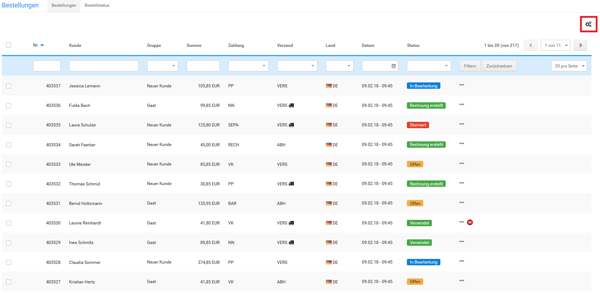
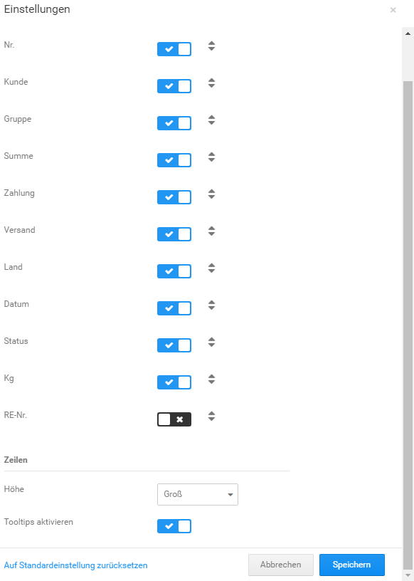
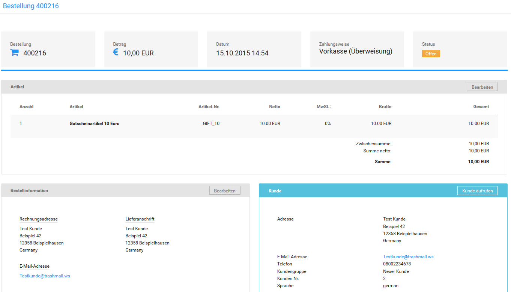

# Bestellungen abwickeln 

Im Gambio Admin deines Shops unter Bestellungen \> Bestellungen findest du eine Übersicht über alle Bestellungen, die im Shopbereich getätigt oder im Gambio Admin manuell angelegt wurden. Der aktuelle Stand einer Bestellung wird über Bestellstatus festgelegt, die in der Spalte Status angezeigt werden.

Über das Zahnrad-Symbol \(siehe rote Markierung in der Abbildung Bestellübersicht\) können die Einstellungen der Bestellübersicht aufgerufen werden. Im oberen Teil werden die einzelnen Spalten der Übersicht aufgelistet. Durch Setzen beziehungsweise Entfernen des Häkchens hinter dem Spaltennamen kann die jeweilige Spalte zur Anzeige an- respektive abgeschaltet werden.

Die Reihenfolge der Spalten kann geändert werden, indem du den Mauszeiger über das Pfeilsymbol bewegst und die linke Maustaste klickst und hältst. Ziehe anschließend die betreffende Spalte nach oben oder unten an ihre neue Position und lasse die Maustaste wieder los.

Über die das Dropdown Höhe kannst du die Zeilenhöhe der Übersicht einstellen. Setze beziehungsweise entferne den Haken für Tooltips aktivieren um die Anzeige der Tooltips an- respektive abzuschalten.

Die Detailseite zu einer Bestellung enthält zusätzliche Informationen, wie die verwendete Zahlungsweise, die Versandart und die Rechnungs- und Lieferadresse.

1.  Wähle in der Liste Bestellungen die gewünschte Bestellung aus
2.  Klicke am Ende der Zeile auf Anzeigen oder das Augen-Symbol

")

**Note:** Die Detailseite einer Bestellung enthält alle für die Bestellabwicklung nötigen Funktionen. Wesentliche Funktionen sind zum schnellen Zugriff auch in der Bestellübersicht vorhanden.

  

  

  

