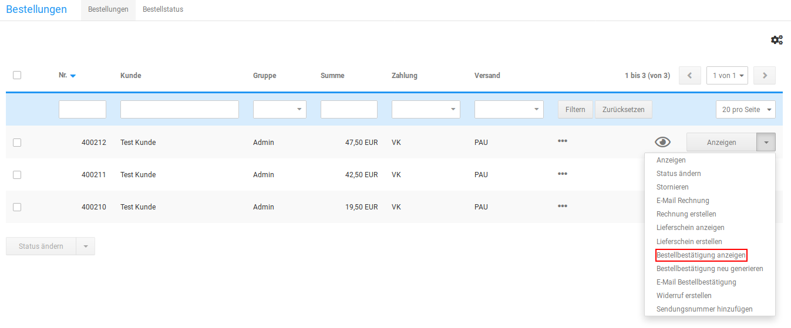

# Bestellbestätigung 

Die Bestellbestätigung wird in der Grundkonfiguration automatisch nach dem Eingang einer Bestellung an den Kunden und an die unter Kunden \> E-Mails \> E-Mail-Optionen im Feld Verrechnung - Weiterleitungsadressen hinterlegten E-Mail Adressen geschickt. Wenn zu einer Bestellung vom Shopsystem keine Bestellbestätigung versendet wurde, wird die betroffene Bestellung in der Bestellübersicht unter Bestellungen \> Bestellungen mit einem Briefumschlag-Symbol markiert.

!!! Info "Hinweis
	 Bei manuell angelegten Bestellungen wird vom Shopsystem keine automatische Bestellbestätigung versendet.

## Bestellbestätigung anzeigen 

Die Bestellbestätigung kann zur schnellen Einsicht aus dem Gambio Admin deines Shops angezeigt werden. Klicke in der Bestellübersicht unter Bestellungen \> Bestellungen auf den Eintrag Bestellbestätigung anzeigen der Dropdown-Schaltfläche. Die Bestellbestätigung zur ausgewählten Bestellung wird in einem neuen Fenster geöffnet.

## Bestellbestätigung versenden 

Die Bestellbestätigung zu einer Bestellung versendest du im Gambio Admin deines Shops unter Bestellungen \> Bestellungen von Hand. Die E-Mail-Adresse des Empfängers kannst du dabei individuell eingeben.

1.  Wähle aus der Bestellübersicht die Bestellung aus, zu der du eine Bestellbestätigung versenden möchtest
2.  Klicke über die Dropdown-Schaltfläche auf E-Mail Bestellbestätigung

    Die Funktion zum Versenden der Bestellbestätigung findest du außerdem auf der Detailseite zur gewählten Bestellung am unteren Rand

3.  Trage im Feld Betreff einen abweichenden Betreff für die Bestätigungsmail ein
4.  Trage im Feld E-Mail die E-Mail-Adresse des Empfängers ein
5.  Klicke auf Senden, um die Bestätigungsmail an die angegebene E-Mail-Adresse zu senden

## Bestellbestätigung neu generieren 

Wenn du Änderungen an einer Bestellung vornimmst, wie unter Bestellung bearbeiten beschrieben, musst du die Bestätigungsmail neu generieren. Wähle in der Bestellübersicht die Bestellung aus, zu der du die Bestätigungsmail neu generieren möchtest und klicke über die Dropdown-Schaltfläche auf Bestellbestätigung neu generieren.

