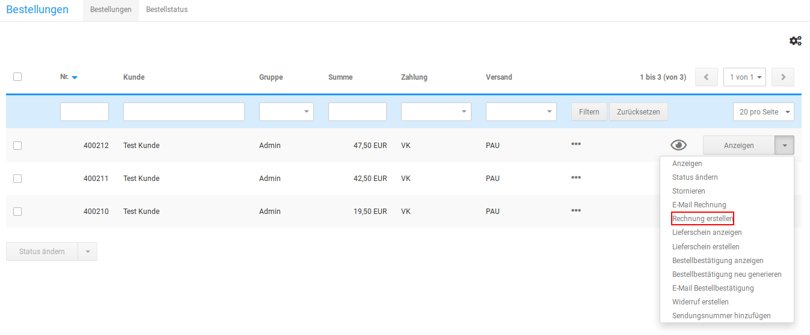

# Rechnung & Lieferschein 

**Note:** Die Optionen für Rechnung und Lieferschein stehen nur in Verbindung mit dem PDFCreator-Zusatzmodul zur Verfügung, das separat installiert werden muss. Die notwendigen Schritte sind in der Installationsanleitung beschrieben.

Die Rechnung und den Lieferschein zu einer Bestellung kannst du auf der Detailseite der Bestellung im Gambio Admin deines Shops unter Bestellungen \> Bestellungen erzeugen. Eine Anleitung zur Konfiguration von Rechnung und Lieferschein findest du im Kapitel Rechnung & Lieferschein konfigurieren.

## Rechnung erstellen { .section}

Wenn du die Rechnung zu einer Bestellung per Post, beispielsweise mit der Lieferung, verschicken möchtest, erstelle die Rechnung im Gambio Admin deines Shops unter Bestellungen \> Bestellungen.

1.  Wähle aus der Bestellübersicht die Bestellung aus, zu der du eine Rechnung erzeugen möchtest
2.  Klicke in der Dropdown-Schaltfläche auf Rechnung erstellen

    Die Funktion Rechnung erstellen kannst du auch auf der Detailseite der Bestellung unterhalb der Bestelldetails ausführen

3.  Der Bestellstatus deiner Bestellung wechselt auf Rechnung erstellt, die Rechnung wird erzeugt und im Webbrowser angezeigt

CAUTION:

Jeder Klick auf Rechnung erstellen erzeugt eine neue Rechnung mit eigener Rechnungsnummer. Zur Einsicht klicke stattdessen bitte auf Rechnung anzeigen.

## Rechnung per E-Mail senden { .section}

Wenn du die Rechnung per E-Mail versendest, muss sie vorher nicht generiert werden. Die Rechnung kannst du im Gambio Admin deines Shops unter Bestellungen \> Bestellungen versenden.

1.  Wähle aus der Bestellübersicht die Bestellung aus, zu der du eine Rechnung erzeugen möchtest
2.  Klicke in der Dropdown-Schaltfläche auf E-Mail Rechnung

    Die Funktion E-Mail Rechnung kannst du auch auf der Detailseite der Bestellung unterhalb der Bestelldetails ausführen

3.  Der Bestellstatus deiner Bestellung wechselt auf Rechnung erstellt, die Rechnung wird erzeugt und dem Kunden per E-Mail zugesandt

## Lieferschein erstellen { .section}

Wenn du deiner Lieferung einen Lieferschein beilegen möchtest, erstelle den Lieferschein im Gambio Admin deines Shops unter Bestellungen \> Bestellungen.

1.  Wähle aus der Bestellübersicht die Bestellung aus, zu der du einen Lieferschein erzeugen möchtest
2.  Klicke in der Dropdown-Schaltfläche auf Lieferschein erstellen

    Die Funktion Lieferschein erstellen kannst du auch auf der Detailseite der Bestellung unterhalb der Bestelldetails ausführen

3.  Der Bestellstatus deiner Bestellung bleibt unverändert, der Lieferschein wird erzeugt und im Webbrowser angezeigt

