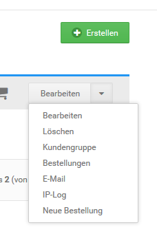

# Bestellung manuell anlegen 

Bestellungen kannst du für deine Kunden im Gambio Admin deines Shops unter Kunden \> Kunden anlegen. Wähle aus der Kundenliste den Kunden aus, für den du eine neue Bestellung anlegen möchtest. Der aktuell ausgewählte Kunde ist grau hinterlegt. Klicke im Dropdown auf Neue Bestellung. Das Shopsystem legt eine neue, leere Bestellung für den gewählten Kunden an.

**Note:** In den meisten Fällen ist es einfacher und komfortabler, Bestellungen im Namen des Kunden über den Shopbereich anzulegen. Registriere dazu ein neues Kundenkonto für deinen Kunden, melde dich mit dem Konto in deinem Shop an und führe die Bestellung über den Shopbereich aus.

-   **[Kundendaten eintragen](13_2_1_Kundendaten_eintragen.md)**  

-   **[Artikel hinzufügen](13_2_2_Artikel_hinzufuegen.md)**  

-   **[Bestellsummen erzeugen](13_2_3_Bestellsummen_erzeugen.md)**  

