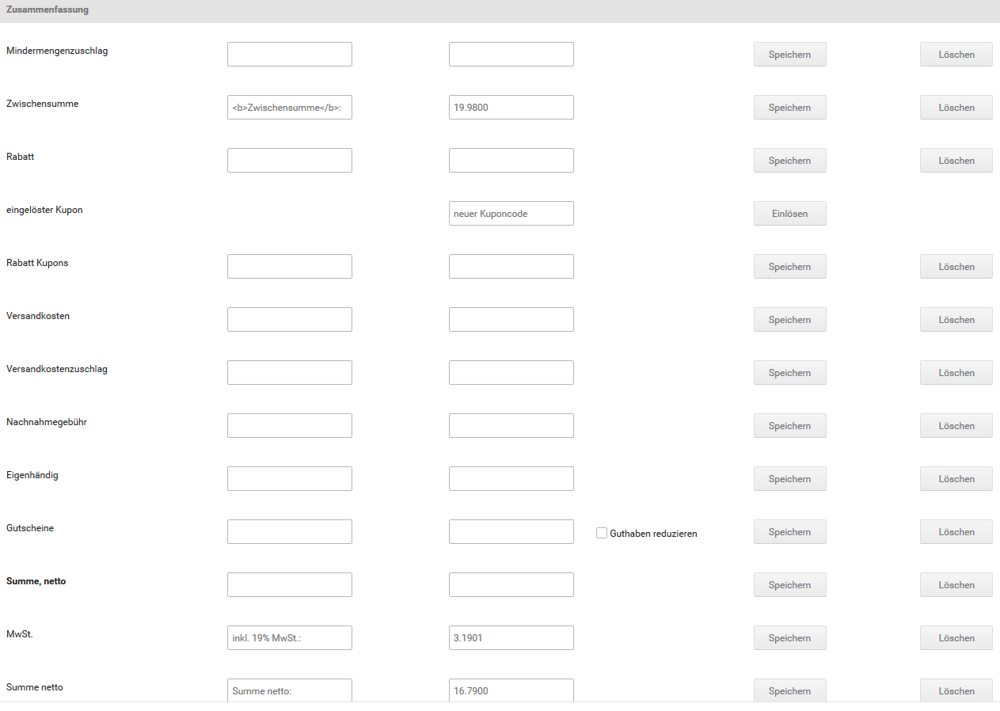

# Bestellsummen erzeugen {#bestellung_manuell_anlegen_bestellsummen_erzeugen}

Die Bestellsummen erzeugst du auf der Bestell-Eingabemaske. Klicke auf der Detailseite der Bestellung auf Bearbeiten, um die Bestell-Eingabemaske aufzurufen.

## Sprache der Bestellung einrichten { .section}

1.  Klicke auf Bearbeiten und anschließend auf den Reiter Versandarten, Zahlungsweisen und Summen
2.  Wähle unter Sprache die Sprache aus, die in der Bestellbestätigung und auf der Rechnung verwendet wird und klicke auf Speichern

## Zahlungsweise und Versandart festlegen { .section}

1.  Klicke auf Bearbeiten und anschließend auf den Reiter Versandarten, Zahlungsweisen und Summen
2.  Wähle unter Zahlungsweise aus der Liste Neu die gewünschte Zahlungsweise aus und klicke auf Speichern
3.  Wähle unter Versandart aus der Liste Neu die gewünschte Versandart aus
4.  Trage die Höhe der Versandkosten in das Feld Preis ein
5.  Klicke auf Speichern, um die Versandkosten zu speichern

Die Versandkosten werden automatisch in die Zusammenfassung eingetragen

## Bestellsummen berechnen { .section}

Ab der Version 2.1 werden die Bestellsummen automatisch berechnet. Setze hierzu den Haken bei Nachbearbeitung beenden und Bestellung neu berechnen bevor du die Bearbeitung schließt.

Du hast eine Bestellung manuell angelegt. Bei manuell angelegte Bestellungen werden vom Shopsystem keine automatischen E-Mails versendet. Informationen zur weiteren Abwicklung der Bestellung kannst du dem Kapitel Bestellung abwickeln entnehmen.

