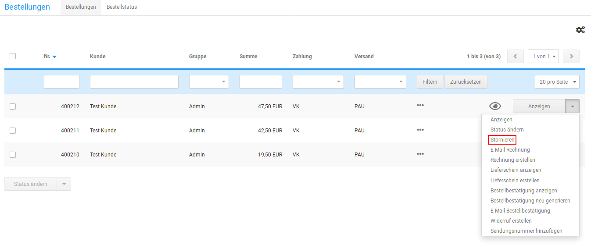
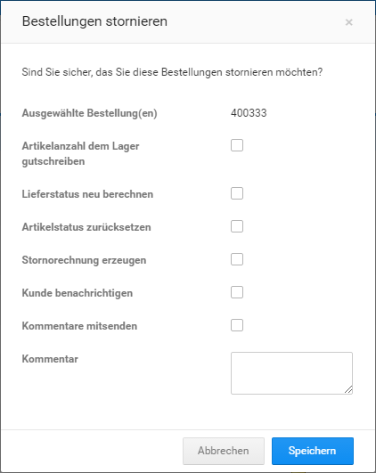

# Bestellung stornieren {#bestellung_stornieren}

Bestellungen kannst du im Gambio Admin deines Shops unter Bestellungen \> Bestellungen stornieren. Der Bestellstatus einer stornierten Bestellung kann nachträglich nicht mehr verändert werden.

1.  Wähle aus der Bestellübersicht die zu stornierende Bestellung aus

    Die aktuell gewählte Bestellung ist grau hinterlegt

2.  Klicke in der Dropdown-Schaltlfläche auf Stornieren
3.  Fülle die Maske Stornieren aus

    Eine Beschreibung der Felder in der Maske Stornieren findest du in der Tabelle Übersicht über die Stornieren-Maske

4.  Klicke auf Senden

    Der Bestellstatus deiner Bestellung wechselt auf Storniert

CAUTION:

Wurde zu einer zu stornierenden Bestellung bereits eine Rechnung erstellt, sollte hierzu eine Stornorechnung erzeugt werden \(siehe Stornorechnung erzeugen\).

|Feldname|Beschreibung|
|--------|------------|
|Artikelanzahl dem Lager gutschreiben|wenn aktiviert, wird die Artikelanzahl dem Lagerbestand gutgeschrieben|
|Lieferstatus neu berechnen|wenn aktiviert, wird der Lieferstatus für die Artikel der Bestellung neu berechnet \(nur, wenn du automatische Lieferstatus verwendest\)|
|Artikelstatus zurücksetzen|wurde der Artikel während der Bestellung inaktiv gesetzt, wird dies rückgängig gemacht|
|Stornorechnung erzeugen|wurde zu der Bestellung bereits eine Rechnung erzeugt, wird eine entsprechende Stornorechnung angelegt|
|Kunde benachrichtigen|wenn aktiviert, wird der Kunde über die Stornierung benachrichtigt|
|Kommentare mitsenden|wenn aktiviert, wird der Benachrichtigung ein persönlicher Kommentar mitgesendet|
|Betreff|Betreff der Benachrichtigung|
|E-Mail|Empfänger der Benachrichtigung|
|Kommentare|persönlicher Kommentar zur Benachrichtigung|

**Parent topic:**[Bestellung rückabwickeln](13_4_Bestellungen_rueckabwickeln.md)

