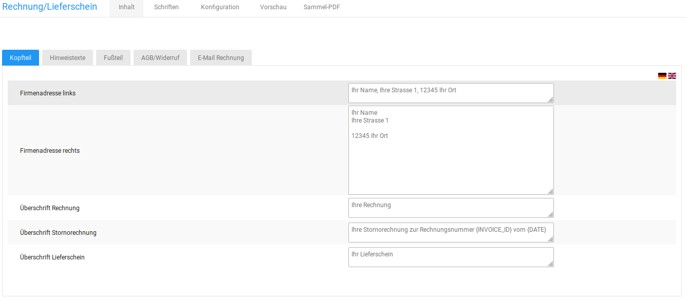
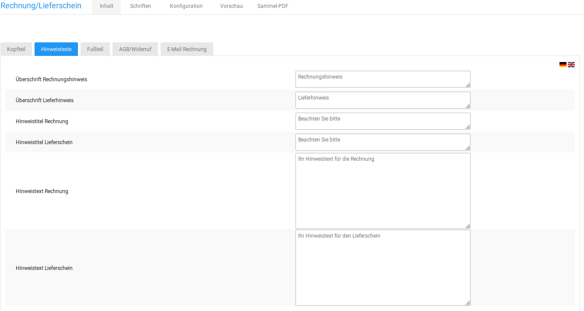

# Inhalt 

Auf der Registerkarte Inhalt kannst du Inhalte vorgeben, die auf allen Rechnungen erscheinen sollen.

## Kopfteil { .section}

Auf der Registerkarte Inhalt im Abschnitt Kopfteil kannst du deine Firmenanschrift und den Inhalt für die Betreffzeile eintragen. Gib die gewünschten Daten ein und klicke auf Speichern.

Wenn du den Kopfteil der Rechnung verwenden möchtest, wähle auf der Registerkarte Konfiguration im Abschnitt Anzeige bei der Liste Kopfteil verwenden? den Wert ✔ aus.

## Hinweistexte { .section}

Auf der Registerkarte Inhalt im Abschnitt Hinweistexte kannst du Hinweistexte für die Rechnung und den Lieferschein hinterlegen, die auf jeder Rechnung ausgegeben werden. Gib die gewünschten Daten ein und klicke auf Speichern.

Wenn du die Hinweistexte verwenden möchtest, wähle auf der Registerkarte Konfiguration im Abschnitt Anzeige bei den Checkboxen Hinweis verwenden? und Hinweistext verwenden? jeweils den Wert ✔ aus.

## Fußteil { .section}

Auf der Registerkarte Inhalt im Abschnitt Fußteil kannst du deine Firmenanschrift und den Inhalt für die Fußzeile der Rechnung eintragen. Die Fußzeile enthält immer vier Spalten. Gib die gewünschten Daten ein und klicke auf Speichern.

Wenn du den Fußteil der Rechnung verwenden möchtest, wähle auf der Registerkarte Konfiguration im Abschnitt Anzeige bei der Checkbox Fußteil verwenden? den Wert ✔ aus.

Wenn eine der Spalten Bankdaten enthalten soll, setze hierfür jeweils den Haken unter Spalte enthält Bankverbindung.

## Agb/Widerruf { .section}

Auf der Registerkarte Inhalt im Abschnitt AGB/Widerruf kannst du die AGB und die Widerrufsbelehrung eintragen, die auf der PDF-Rechnung angezeigt werden sollen. Gib die gewünschten Daten ein und klicke auf Speichern.

Wenn du deine AGB und das Widerrufsrecht auf der Rechnung verwenden möchtest, wähle auf der Registerkarte Konfiguration im Abschnitt Anzeige bei den Checkboxen Agbs verwenden? und Widerruf verwenden? jeweils den Wert ✔ aus.

## E-Mail Rechnung { .section}

Auf der Registerkarte Inhalt im Abschnitt E-Mail Rechnung kannst du den Inhalt der Betreffzeile für die Rechnungs E-Mail festlegen. Gib im Feld E-Mail Betreff den E-Mail Betreff für die Rechnungs E-Mail ein und klicke auf Speichern. Es steht ebenfalls ein Feld für einen abweichenden Betreff beim Erzeugen mehrerer Rechnungen zur Verfügung.

