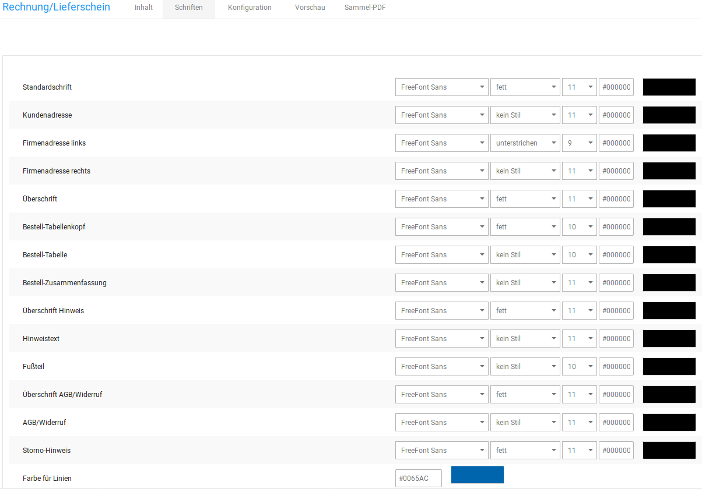
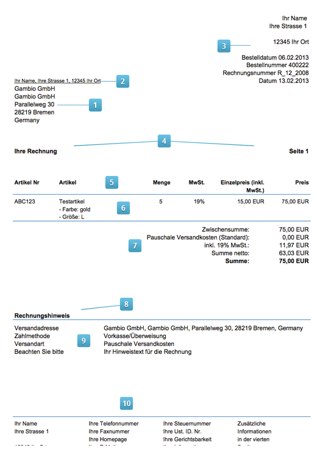

# Schriften {#rechnung_und_lieferschein_konfigurieren_schriften}

Auf der Registerkarte Schriften kannst du die Schriftarten, -farben und -größen einstellen, die auf der Rechnung verwendet werden.

1.  Wähle aus der ersten Liste einer Schrift die Schriftart aus
2.  Wähle aus der zweiten Liste einer Schrift den Schritstil aus
3.  Wähle aus der dritten Liste einer Schrift die Schriftgröße aus
4.  Gib in das Textfeld einer Schrift die Schriftfarbe in Hexadezimal-Codierung ein, oder wähle rechts neben dem Textfeld die gewünschte Schriftart mit dem Farbrad aus

Klicke nach vorgenommenen Änderungen auf Speichern, um die Änderungen für zukünftige Rechnungen zu übernehmen.

1.  Kundenadresse

    Die Kundenadresse wird links im Sichtfenster angezeigt

2.  Firmenadresse links

    Die Firmenadresse links wird oberhalb der Kundenadresse angezeigt

3.  Firmenadresse rechts

    Die Firmenadresse rechts wird im Kopfteil der Rechnung rechts angezeigt

4.  Überschrift

    Die Schrift Überschrift wird für Betreff und die Seitenzahlen verwendet

5.  Bestell-Tabellenkopf

    Der Bestell-Tabellenkopf ist die Titelzeile der Artikel-Liste

6.  Bestell-Tabelle

    Die Bestell-Tabelle enthält die Artikel der Bestellung

7.  Bestell-Zusammenfassung

    Die Bestell-Zusammenfassung enthält den Summenblock

8.  Überschrift Hinweis

    Die Überschrift für den Hinweis wird unterhalb des Summenblocks angezeigt

9.  Hinweistext

    Der Hinweistext wird unter der Überschrift für den Hinweis angezeigt

10. Fußteil

    Der Fußteil wird am unteren Seitenrand jeder Seite angezeigt

**Parent topic:**[Rechnung & Lieferschein konfigurieren](13_6_Rechnung_UND_Lieferschein_konfigurieren.md)

