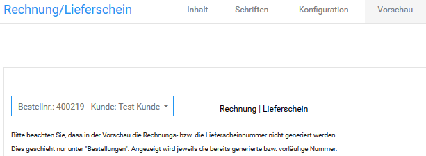

# Vorschau {#rechnung_und_lieferschein_konfigurieren_vorschau}

Auf der Registerkarte Vorschau kannst du eine Vorschau einer Rechnung oder eines Lieferscheins mit der aktuellen Konfiguration erstellen.

**Note:** Du kannst die Rechnungsvorschau nur generieren, wenn bereits mindestens eine Bestellung in deinem Shop eingegangen ist. Wenn du deinen Shop noch einrichtest, erstelle zunächst eine Testbestellung.

1.  Wähle aus der Liste Wählen eine Bestellung aus deinem Shop aus
2.  Klicke auf Rechnung, um eine Vorschau für die Rechnung zu dieser Bestellung zu generieren
3.  Klicke auf Lieferschein, um eine Vorschau für den Lieferschein zu dieser Bestellung zu generieren

