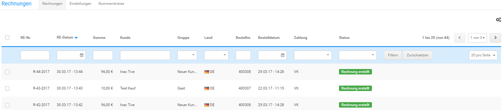

# Übersicht 

Die Übersicht der erstellten Rechnungen kann unter Bestellungen \> Rechnungen aufgerufen werden. Über die Reiter Einstellungen und Nummernkreise gelangst du direkt zu den Menüpunkten Shop Einstellungen \> Rechnung/Lieferschein bzw. Shop Einstellungen \> Nummernkreise \(siehe Kapitel Rechnung & Lieferschein konfigurieren respektive Nummernkreise\).

Die im Shop erstellten Rechnungen werden in Form einer Tabelle aufgelistet. Es stehen die folgenden Spalten zur Verfügung:

-   RE-Nr.
-   RE-Datum
-   Summe
-   Kunde
-   Gruppe
-   Land
-   Bestellnr.
-   Bestelldatum
-   Zahlung
-   Status

