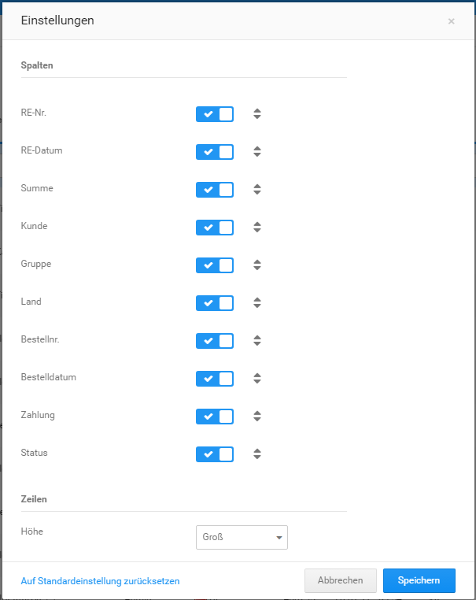

# Einstellungen 

Öffne das Einstellungsfenster mit einem Klick auf das Zahnrad-Symbol.

Über das Einstellungsfenster können die Spaltenauswahl und -reihenfolge sowie die Zeilenhöhe festgelegt werden. Setze \(✔\) bzw. entferne \(✖\) einen Haken, um die Spalte anzuzeigen bzw. auszublenden.

Klicke mit der Maus die beiden Dreiecke am Ende des Eintrags an und halte die Maustaste gedrückt, um diesen nach oben oder unten zu ziehen. Auf diese Weise änderst du die Reihenfolge der Spalte. Über das Dropdown Höhe kann die Zeilenhöhe eingestellt werden. Bestätige die gemachten Änderungen mit einem Klick auf Speichern. Über Abbrechen kann das Einstellungsfenster verlassen werden, ohne die gemachten Änderungen zu übernehmen. Mit Klick auf den Link Auf Standardeinstellung zurücksetzen werden die Standardeinstellungen vorausgewählt \(zum Übernehmen bitte auf Speichern klicken\).

