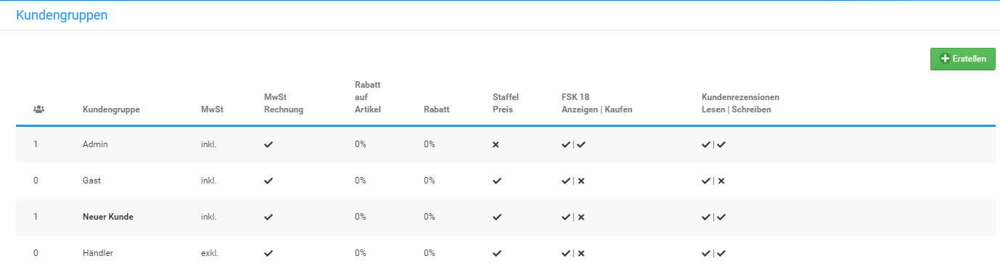
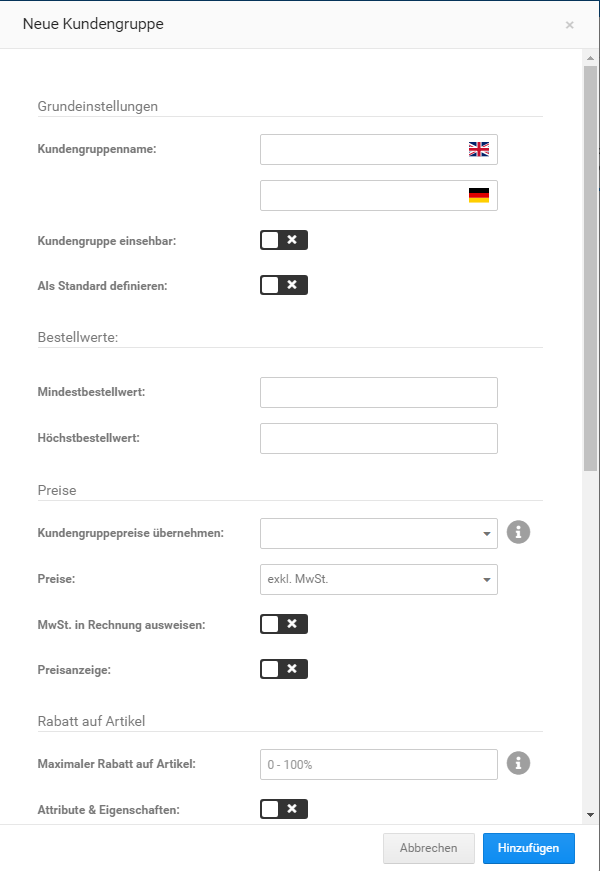

# Kundengruppen

Mit Kundengruppen organisierst du deine Kunden nach beliebigen Kriterien. Jeder Kunde ist Mitglied einer Kundengruppe und kann nicht mehreren Kundengruppen zugewiesen sein. Mit Kundengruppenpreisen kannst du Sonderpreise erstellen, die ausschließlich für spezielle Kundenkreise gelten.

## Kundengruppen anlegen

Neue Kundengruppen kannst du im Gambio Admin deines Shops unter _**Kunden \> Kundengruppen**_ anlegen.

1.  Klicke oberhalb der Kundengruppen-Liste auf Erstellen

    Es öffnet sich die Kundengruppen-Eingabemaske

2.  Trage im Feld _**Kundengruppenname**_ einen Namen für deine neue Kundengruppe ein
3.  Nimm die Konfiguration der Kundengruppe anhand der Tabelle _**Übersicht über die Kundengruppen-Eingabemaske**_ vor
4.  Wähle aus der Liste _**Kundengruppenpreise übernehmen**_ für Artikelpreise die Kundengruppe aus, dessen Kundengruppenpreise in die neue Kundengruppe importiert werden sollen
5.  Klicke auf _**Hinzufügen**_, um die neue Kundengruppe hinzuzufügen

|Feldname|Beschreibung|
|--------|------------|
|Kundengruppenname|Feld für den Namen der Kundengruppe|
|Kundengruppe einsehbar|Bei ✔ wird der Name der Kundengruppe im Shopbereich im Dropdown des Login-Buttons in der Sekundärnavigation angezeigt|
|Als Standard definieren|Wenn aktiviert, wird die aktuelle Kundengruppe als Standardkundengruppe definiert|
|Mindestbestellwert|Mindestbestellwert für die Kundengruppe \(optional\)|
|Höchstbestellwert|Höchstwert für die Kundengruppe \(optional\)|
|Kundengruppenpreise übernehmen|Übernimmt die Artikelpreise aus der ausgewählten Gruppe|
|Preise|Auswahlliste für die Anzeige von Preisen inklusive oder exklusive Umsatzsteuer|
|MwSt. in Rechnung ausweisen|Bei ✖ wird die Umsatzsteuer auf der Rechnung nicht ausgewiesen|
|Preisanzeige|Bei ✖ werden im Shop keine Preise angezeigt, die Kaufoptionen werden deaktiviert|
|Maximaler Rabatt auf Artikel|Feld für den Maximalen Artikelrabatt, in Artikeln eingetragene Rabatte werden bis zu diesem Wert gewährt|
|Attribute & Eigenschaften|Bei ✔ werden auch Artikelattribute und Artikeleigenschaften mit dem Artikelrabatt reduziert|
|Rabatt auf gesamte Bestellung|Feld für Rabatt auf Gesamtbestellung|
|Rabatt auf Gesamtbestellwert|Bei ✔ wird der Prozentwert aus dem vorherigen Feld bei der Bestellzusammenfassung als Nachlass auf die Gesamtrechnung ausgezeichnet|
|Staffelpreise aktivieren|Bei ✔ werden für diese Kundengruppe eingerichtete Staffelpreise angezeigt|
|Unerlaubte Zahlungsweisen|Kommagetrennte Liste für diese Kundengruppe nicht erlaubter Zahlungsweisen, Angabe anhand des Modulnamens, z.B. invoice,cod für Rechnung und Nachnahme|
|Unerlaubte Versandarten|Kommagetrennte Liste für diese Kundengruppe nicht erlaubter Versandarten, Angabe anhand des Modulnamens, z.B: flat,table für Pauschale Versandkosten und Versandkosten nach Preis/Gewicht|
|FSK18 Artikel kaufen|Bei ✔ können Kunden dieser Gruppe als FSK18 ausgewiesene Artikel erwerben|
|FSK18 Artikel anzeigen|Bei ✔ werden Kunden dieser Gruppe Artikel angezeigt, die als FSK18 ausgewiesen sind|
|Artikel bewerten|Bei ✔ können Kunden dieser Gruppe Kundenrezensionen verfassen und Artikel bewerten|
|Kundenrezensionen lesen|Bei ✔ können Kunden dieser Gruppe Kundenrezensionen einsehen|

## Kundengruppen bearbeiten

Die Einstellungen von vorhandenen Kundengruppen kannst du im Gambio Admin deines Shops unter _**Kunden \> Kundengruppen**_ anpassen.

!!! danger "Achtung"

	 Die Kundengruppen _**Admin**_ und _**Gast**_ haben spezielle Aufgaben und verhalten sich stellenweise anders, als eine neu angelegte Gruppe. Sie sollten daher nicht für andere Zwecke verwendet werden.

1.  Wähle aus der Liste _**Kundengruppen**_ die zu bearbeitende Kundengruppe aus, indem du den Mauszeiger in die zugehörige Zeile bewegst
2.  Klicke auf das Bleistif-Symbol
3.  Nimm die gewünschten Änderungen anhand der Tabelle _**Übersicht über die Kundengruppen-Eingabemaske**_ vor
4.  Klicke auf _**Aktualisieren**_, um die Änderungen zu übernehmen

## Kundengruppen zuweisen

Bestehende Kundenkonten kannst du unter _**Kunden \> Kunden**_ einer Kundengruppe zuweisen.

1.  Wähle aus der Liste _**Kunden**_ den Kunden aus, der einer neuen Kundengruppe zugewiesen werden soll
2.  Klicke über die Dropdown-Schaltfläche auf _**Kundengruppe**_
3.  Wähle die gewünschte Kundengruppe aus, der der gewählte Kunde zugewiesen werden soll
4.  Klicke auf _**Aktualisieren**_, um den Kunden der neuen Kundengruppe zuzuweisen

## Kundengruppen löschen

Nicht mehr benötigte Kundengruppen kannst du im Gambio Admin deines Shops unter _**Kunden \> Kundengruppen**_ löschen.

!!! danger "Achtung"

	 Kundengruppen können nicht gelöscht werden, wenn sich darin noch mindestens ein Kunde befindet. Weise Kunden aus zu löschenden Kundengruppen einer alternativen Kundengruppe zu, wie im Kapitel _**Kundengruppen zuweisen**_ beschrieben. Das Löschen von den im Grundumfang enthaltenen Kundengruppen \(_**Admin**_, _**Gast**_, _**Neuer Kunde**_, _**Händler**_\) ist standardmäßig nicht vorgesehen.

1.  Wähle aus der Liste _**Kundengruppen**_ die zu löschende Kundengruppe aus, indem du den Mauszeiger in die zugehörige Zeile bewegst
2.  Klicke auf das nun angezeigte Mülleimer-Symbol
3.  Überprüfe in der angezeigten Sicherheitsabfrage, ob die korrekte Kundengruppe gewählt wurde und klicke erneut auf _**Löschen**_, um das unwiderrufliche Löschen der Kundengruppe zu bestätigen
