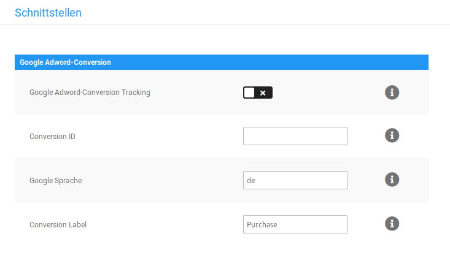

# Google Conversion-Tracking 

!!! Info "Hinweis"
	

Das Google Conversion-Tracking-Modul unter Module \> Modul-Center entspricht nicht der aktuellsten Implementierung. Wir empfehlen stattdessen die entsprechenden Funktionen des Google Services-Moduls im Bereich Google des Gambio Admins zu verwenden.

Mit dem Google Conversion-Tracking analysierst du das Kauf- und Kaufabbruchverhalten deiner Kunden über einen Dienst von Google Analytics. Das Conversion-Tracking kannst du im Gambio Admin deines Shops unter Module \> Modul-Center unter dem Eintrag Google Adword-Conversion einrichten. Wähle hierzu den Eintrag aus und klicke auf Bearbeiten.

1.  Wähle bei Google Conversion-Tracking die Option ✔, um das Google Conversion- Tracking zu aktivieren
2.  Gib im Feld Conversion ID die Conversion ID ein, die du von Google erhältst
3.  Gib im Feld Google Sprache den zweistelligen ISO-Code der von dir bevorzugten Sprache ein
4.  Gib im Feld Conversion Label das von dir gewünschte Conversion Label ein
5.  Klicke auf Speichern, um die Einstellungen für Google Conversion-Tracking zu übernehmen

