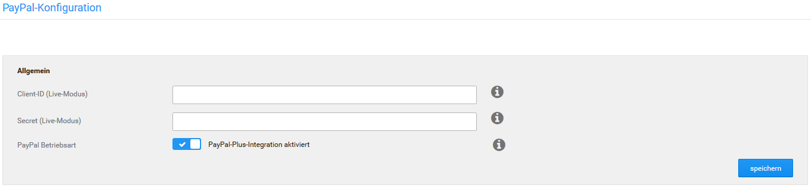

# Allgemein 

PayPal 3 wird weitestmöglich vorkonfiguriert. Für die Ersteinrichtung ist zunächst die Eingabe der Zugangsdaten notwendig:

CAUTION:

Für die Verwendung von PayPal und PayPal Plus v3.x sind neue Zugangsdaten für die sogenannte REST-Schnittstelle erforderlich. Deine bisherigen Zugangsdaten können **nicht** weiter verwendet werden! \(vgl. Kapitel Erhalten von Zugangsdaten bei PayPal\)

Gib deine PayPal-Zugangsdaten ein und wähle die Betriebsart der Schnittstelle. Standardmässig ist der Klassikmodus aktiviert, in dem sich die Zahlungsweise für Kunden so verhält, wie du es von bisherigen PayPal-Modulen gewohnt bist. Im PLUS-Modus wandert die Auswahl der Zahlart von der PayPal Webseite in die Zahlungsauswahl des Shops. Klicke auf Schnittstelle einrichten, um die Ersteinrichtung vorzunehmen.

CAUTION:

Für den Betrieb der Schnittstelle im PLUS-Modus, musst du eine Freigabe von PayPal besitzen. Wenn du die Schnittstelle in den PLUS-Modus schaltest, aber keine Freigabe besitzt, wird je nach Status deines Händlerkontos bei PayPal eine unvollständige Auswahl von PayPal-Zahlungsweisen oder eine Fehlermeldung anstatt der PayPal Zahlungsweisen angezeigt. Nach Aktivierung des PLUS-Modus solltest du zu deiner eigenen Sicherheit eine Probebestellung durchführen und dabei prüfen, ob die Zahlungsweisen korrekt und wie gewünscht angezeigt werden. Solltest du noch keine Freigabe besitzen, kannst du diese hier bei PayPal beantragen: https://www.paypal.com/de/webapps/mpp/paypal-plus

