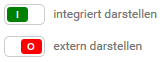
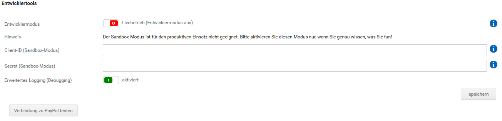

# Experteneinstellungen 

## Bestellstatusänderungen nach Aktionen 

Über den Bereich Bestellstatusänderungen nach Aktionen kann der jeweilige Bestellstatus nach einer

-   abgeschlossenen Zahlung
-   schwebenden Zahlung
-   fehlgeschlagenen Zahlung

festgelegt werden. Wähle hierzu den jeweiligen Status über das Dropdown-Menü aus und klicke auf Speichern.

## Integration anderer Zahlungsmodule im PayPal Plus Modus 

Über PayPal Plus können andere Zahlungsweisen zugunsten einer einheitlichen Darstellung optisch ins PayPal Modul integriert dargestellt werden. Nimm die Einstellungen wie folgt vor:

und bestätige diese mit einem Klick auf Speichern. Wir empfehlen alle Zahlungsweisen extern darzustellen.

!!! Info "Hinweis"
	 Bei den hier verwendeten Zahlungsweisen handelt es sich um die shopeigenen Zahlungsmodule. Diese werden nicht ersetzt, sondern lediglich optisch zusammengefasst.

## Darstellung im Shop 

Über die Einstellungen unter Darstellung im Shop können Details zur Darstellung von PayPal vorgenommen werden.

Hierbei kann die Verwendung der ECS \(Express Checkout Shortcut, ‘Direkt zu PayPal‘\)-Buttons für den Warenkorb und die Artikeldetailseite an- bzw. abgeschaltet werden. Über diese Buttons ist ein verkürzter Bestellvorgang möglich. Zudem kann die Darstellung der Buttons über den Button-Stil geändert werden.

Nimm die gewünschten Einstellungen vor und bestätige diese mit einem Klick auf Speichern.

## Sonstige Einstellungen 

Wird das Zahlungsmodul im Klassik-Modus verwendet, sind für die Zahlungsoperationen folgende Einstellungen möglich:

-   Sale - In diesem Modus wird die Zahlung sofort abgebucht und deinem Händlerkonto gutgeschrieben
-   Authorization - Dieser Modus reserviert den Rechnungsbetrag zunächst, die Abbuchung muss aber nachträglich manuell ausgelöst werden.

    Dies ist zum Beispiel dann sinnvoll, wenn du Waren mit längeren Lieferfristen verkaufst und dem Kunden erst zum Zeitpunkt der Lieferung der Betrag abgebucht werden soll.

-   Order - entspricht dem Authorization-Betrieb, bis auf den Punkt dass beim Kunden der Zahlbetrag nicht fest vorgemerkt wird. Der Betrag wird erst in einem Folgeschritt fest reserviert und abgebucht.

!!! Info "Hinweis"
	 Bei der Verwendung von PayPal Plus als Betriebsart wird immer Sale verwendet.

Über Login per ECS erlauben kann festgelegt werden, was geschieht wenn ein Kunde nach einer ECS-Zahlung \(„Direkt zu PayPal“\) in den Shop zurückkehrt. Ist der Kunde nicht in den Shop eingeloggt, besitzt aber ein Kundenkonto im Shop \(identifiziert anhand der E-Mail Adresse\) muss der Kunde im Regelfall sein Shopkennwort eingeben. Wird diese Option aktiv gesetzt, wird das Passwort im Shop nicht abgefragt, der Kunde wird direkt ins Shop-Kundenkonto eingeloggt.

Zudem gibt es die Einstellung Nur Zahlungsweisen mit sofortiger Geldverfügbarkeit erlauben. Hier kann ausgewählt werden, ob verzögerte Zahlungen \(z.B. Rechnung, Ratenzahlung\) erlaubt sind. Auch die Einschränkung auf physische Artikel ist mit der Auswahl Verzögerte Zahlungen erlauben \(außer Downloadartikel\) möglich.

Darüber hinaus kann festgelegt werden, ob bei PayPal-Bestellungen Selbstabholung durch den Kunden erlaubt ist. Beachte bei der Wahl der Einstellung insbesondere die dadurch möglichen Implikationen in Bezug auf den PayPal-Käuferschutz.

Nimm die jeweiligen Einstellungen vor und bestätige diese mit einem Klick auf Speichern.

## Entwicklertools 

CAUTION:

Die Optionen auf dieser Seite dienen der Fehlersuche und Testzwecken. Alle Optionen dieser Seite sollten im Livebetrieb deaktiviert sein.

Über die Entwicklertools können der Sandbox-Modus aktiviert werden, um PayPal vom Live-Betrieb in den Testmodus zu versetzen und die notwendigen Zugangsdaten für dessen Verwendung eingegeben werden. Zudem kann ein erweitertes Logging aktiviert werden, dessen Informationen im Fehlerfall bei der Fehlersuche von Nutzen sind. Über die Schaltfläche Verbindung zu PayPal testen kann die Verbindung zu den PayPal-Servern geprüft werden. Der Test ist eine allgemeine technische Verbindungsprüfung, der Zugangsdaten nicht berücksichtigt und somit keine Indizien auf deren Korrektheit liefert.

Nimm hier die gewünschten Einstellungen vor und bestätige diese mit einem Klick auf Speichern.

## Automatische Statusaktualisierungen von Zahlungen \(PayPal-Parameter\) 

Über die automatische Statusaktualisierung wird für Bestellungen, dessen Zahlung in der Schwebe ist, eine automatisierte Prüfung durchgeführt und der Bestellstatus im Shop aktualisiert.

Dies erfordert die Einrichtung eines sogenannten Webhooks für dein PayPal-Konto, über den die automatische Prüfung angestoßen wird. Hierfür ist es zwingend erforderlich, dass dein Shop mit einem gültigen SSL-Zertifikat ausgestattet und über SSL erreichbar ist.

Bei der Ersteinrichtung des Moduls wird versucht die automatischen Statusaktualisierungen automatisch einzurichten, dies kann auf dieser Seite kontrolliert werden. Wenn die Einrichtung nicht erfolgreich war, kann über den Button Benachrichtigungen einrichten ein erneuter Versuch unternommen werden. Über die löschen-Buttons im ID-Feld der unteren Tabelle können bei PayPal hinterlegte Endpunkte \(soweit bereits vorhanden\) zu Aufräumzwecken gelöscht werden.

Falls kein SSL zur Verfügung steht, kann alternativ auch ein sogenannter Cronjob bei deinem Hosting-Anbieter eingerichtet werden, der den Status jeder offenen PayPal Bestellung überprüft und bei Veränderungen aktualisiert. Verwende die untere URL im Bereich Automatische Statusaktualisierungen von Zahlungen \(PayPal-Parameter\) als Vorlage, um diesen einzurichten.

## Darstellung auf der PayPal Zahlungsseite \(PayPal-Parameter\) 

Über diesen Unterpunkt kann die grafische Darstellung der PayPal-Zahlungsseite angepasst werden. Die Ersteinrichtung des Moduls erzeugt dabei eine funktionierende Konfiguration, schlägt dies fehl wird oben auf der Seite ein Warnhinweis eingeblendet. Klicke auf Neues Darstellungsprofil anlegen oder löschen um Darstellungsprofile zu verwalten. Bei der Bearbeitung des Profils sind die Einstellungen

-   Name
-   Startseitentyp
-   Markenname
-   Logo-URL
-   Lokalisierung der Zahlungsseiten

möglich.

Verwende die Buttons verwenden\[xx\] um ein Darstellungsprofil mit einer Shopsprache zu verknüpfen.

!!! Info "Hinweis"
	 Für den fehlerfreien Betrieb muss mit jeder im Shop aktivierten Sprache ein Darstellungsprofil verknüpft sein. Damit die PayPal Zahlungsoptionen für Kunden immer in der richtigen Sprache angezeigt werden, empfiehlt es sich für jede im Shop aktivierte Sprache ein separates Profil anzulegen und passend zu konfigurieren.

