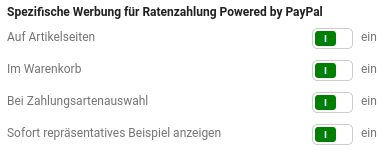
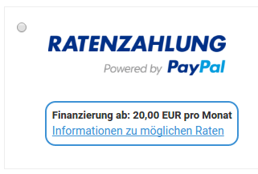
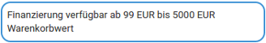
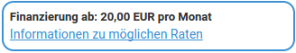

# Konfiguration {#ratenzahlung_powered_by_paypal_konfiguration}

Die Konfiguration erfolgt über die Experteneinstellungen von PayPal und Paypal Plus. Wähle hierzu unter Module \> Zahlungsweisen \> Sonstige eines der installierten Module - PayPal und PayPal Plus bzw. Ratenzahlung Powered by PayPal - aus und klicke auf die Schaltfläche Konfiguration. Wähle anschließend den Bereich Experteneinstellungen und öffne dort den Abschnitt Darstellung im Shop.

Es werden im unteren Bereich die Einstellungen Spezifische Werbung für Ratenzahlung Powered by PayPal angezeigt. Hierüber lässt sich die Anzeige des Finanzierhungshinweises auf der Artikeldetailseite, im Warenkorb und auf der Zahlungsweisenseite steuern. Hierbei ist die Anzeige eines pauschalen oder repräsentativen Hinweises möglich, bei letzterem werden die ungefähren Raten anstelle der allgemeinen Informationen angezeigt.

