# Rechtliche Einstellungen 

!!! danger "Achtung"

	 Bitte nimm Änderungen an den rechtlichen Einstellungen ausschließlich in Absprache mit deinem Rechtsberater vor. Unsachgemäße Änderungen an den Einstellungen bergen die Gefahr einer Abmahnung!

## Allgemeines

Die allgemeine rechtliche Konfiguration kannst du unter _**Shop Einstellungen \> Rechtliches**_ bzw. _**Einstellungen / Rechtliches**_ vornehmen.

### Datenschutzlink

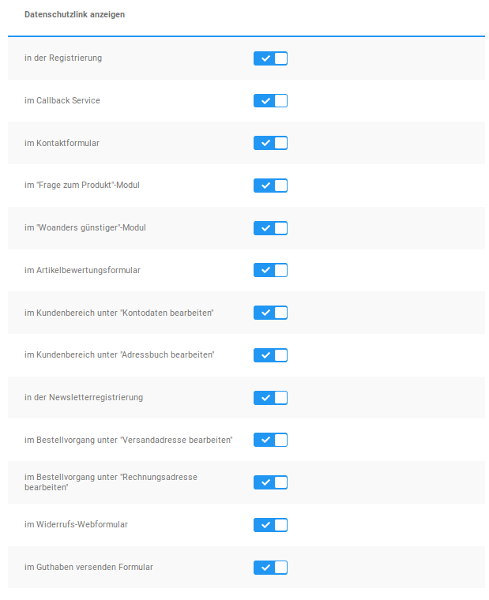

Ein Link zu den aktuellen Datenschutzbestimmungen wird in der Grundeinstellung auf jeder Seite eingebunden, auf der persönliche Daten des Kunden über ein Formular übertragen werden. Der Link zu den Datenschutzbestimmungen kann bei Bedarf für bestimmte Seiten deaktiviert werden. Deaktiviere dazu das Kontrollkästchen für die entsprechende Seite.

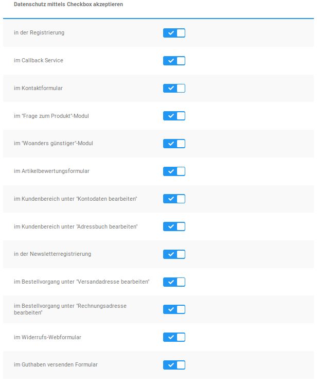

Zudem kann festgelegt werden, ob ein so angezeigter Link um eine Checkbox ergänzt wird. Der Kunde muss in diesem Fall bestätigen, dass dieser die Datenschutzbestimmungen zur Kenntnis genommen hat, bevor er fortfahren kann.

### Allgemeine Geschäftsbedingungen

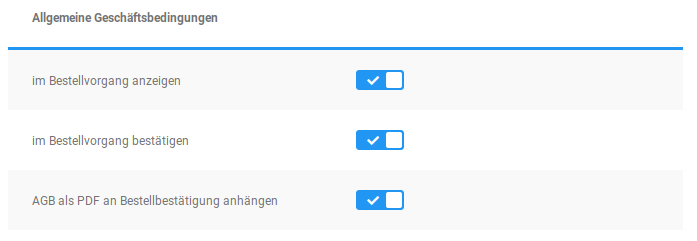

In der Grundkonfiguration werden die Allgemeinen Geschäftsbedinungen \(AGB\) im Bestellvorgang angezeigt und müssen bestätigt werden. Deaktiviere die Kontrollkästchen, wenn die AGB nicht angezeigt werden sollen. Zudem kann eingestellt werden, ob die AGB im PDF-Format als Anhang der Bestellbestätigung versendet werden sollen.

!!! note "HInweis" 
	 Deaktiviere das Kontrollkästchen _**im Bestellvorgang bestätigen**_, wenn du die Anzeige der AGB im Bestellvorgang deaktivierst. Eine Bestellung ist sonst nicht möglich.

### Widerrufsrecht

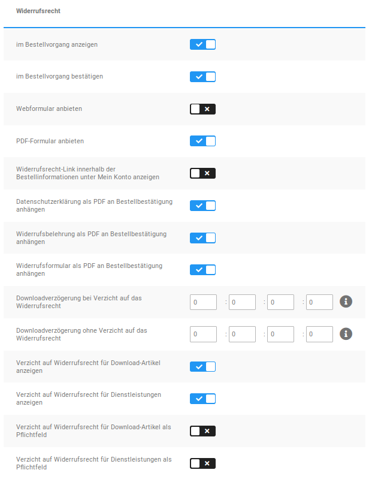

In der Grundkonfiguration wird das Widerrufsrecht im Bestellvorgang angezeigt und muss bestätigt werden. Deaktiviere die Kontrollkästchen, wenn das Widerrufsrecht nicht angezeigt werden soll. Folgende Einstellungen sind möglich:

|Feldname|Beschreibung|
|--------|------------|
|im Bestellvorgang anzeigen|Soll das Widerrufsrecht im Bestellvorgang angezeigt werden?|
|im Bestellvorgang bestätigen|Soll das Widerrufsrecht im Bestellvorgang vom Kunden bestätigt werden?|
|Webformular anbieten|Soll der Link zum Online-Widerrufsformular angezeigt werden?|
|PDF-Formular anbieten|Soll das Widerrufsformular als PDF-Datei zur Verfügung stehen?|
|Widerrufsrecht-Link innerhalb der Bestellinformationen unter Mein Konto anzeigen|Der Abschnitt _**Widerrufsformular**_ wird in den einzelnen Bestellungen unter _**Ihr Konto**_ angezeigt. Dieser beinhaltet die Verweise unter _**Webformular anbieten**_ und _**PDF-Formular anbieten**_.|
|Datenschutzerklärung als PDF an Bestellbestätigung anhängen|Die Datenschutzerklärung wird der Bestellbestätigung als PDF-Anhang hinzugefügt.|
|Widerrufsbelehrung als PDF an Bestellbestätigung anhängen|Die Widerrufsbelehrung wird der Bestellbestätigung als PDF-Anhang hinzugefügt.|
|Widerrufsformular als PDF an Bestellbestätigung anhängen|Das Widerrufsformular wird der Bestellbestätigung als PDF-Anhang hinzugefügt.|
|Downloadverzögerung bei Verzicht auf das Widerrufsrecht|Zeit, bis das Herunterladen eines Download-Artikels möglich ist, wenn auf das Widerrufsrecht verzichtet wurde.|
|Downloadverzögerung ohne Verzicht auf das Widerrufsrecht|Zeit, bis das Herunterladen eines Download-Artikels möglich ist, wenn nicht auf das Widerrufsrecht verzichtet wurde.|
|Verzicht auf Widerrufsrecht für Download-Artikel anzeigen|Auswahl zum Verzicht auf das Widerrufsrecht für Download-Artikel im Bestellvorgang anzeigen?|
|Verzicht auf Widerrufsrecht für Dienstleistungen anzeigen|Auswahl zum Verzicht auf das Widerrufsrecht für Dienstleistungen im Bestellvorgang anzeigen?|
|Verzicht auf Widerrufsrecht für Download-Artikel als Pflichtfeld|Muss bei Download-Artikeln zwangsweise auf das Widerrufsrecht verzichtet werden?|
|Verzicht auf Widerrufsrecht für Dienstleistungen als Pflichtfeld|Muss bei Dienstleistungen zwangsweise auf das Widerrufsrecht verzichtet werden?|

### Datenweitergabe an Transportunternehmen

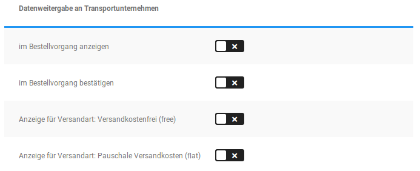

Durch das Setzen des Hakens _**im Bestellvorgang anzeigen**_ wird dem Kunden im Bestellvorgang ein Text angezeigt, mit dem er der Weitergabe seiner Daten an das im Bestellvorgang ausgewählte Transportunternehmen seine Einwilligung erteilen kann. Der angezeigte Text kann bei Bedarf unter _**Darstellung \> Content Manager \> Elemente**_ bzw. _**Inhalte \> Content Manager \> Elemente**_ im Content _**Datenweitergabe an Transportunternehmen**_ angepasst werden.

!!! danger "Achtung"

	 Der Text im Content _**Datenweitergabe an Transportunternehmen**_ enthält einen Codebaustein, über den der Name der ausgewählten Versandart in die Einwilligung eingesetzt wird. Beim Vornehmen von Änderungen sollte daher unbedingt darauf geachtet werden, dass dieser Code nicht versehentlich entfernt wird.

Wenn du den Haken _**im Bestellvorgang bestätigen**_ setzt, wird die Einwilligung zu einem Pflichtfeld, sodass der Kunde seine Einwilligung erteilen muss, um den Bestellvorgang fortsetzen zu können.

Zudem wird für jede installierte Versandart ein Haken angezeigt. Setze den jeweiligen Haken, damit die Einwilligung bei Verwendung der entsprechenden Versandart angezeigt werden kann.

!!! note "Hinweis"

	 Der Hinweis wird nur angezeigt, wenn sowohl die Haken für _**im Bestellvorgang anzeigen**_ als auch die jeweilige\(n\) Versandart\(en\) gesetzt sind.

	 Die Einstellung _**im Bestellvorgang bestätigen**_ greift nur, wenn die Einwilligung auch angezeigt wird.

### Bestellbestätigungs-Seite

Auf der Bestellbestätigungs-Seite werden in der Grundkonfiguration Links zu den aktuell gültigen Datenschutzerklärungen, den AGB und dem Widerrufsrecht angezeigt. Deaktiviere die Kontrollkästchen zu den Texten, die auf der Bestellbestätigung nicht angezeigt werden sollen.

### IP-Logging

Nähere Informationen zum IP-Logging erhältst du im Kapitel _**IP-Logging**_.

### Mehrwertsteuer-Anzeige

In der Grundkonfiguration wird auf allen Seiten die Mehrwertsteuer unterhalb des Artikelpreises angezeigt, von denen aus ein Artikel in den Warenkorb gelegt werden kann. Deaktiviere das Kontrollkästchen _**Mehrwertsteuer unter Artikelpreisen anzeigen**_, wenn du die Anzeige deaktivieren möchtest. Setze den Haken _**für Auch Mehrwertsteuer anzeigen, wenn diese gleich 0 sind**_ wenn du die Mehrwertsteuer ebenfalls anzeigen möchtest, wenn der Steuersatz 0% ist.

### Einwilligungsprotokoll exportieren

Über Klick auf die Schaltfläche _**Exportieren**_ wird eine Liste im CSV-Format erstellt, in der die Zustimmungen deiner Kunden zu den jeweiligen Rechtstexten des Shops aufgeführt werden.

## Einstellungen für Kleinunternehmer

Kleinunternehmer führen in Deutschland unter bestimmten Voraussetzungen keine Umsatzsteuer ab und müssen im Shop daher keine Umsatzsteuer ausweisen. Das Shopsystem bietet eine Funktion an, mit der der Artikelpreis regulär eingegeben, die enthaltene Steuer jedoch nicht ausgewiesen wird.

1.  Aktiviere unter _**Shop Einstellungen \> Allgemeines**_ bzw. _**Einstellungen / Rechtliches / Mehrwertsteueranzeige**_ das Kontrollkästchen _**Kleinunternehmerreglung**_
2.  Installiere unter _**Module \> Zusammenfassung**_ das Modul _**Kleinunternehmerregelung**_
3.  Deinstalliere unter _**Module \> Zusammenfassung**_ das Modul _**MwSt**_.

Bei Artikelpreisen und zukünftigen Bestellungen wird anstatt der Umsatzsteuer ein Hinweis angezeigt, dass die Steuer aufgrund der Kleinunternehmerregelung nicht ausgewiesen wird.

!!! note "Hinweis" 
	 Wähle beim Einstellen von Artikeln auf der Artikel-Detailseite aus der Liste _**Steuersatz**_ den regulären Steuersatz für deine Artikel aus. Wenn die Voraussetzungen nicht mehr erfüllt werden, müssen dadurch nicht alle Artikelpreise neu angelegt werden.
	 

## Verbraucherrechterichtlinie

Mit Inkrafttreten der Verbraucherrechterichtlinie hat es im Shop zahlreiche Veränderungen gegeben. Dieser Teil des Handbuches zeigt dir in einer Schritt-Für-Schritt-Anleitung, wie sich die einzelnen Komponenten einstellen lassen.

!!! danger "Achtung"

	 Das Vorhandensein der Bestandteile ist zur rechtlichen Absicherung deines Shops nicht ausreichend. Die Umsetzung der Verbraucherrechterichtlinie setzt u.a. das Vornehmen verschiedener Konfigurationen voraus. Dieses Kapitel bietet dir eine Übersicht über die Einstellungsmöglichkeiten.
	 
	 
### Einbinden der Rechtstexte

Zuallererst sollten die Rechtstexte zum Widerrufsrecht hinterlegt werden. Dies geschieht unter _**Darstellung \> Content Manager \> Elemente**_ bzw. _**Inhalte \> Content Manager \> Elemente**_, hier stehen mehrere Contents zur Verfügung, über die die Widerrufstexte verwaltet werden. Hierzu zählen die Inhalte _**Widerrufsrecht 1**_ bis _**Widerrufsrecht 4**_ \(ID 3889896 bis 3889899\). Auf diese Contents kann der Widerrufstext, je nach thematischer Abgrenzung, verteilt werden. Er wird dann grafisch unterteilt in separaten Textboxen im Bestellvorgang angezeigt. Es ist nicht notwendig alle Contents zu verwenden, aber der Text muss in mindestens einem dieser Contents hinterlegt werden. Zusammenfassend für die Widerrufstexte steht der Content _**Widerrufsrecht & Muster-Widerrufsformular**_ \(ID 3889895\) im Bereich _**Seiten**_ des Content Managers, unter dem die einzelnen Widerrufstexte kombiniert werden und der ebenfalls eine Download-Möglichkeit für das Widerrufsformular beinhaltet.

!!! danger "Achtung"

	 Der Content _**Widerrufsrecht & Muster-Widerrufsformular**_ dient nur zum Zusammenführen der Texte unter _**Widerrufsrecht 1**_ bis _**Widerrufsrecht 4**_. Bitte trage **keine Texte** unter _**Widerrufsrecht & Muster-Widerrufsformular**_ ein, da diese hier **nicht** vorgesehen sind!

Um deine Texte für das Widerrufsrecht zu hinterlegen, klicke bitte bei einem der Contents _**Widerrufsrecht 1**_ bis _**Widerrufsrecht 4**_ \(ID 3889896 bis 3889899\) auf _**Bearbeiten**_. Nun kann die jeweilige Widerrufsbelehrung in das Textfeld eingefügt werden. Wenn du die Texte über einen externen Anbieter, wie z.B. Janolaw, beziehst, kann die zugehörige Datei über _**Datei wählen**_ eingebunden werden, nachdem die _**Elementart**_ auf _**Skriptdatei**_ umgestellt worden ist. Abschließend setze bitte den Haken bei _**sichtbar**_. Nur wenn der Content sichtbar geschaltet ist, wird er auch angezeigt und verwendet.

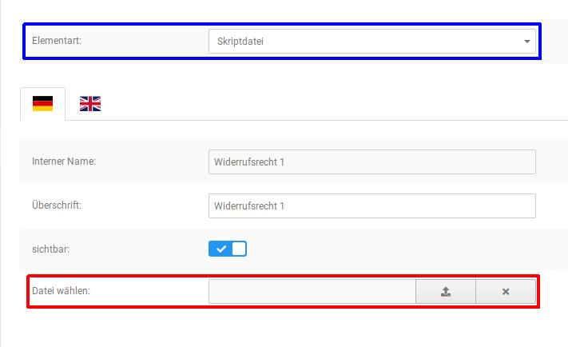

Die Widerrufstexte können im Shop auch als PDF-Datei heruntergeladen werden. Im Normalfall werden diese Dateien im Shop aus den jeweiligen Inhalten der einzelnen Contents \(3889896 bis 3889899\) erzeugt. Alternativ kann jedoch auch eine separate Datei zu diesem Zweck hinterlegt werden. Diese Datei muss nicht zwingend im PDF-Format vorliegen. Beim Bearbeiten des Contents _**Widerrufsrecht & Muster-Widerrufsformular**_ \(ID 3889895\) kann diese über _**Als Download**_ in den Shop hochgeladen werden. Eine Datei, die hier eingestellt wurde, wird anstelle der automatisch generierten PDF zum Download bereitgestellt.

!!! note "Hinweis" 
	 Im Gegensatz zu Texten kann für eine zu hinterlegende PDF-Datei auch der Content _**Widerrufsrecht & Muster-Widerrufsformular**_ \(Gruppe 3889895\) verwendet werden. Dieser Content verfügt auch über eine zusätzliche Einstellungsoption für das _**Muster-Widerrufsformular**_.

Der Shop enthält ein Muster-Widerrufsformular im PDF-Format. Allerdings besteht auch die Möglichkeit, diese Datei durch ein eigenes Formular zu ersetzen. Diese Einstellung kann unter _**Darstellung \> Content Manager**_ bzw. _**Inhalte \> Content Manager**_ im Content _**Widerrufsrecht & Muster-Widerrufsformular**_ \(ID 3889895\) vorgenommen werden.

!!! note "Hinweis" 
	 Weitere Informationen zum Hochladen von Dateien findest du im Kapitel _**Verwenden des Dateimanagers**_.

Lade die Datei, wie bereits beschrieben, über _**Muster-Widerrufsformular**_ in den Shop hoch.

### Festlegen der Versand- & Zahlungsbedingungen

Der Content _**Versand- & Zahlungsbedingungen**_ \(ID 3889891\) verfügt über eine Matrix zur Auflistung der Versandkosten und Zahlungsweisen für die im Shop aktivierten Länder. Im Textfeld wird diese Matrix mit Hilfe des Platzhalters _**\{$shipping\_and\_payment\_ matrix\}**_ eingebunden. Dieser ist standardmäßig im Content vorhanden.

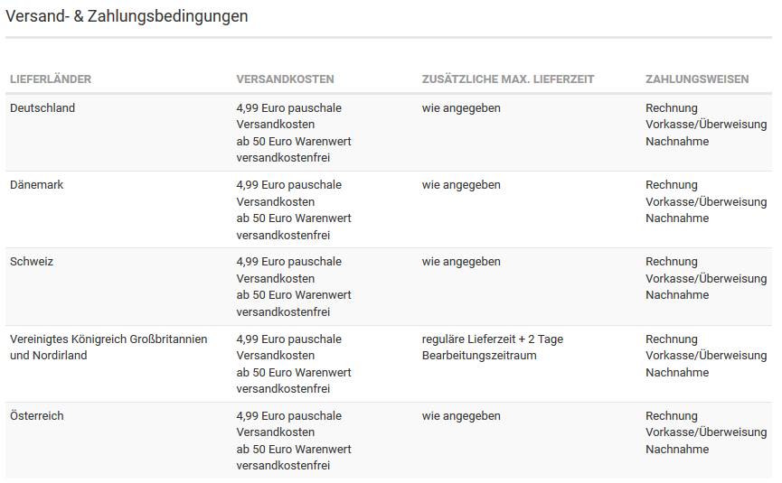

!!! danger "Achtung"

	 Ohne den Plartzhalter _**\{$shipping\_and\_payment\_matrix\}**_ wird die Matrix nicht angezeigt. Dieser Text muss also im Content bestehen bleiben, wenn die Matrix verwendet werden soll.

Um diesen Inhalt für deinen Shop zu erzeugen, öffne _**Darstellung \> Content Manager**_ bzw. _**Inhalte \> Content Manager**_ und bearbeite den Content _**Versand- & Zahlungsbedingungen**_ \(ID 3889891\). Klicke auf die Schaltfläche _**Matrix erzeugen**_, die du links unter dem Texteingabefeld findest.

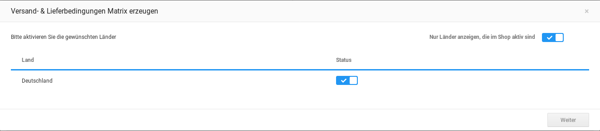

Im ersten Schritt werden die Versandländer bestätigt. Diese werden in alphabetischer Reihenfolge mit ihrem jeweiligen Status aufgelistet. Mit Hilfe des Hakens, der für das Feld _**Nur Länder anzeigen, die im Shop aktiv sind**_ gesetzt werden kann, lässt sich die Auswahl entsprechend einschränken. Aktiviere bzw. deaktiviere die Länder, indem du den zugehörigen Haken in der Spalte _**Status**_ setzt respektive entfernst, um die Zusammenstellung deiner Versandländer festzulegen.

!!! note "Hinweis" 
	 Die für den Versand aktivierten und für die Matrix aktivierten Länder sind unabhängig voneinander. Die in der Matrix als aktiviert angezeigten Länder müssen also nicht zwangsläufig unter _**Shop Einstellungen \> Land/Steuer \> Länder**_ bzw. _**Einstellungen / Sprachen, Länder, Steuern / Sprachen**_ aktiviert sein. Änderungen in einem Bereich haben keine Auswirkungen auf den anderen Bereich.

Mit Klick auf _**Weiter**_ wird die Auswahl bestätigt und die Ansicht wechselt zu den Eingabebereichen der Matrix.

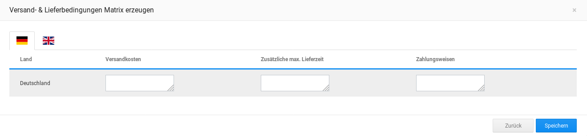

Hier können, für jedes Land individuell, folgende Informationen eingetragen werden

-   Versandhinweise: dieses Feld wird im Shop als _**Versandkosten**_ angezeigt, hier können die einzelnen Versandkosten sowie Hinweise hierzu aufgeführt werden.
-   Zusätzliche max. Lieferdauer
-   Zahlungshinweise: dieses Feld wird im Shop als _**Zahlungsweisen**_ angezeigt, hier werden die verfügbaren Zahlungsmethoden \(z.B. Paypal oder Vorkasse/Überweisung\) sowie Hinweise hierzu aufgeführt.

Die Eintragung kann nach Sprachen getrennt \(standardmäßig deutsch/englisch\) vorgenommen werden. Wenn über die Flaggen links oben zwischen den Sprachen umgeschaltet wird, bleiben die jeweils im anderen Bereich vorgenommenen Eintragungen erhalten.

Mit Klick auf _**Speichern**_ werden die Einstellungen aus beiden Schritten gespeichert. Mit Klick auf _**Zurück**_ wird die Länderauswahl erneut aufgerufen. Auch beim Wechsel zwischen den beiden Bildschirmen bleiben die im jeweils anderen Teil gemachten Einstellungen erhalten.

### Kontaktinformationen

Zu den formalen Inhalten des Widerrufsformulars gehören auch die Kontaktinformationen. Sie werden unter _**Shop Einstellungen \> Mein Shop**_ bzw. _**Einstellungen / Shop / Shopbetreiber**_ eingetragen.

|Feldname|Beschreibung|
|--------|------------|
|Vorname|Der Vorname des Shop-Betreibers|
|Nachname|Der Nachname des Shop-Betreibers|
|Straßenname|Der Straßenname des Firmensitzes|
|Hausnummer|Die Hausnummer des Firmensitzes|
|Postleitzahl|Die Postleitzahl des Firmensitzes|
|Ort|Der Ort des Firmensitzes|
|Telefonnummer|Die Telefonnummer des Shop-Betreibers|
|Faxnummer|Die Faxnummer des Shop-Betreibers|

### Einstellen des Widerrufsrechts

Die Grundeinstellungen zum Widerrufsrecht werden unter _**Shop Einstellungen \>**_ _**Rechtliches**_ bzw. _**Einstellungen / Rechtliches / Widerruf**_ vorgenommen. Hierzu zählen der Reihe nach:

|Feldname|Beschreibung|
|--------|------------|
|Webformular anbieten|Soll der Link zum Online-Widerrufsformular angezeigt werden?|
|PDF-Formular anbieten|Soll das Widerrufsformular als PDF-Datei zur Verfügung stehen?|
|Content ID|ID-Nummer des Haupt-Widerrufs-Contents: 3889895|

!!! note "Hinweis"

	 Diese Einstellung wird nur angezeigt, wenn die vergebene Content ID nicht dem Standardwert 3889895 entspricht.

|Feldname|Beschreibung|
|--------|------------|
|Webformular anbieten|Widerrufsformular zum online ausfüllen anbieten|
|PDF-Formular anbieten|Widerrufsformular zum Herunterladen als PDF anbieten|
|Widerrufsrecht-Link innerhalb der Bestellinformationen unter _**Mein Konto**_ anzeigen|Der Abschnitt _**Widerrufsformular**_ wird in den einzelnen Bestellungen unter _**Ihr Konto**_ angezeigt. Dieser beinhaltet die Verweise unter _**Webformular anbieten**_ und _**PDF-Formular anbieten**_.|
|AGB als PDF an Bestellbestätigung anhängen|Die Allgemeinen Geschäftsbedingungen werden der Bestellbestätigung als PDF-Anhang hinzugefügt.|
|Widerrufsbelehrung als PDF an Bestellbestätigung anhängen|Die Widerrufsbelehrung wird der Bestellbestätigung als PDF-Anhang hinzugefügt.|
|Widerrufsformular als PDF an Bestellbestätigung anhängen|Das Widerrufsformular wird der Bestellbestätigung als PDF-Anhang hinzugefügt.|
|Downloadverzögerung bei Verzicht auf das Widerrufsrecht|Zeit, bis das Herunterladen eines Download- Artikels möglich ist, wenn auf das Widerrufsrecht verzichtet wurde.|
|Downloadverzögerung ohne Verzicht auf das Widerrufsrecht|Zeit, bis das Herunterladen eines Download-Artikels möglich ist, wenn nicht auf das Widerrufsrecht verzichtet wurde.|
|Verzicht auf Widerrufsrecht für Download-Artikel als Pflichtfeld|Muss bei Download-Artikeln zwangsweise auf das Widerrufsrecht verzichtet werden?|
|Verzicht auf Widerrufsrecht für Dienstleistungen als Pflichtfeld|Muss bei Dienstleistungen zwangsweise auf das Widerrufsrecht verzichtet werden?|

Lege hier fest, in welchem Format du das Widerrufsformular anbieten möchtest, als PDF-Download und/oder Online-Formular. Stelle ein, ob die Verlinkung zum Widerrufsrecht unter _**Ihr Konto**_ angezeigt werden soll. Außerdem kannst du wählen, welche deiner Rechtsinformationen \(AGB, Widerrufsbelehrung, Widerrufsformular\) der Bestellbestätigung als Anhang beigegeben werden soll. Zudem kann eingestellt werden, ob der Verzicht auf das Widerrufsrecht bei Download-Artikeln oder Dienstleitungen als Pflichtangabe gemacht werden soll. Schlussendlich kannst du die sogenannte Downloadverzögerung festlegen, sowohl mit als auch ohne den Verzicht auf das Widerrufsrecht.

### Artikeltyp festlegen

Nach der Verbraucherrechterichtlinie wird bei im Shop vorhandenen Artikeln nach Standard- Artikeln \(materiellen Produkten\), Download-Artikeln und Dienstleistungen unterschieden. Diese Klassifizierung ist shopseitig notwendig, um bei Downloads und Dienstleistungen ggf. auf das Widerrufsrecht verzichten zu können. Zudem besteht die Möglichkeit, den genannten Verzicht als Pflichteingabe im Bestellprozess festzulegen.

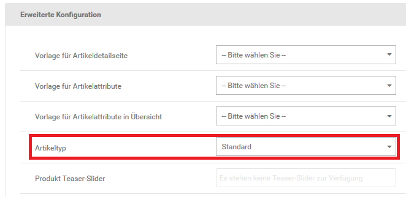

Um die Einstellung in deinen Artikeln vorzunehmen, bearbeite diese unter _**Artikel \> Artikel/Kategorien**_. Alternativ kann auch die Schaltfläche _**Produkt bearbeiten**_ in der Artikeldetailansicht verwendet werden.

Die Klassifizierung erfolgt über das Dropdown-Menü _**Artikeltyp**_. Hier kann zwischen _**Standard**_, _**Download**_ und _**Dienstleistung**_ gewählt werden. Die Voreinstellung beim Anlegen eines neuen Artikels ist _**Standard**_.

Die genannte Einstellung ist auch Bestandteil von Importen und Exporten unter _**Artikel \> CSV Import/Export**_ bzw. _**Import/Export \> Artikeldaten\(alt\)**_. Hier wird das Feld product\_type für die entsprechende Angabe verwendet, für die einzelnen Auswahlmöglichkeiten \(Deutsch/Englisch\) stehen folgende Zahlenwerte:

|Wert|Bedeutung|
|----|---------|
|1|Standard/Default|
|2|Download/Download|
|3|Dienstleistung/Service|

Unter _**Import/Export \> Artikeldaten**_ bzw. _**Artikel \> Import/Export**_ trägt die Spalte die Bezeichnung _**p\_type**_.

### Lieferzeiten kennzeichnen

Die Angabe der Lieferzeit wurde um den Link _**Ausland abweichend**_ erweitert. Dieser Link verweist auf die Seite _**Versand- & Zahlungsbedingungen**_ und informiert deine Kunden darüber, dass die angegebenen Lieferzeiten nicht für den Versand ins Ausland gelten.

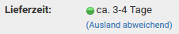

Die Anzeige dieses Links kann unter _**Shop Einstellungen \> Lieferstatus**_ bzw. _**Einstellungen / Lieferung / Lieferstatus**_ nach aufrufen der Seite für jeden einzelnen Status aktiviert bzw. deaktiviert werden. Wähle hierzu den jeweiligen Status aus und klicke auf die Schaltfläche _**Bearbeiten**_.

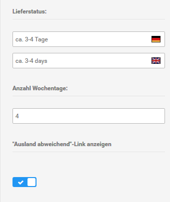

## Cookie Hinweis

Der Cookie Hinweis kann unter _**Shop Einstellungen \> Rechtliches**_ über den Reiter _**Cookie Hinweis**_ konfiguriert werden. Der Hinweis erscheint beim ersten Aufruf des Shops und kann durch den Kunden bestätigt oder \(je nach Konfiguration\) geschlossen werden. Zur Bestätigung des Hinweises wird ein eigener Button angezeigt, dessen Beschriftung du frei festlegen kannst.

!!! note "Hinweis"

	 Wenn eine andere Seite des Shops oder die Startseite nochmals geladen wird, erfolgt keine erneute Anzeige des Cookie Hinweises.

	 Um die Funktion und/oder Darstellung bei Bedarf zu testen, empfehlen wir den Browser-Cache und die Cookies zu löschen oder wahlweise ein privates Browser-Fenster zu verwenden. Auf diese Weise wird der Shop wie beim ersten Aufruf geladen.

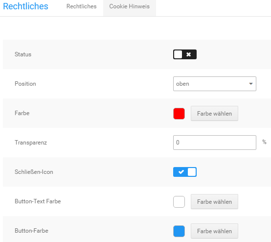

Folgende Einstellungen können allgemein vorgenommen werden:

-   Status: setzen des Hakens \(✔\) zum Aktivieren des Cookie-Hinweises, entfernen \(✖\) zum Deaktvieren
-   Position: oben/unten, Cookie Hinweis wird wahlweise am oberen oder unteren Bildschirmrand angezeigt

    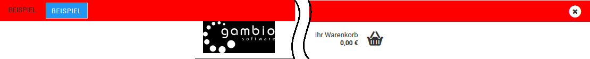

-   _**Farbe**_: hierüber kann die Hintergrunfarbe des Hinweises eingestellt werden
-   _**Transparenz**_: Transparenz der Hintergrundfarbe in Prozent \(0 - 100\)
-   _**Schließen-Icon**_: ist der Haken gesetzt \(✔\) wird ein x-Symbol zum Schließen des Hinweises angezeigt
-   _**Button-Text-Farbe**_: Farbe für die Beschriftung der Schaltfläche
-   _**Button-Farbe**_: Hintergrundfarbe der Schaltfläche

Folgende Einstellungen sind sprachabhängig. Klicke eine der Landesflaggen an, um die Einstellungen für die jeweilige Sprache vorzunehmen.

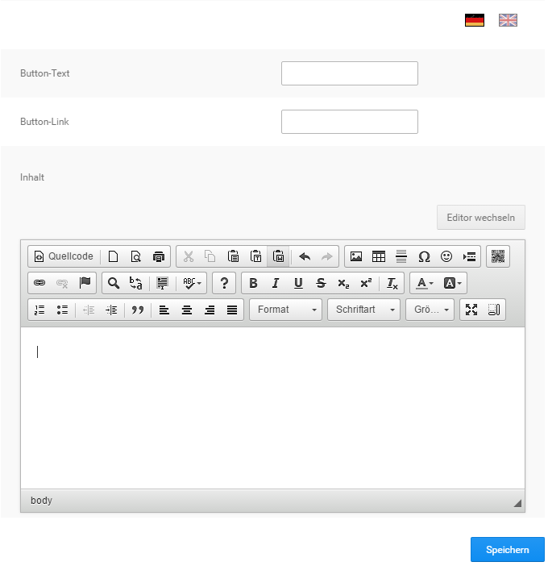

-   _**Button-Text**_: Beschriftung des Buttons zur Bestätigung des Cookie Hinweises
-   _**Button-Link**_: Link der beim Anklicken des Buttons aufgerufen werden kann
-   _**Inhalt**_: Hier kann der Text für den Cookie Hinweis hinterlegt werden

!!! note "Hinweis" 
	 Eine Übersicht über die einzelnen Schaltflächen des Editor-Fensters findest du im Kapitel _**CK-Editor**_ unter _**Funktionsübersicht**_

Bestätige alle gemachten Änderungen mit Klick auf Speichern.