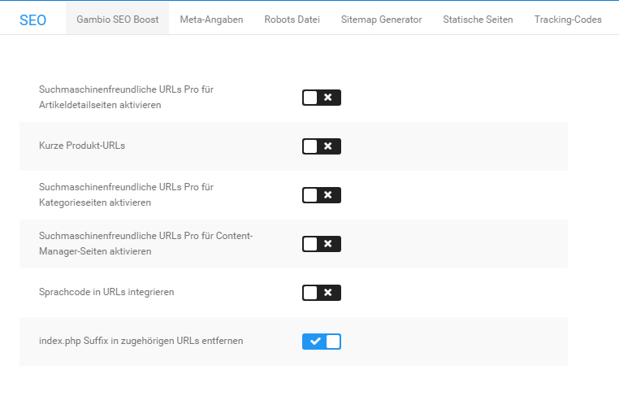

# Gambio SEO Boost

Das Shopsystem kann die URLs der Artikelseiten in einer für Suchmaschinen besser lesbare Form darstellen. Die lesbaren URLs kannst du unter _**Shop Einstellungen \> SEO \> Gambio SEO Boost**_ bzw. _**Einstellungen / Suchmaschinenoptimierung / SEO URLs**_ separat für Artikel-, Kategorie- und Inhaltsseiten einstellen. Die Funktion für lesbare URLs greift auf die Funktionen von mod\_rewrite zurück.

!!! danger "Achtung"

	 Gambio SEO Boost kann nur auf Servern verwendet werden, die mod\_rewrite unterstützen. Wenn du Gambio SEO Boost auf einem Server ohne mod\_rewrite aktivierst, ist dein Onlineshop nicht mehr aufrufbar!

## Gambio SEO Boost aktivieren

Verbinde dein FTP-Programm mit deinem FTP-Server. Wechsele in das Hauptverzeichnis deines Shops und stelle sicher, dass sich dort die Datei _**.htaccess**_ befindet. Ist dies nicht der Fall, lade bitte die Datei _**.htaccess**_ aus dem Instalaltionspaket deiner Shopsoftware in das Hauptverzeichnis deines Shops. Du findest die Datei im **Installationspaket** unter _**/Shopsystem/Dateien/**_

!!! note "Hinweis" 
	 Wenn dir die .htaccess-Datei nicht angezeigt wird, ist dein FTP-Programm gegebenenfalls so konfiguriert, dass unsichtbare Dateien ausgeblendet werden. Wie du die Funktion deaktivieren kannst, erfährst du beim Hersteller deines FTP-Programms. Wenn die Datei auch mit der aktivierten Darstellung unsichtbarer Dateien nicht angezeigt werden kann, lade die Datei aus dem entsprechenden Verzeichnis von der Installations-CD oder dem Installation-Archiv in das Hauptverzeichnis deines Shops auf deinen FTP-Server hoch.

Aktiviere im Administrationsbereich deines Shops unter _**Shop Einstellungen \> SEO \> Gambio SEO Boost**_ bzw. _**Einstellungen / Suchmaschinenoptimierung / SEO URLs**_ die Kontrollkästchen für die Seitentypen, die mit lesbaren URLs dargestellt werden sollen. Wenn du den jeweiligen Ländercode innerhalb des Adresspfades deines Shops verwenden möchtest, setze bitte ebenfalls den Haken für _**Ländercode in URLs integrieren**_. Über die Einstellung _**index.php Suffix in zugehörigen URLs entfernen**_ kannst du festlegen, ob deine Startseite mit oder ohne die Angabe _**index.php**_ in der Adresszeile geladen wird. Klicke abschließend auf _**Speichern**_.

Leere die Caches für die Seiten- und Modulausgabe unter _**Toolbox \> Cache**_.

