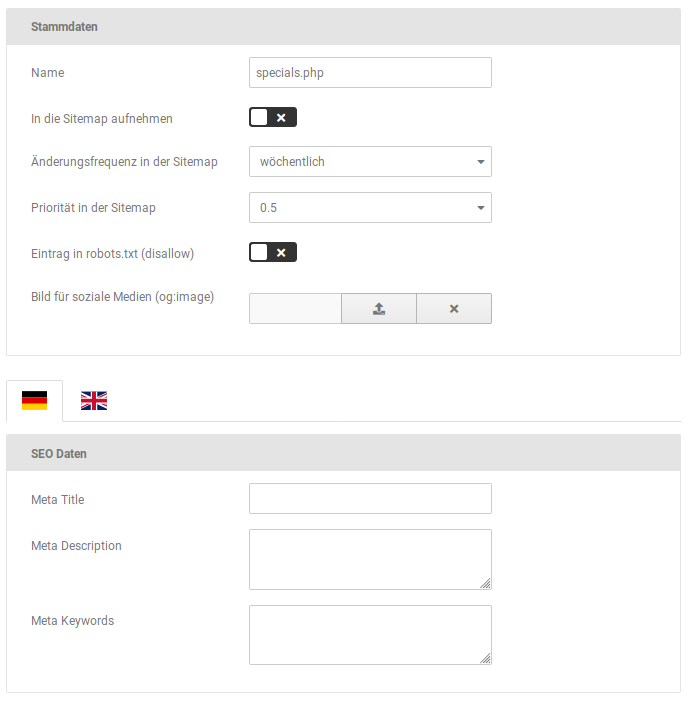

# Statische Seiten

_**Statische Seiten**_ bezeichnet Teiles des Shops, die mit vordefiniertem Inhalt gefüllt werden und daher nicht frei konfiguriert werden können. Unter _**Shop Einstellungen \> SEO \> Statische Seiten**_ bzw. unter _**Einstellungen / Suchmaschinenoptimierung / **_ _**Statische Seiten**_, nach Aufruf der Seite, kann festgelegt werden ob diese Seiten in die Sitemap respektive die Robots- Datei aufgenommen werden sollen. Diese sind der Reihe nach:

|Name|Seite im Shop|Sitemap \(Voreinstellung\)|Robots-Disallow \(Voreinstellung\)|
|----|-------------|--------------------------|----------------------------------|
|specials.php|Übersichtsseite der Sonderangebote|||
|products\_new.php|Übersichtsseite der neuen Artikel|||
|login.php|die Seite 'Melden Sie sich an' über die wahlweise eingeloggt oder ein neues Konto erstellt werden kann|||
|password\_double\_opt.php|Bestätigungsseite beim Anfordern eines neuen Passworts|||
|wish\_list.php|Merkzettel|||
|shopping\_cart.php|Warenkorb|||
|advanced\_search\_result.php|Suchergebnisseite der erweiterten Suche|||
|advanced\_search.php|Erweiterte Suche|||
|newsletter.php|Newsletter-Anmeldung|||
|index.php|Startseite \(direkter Aufruf der zugehörigen PHP-Datei\)|||

## Seiten in Sitemap und Robots-Datei aufnehmen

Setze einen Haken, um die jeweilige Seite in die Sitemap bzw. Robots-Datei aufnehmen zu lassen. Entfernst du den Haken, wird der Eintrag aus der jeweiligen Datei entfernt.

!!! note "Hinweis" 
	 Nachdem eine Änderung vorgenommen worden ist, muss die Sitemap bzw. Robots- Datei neu erzeugt werden, damit diese wirksam wird \(siehe Kapitel _**Sitemap**_ bzw. _**Robots- Datei**_\).

!!! danger "Achtung"

	 Beim Vornehmen dieser Einstellungen solltest du dir immer den Sinn und Zweck der jeweiligen Datei vor Augen halten: die Sitemap erleichtert den Zugang der Suchmaschine, die Robots-Datei blockiert den Zugang.

	 Wenn eine Seite von der Suchmaschine aufgenommen werden soll, muss die Einstellung für die Sitemap also ✔ und für die Robots-Datei ✖ sein.

## Meta-Informationen für statische Seiten bearbeiten

Unter _**Shop Einstellungen \> SEO \> Statische Seiten**_ bzw. unter_** Einstellungen / Suchmaschinenoptimierung / Statische Seiten**_, nach Aufruf der Seite, können die Meta-Informationen für die betreffenden Seiten festgelegt werden. Bewege hierzu den Mauszeiger in die jeweilige Zeile, es werden die Symbole \(bearbeiten, löschen\) angezeigt.

Klicke auf das Bleistift-Symbol, um einen Eintrag zu bearbeiten. Es stehen die folgenden Einstellungen zur Verfügung:

|Feldname|Beschreibung|
|--------|------------|
|Name|Dateiname der statischen Seite|
|In die Sitemap aufnehmen|ist der Haken gesetzt, wird die Seite in die Sitemap aufgenommen|
|Änderungsfrequenz in der Sitemap|Vorgabe wie oft die Seite von Suchmaschinen auf Änderungen geprüft werden soll \(nur Richtwert, der tatsächliche Zeitraum liegt im Ermessen des Suchmaschinenbetreibers\)|
|Priorität in der Sitemap|Wichtigkeit der Seite im Vergleich zum Rest des Shops, von 0.0 \(relativ unwichtig\) bist 1.0 \(sehr wichtig\)|
|Eintrag in robots.txt \(disallow\)|ist der Haken gesetzt, wird die Seite in die Robots-Datei aufgenommen|
|Bild für soziale Medien \(og:image\)|Bild für soziale Medien, wird mit einem Open Graph Meta-Tag eingebunden|
|Meta Title|Titel der Seite, wird auch im Browser-Tab angezeigt|
|Meta Description|Beschreibung der Seite, freier Text|
|Meta Keywords|Schlagwörter, unter denen die Seite von Suchmaschinen gefunden werden soll \(kommagetrennt, ohne Leerzeichen\)|

## Statische Seite erstellen

Über die Schaltfläche _**Erstellen**_ können weitere Einträge für statische Seiten hinzugefügt werden. Es ist also möglich Seiten des Shops, die bisher nicht aufgenommen worden oder neu hinzugekommen sind, zu ergänzen.

Es stehen die gleichen Einstellungsmöglichkeiten wie beim Bearbeiten einer bestehenden Sitemap zur Verfügung \(siehe vorheriges Kapitel _**Meta-Informationen für statische Seiten bearbeiten**_\).

!!! note "Hinweis" 
	 Eigene PHP-Seiten können nicht auf diese Weise mit Meta-Informationen versehen werden. Es ist jedoch eine Aufnahme in die Sitemap bzw. die Robots-Datei möglich.