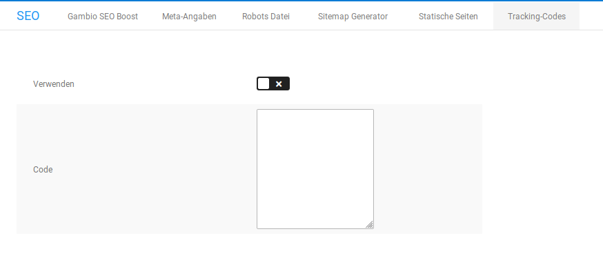

# Tracking-Codes

Mit der Funktion _**Tracking-Codes**_ unter _**Shop Einstellungen \> SEO \> Tracking-Codes**_ bzw. unter _**Einstellungen / Suchmaschinenoptimierung / Tracking Codes**_, nach Aufruf der Seite, kannst du einfache Tracking-Codes in deinen Onlineshop einbinden. Beim Tracking \(Aufzeichnen\) werden Seitenbesuche und das Besucherverhalten deiner Kunden in deinem Shop aufgezeichnet. Die statistische Auswertung wird mit speziellen Programmen vorgenommen. Zum Aufzeichnen der Seitenbesuche wird in der Regel ein Javascript-Code benötigt.

1.  Trage im Feld _**Code**_ den Javascript-Code zu deinem Tracking-Anbieter ein

    Achte darauf, dass die HTML-Tags _**script**_ am Anfang und _**/script**_ am Ende deines Codes erhalten bleiben.

2.  Aktiviere die Option _**Verwenden**_, um das Tracking zu aktivieren. Schalte die Option ab, um das Tracking zu deaktivieren.
3.  Speichere die Änderungen

!!! note "Hinweis" 
	 Erweitertes Tracking, wie beispielsweise Conversion Tracking, kann über die Funktion _**Tracking-Codes**_ nicht eingebunden werden.

!!! danger "Achtung"

	 Beim Tracking werden Daten deiner Kunden aufgezeichnet. Gegebenenfalls sind beim Verwenden eines Trackings Änderungen an deinen Datenschutzbestimmungen nötig. Bitte wende dich dahingehend an deinen Rechtsberater.

