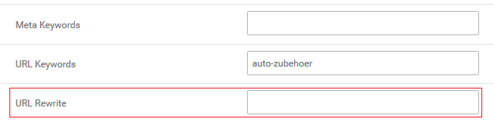
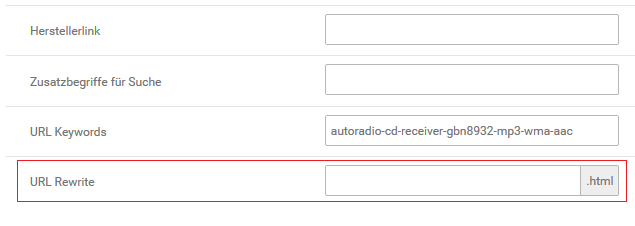
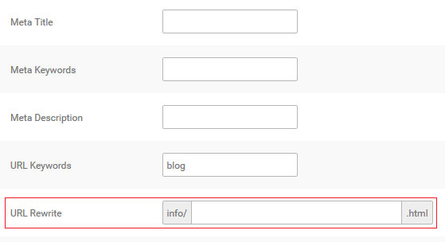

# URL Rewrite

Über _**URL Rewrite**_ können die URLs zu Artikeln, Kategorien und Content-Seiten individuell angepasst werden. Die URL der jeweiligen Seite ist unabhängig von bestehenden URL Keywords.

!!! danger "Achtung"

	 Die Funktion _**URL Rewrite**_ arbeitet nur mit aktiviertem _**Gambio SEO Boost**_.

Du kannst den Teil der URL anpassen, der direkt hinter deiner Shop-Domain \(bzw. direkt hinter dem Ländercode\) in der Adresszeile deines Browsers angezeigt wird.

!!! note "Hinweis" 
	 Content-Seiten werden immer mit einem führenden _**/info/**_ aufgerufen. Content- und Artikelseiten schließen immer mit einem _**.html**_ ab - beides ist fest vorgegeben und muss nicht händisch eingetragen werden. Bei der mehrfachen Verwendung des gleichen Eintrags wird zudem automatisch die ID angehängt.

Bearbeite hierzu den betreffenden Artikel, Content bzw. die betreffende Kategorie und nimm im Feld _**URL Rewrite**_ den Eintrag für den neuen Adresspfad vor. Hierbei sollte beachtet werden, dass die Shop-Domain **nicht** Bestandteil des Rewrites ist.

!!! note "Hinweis" 
	 Trage die neue URL ohne führenden / ein, dieser wird automatisch gesetzt.

Zudem gilt die Änderung jeweils nur für eine Seite. Wenn du beispielsweise die URL einer Kategorie änderst, wird diese Änderung nur für den direkten Aufruf dieser Kategorie wirksam. Sobald eine Unterkategorie oder ein Artikel aufgerufen wird, wird wieder die ursprüngliche URL verwendet.

!!! example "Beispiel" 
	 Du verkaufst Blusen und Hemden in den Kategorien _**Oberbekleidung \>\> Damen**_ bzw. _**Oberbekleidung \>\> Herren**_. Dann würde z.B. folgende SEO Boost-URLs für die Kategorien verwendet werden:

	 www.shop.de/Oberbekleidung/Damen

	 www.shop.de/Oberbekleidung/Herren

	 Um den Aufruf zu vereinfachen, bearbeitest du jeweils die Unterkategorien _**Damen**_ und _**Herren**_ und trägst unter _**URL Rewrite**_ als Kategoriepfad _**Blusen**_ bzw. _**Hemden**_ ein. Nach der Änderung würden die die Kategorien unter

	 www.shop.de/Blusen

	 www.shop.de/Hemden

	 aufgerufen.

Nach dem Speichern sollten, je nach Änderung, unter _**Toolbox \> Cache**_ die Caches für

1.	Artikel- und Kategoriezuordnungen
2.	Modulinformationen und
3.	Seitenausgabe

geleert bzw. neu erzeugt werden.

