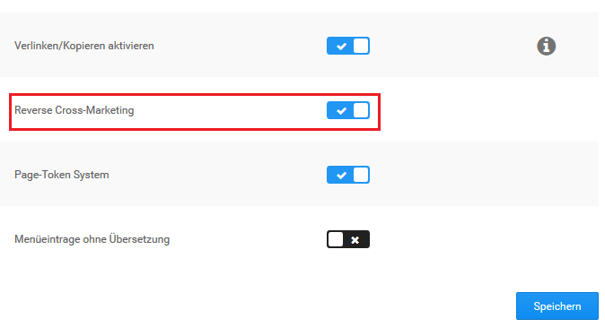
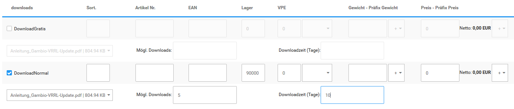
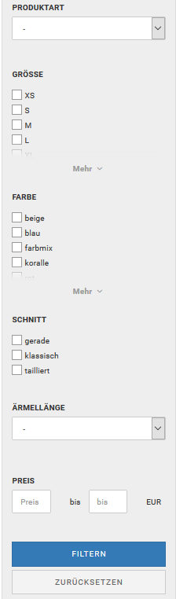

# Zusatzfunktionen

## Cross Selling

Cross Selling ist eine Marketing-Funktion, mit der du einem Artikel weitere Artikel als Empfehlung hinzufügst. Die Empfehlungen werden im Shopbereich unterhalb der Artikelbeschreibung angezeigt.

")

### Artikelempfehlung hinzufügen

1.  Markiere den Artikel, zu dem du Empfehlungen hinzufügen möchtest
2.  Klicke auf _**Cross Selling**_
3.  Trage im Feld _**Produktsuche**_ eine Artikelnummer oder einen Artikelnamen ein, den du zum gewählten Artikel empfehlen möchtest und klicke auf _**Suchen**_
4.  Aktiviere das Kontrollkästchen in der Spalte _**Hinzufügen**_ bei den gefundenen Artikeln, die du zum gewählten Artikel empfehlen möchtest
5.  Klicke auf _**Speichern**_

### Artikelempfehlung löschen

1.  Markiere den Artikel, aus dem du Empfehlungen löschen möchtest
2.  Klicke in der rechten Spalte auf _**Cross Selling**_
3.  Aktiviere das Kontrollkästchen in der Spalte _**Löschen**_ bei den Empfehlungen, die du löschen möchtest
4.  Klicke auf _**Speichern**_ und bestätige das Speichern der Änderungen mit _**OK**_

### Automatische Rückverknüpfung

Artikelempfehlungen werden in der Grundeinstellung des Shopsystems automatisch in beide Richtungen verknüpft. Im empfohlenen Artikel wird der ursprüngliche Artikel auf der Artikel-Detailseite unter _**Dieses Produkt ist kompatibel zu**_ angezeigt. Die automatische Rückverknüpfung kannst du im Gambio Admin deines Shops unter _**Shop Einstellungen \> Zusatzmodule**_ bzw. _**Einstellungen / Layout / Design / Artikeldetailseite**_ deaktivieren. Ändere die Option bei _**Reverse Cross-Marketing**_ auf ✖ und speichere die Änderung.

Wenn du die automatische Rückverknüpfung deaktiviert hast und die Funktion reaktivieren möchtest, ändere die Option bei _**Reverse Cross-Marketing**_ auf ✔ und speichere die Änderung.

## Cross-Marketing Gruppen

Mit Hilfe von Cross-Marketing Gruppen können Cross Selling Artikel mit einem Gruppen-Bezeichner versehen werden.

!!! note "Hinweis"

	 Cross-Marketing Gruppen sind rein optische Textauszeichnungen. Es ist z.B. standardmäßig nicht möglich, Gruppen von Cross Selling Artikeln einem anderen Artikel zuzuordnen.

### Cross-Marketing Gruppe anlegen

Um eine Cross-Marketing-Gruppe anzulegen, gehe im Gambio Admin unter _**Artikel \> Cross-Marketing Gruppen**_ und klicke auf die grüne Schaltfläche _**Erstellen**_.

Du kannst den Gruppennamen jeweils pro im Shop vorhandener Sprache eintragen.

Bestätige die Eingabe mit einem Klick auf _**Einfügen**_. Über _**Abbrechen**_ kannst du die Eingabemaske wieder verlassen, ohne die Eingabe zu übernehmen.

### Cross-Marketing Gruppe bearbeiten

Um eine Cross-Marketing Gruppe zu bearbeiten, wähle diese unter _**Artikel \> Cross-Marketing Gruppen**_ aus und klicke auf die Schaltfläche _**Bearbeiten**_, in der rechten, unteren Bildschirmecke. Klicke auf _**Aktualisieren**_. um die Änderungen zu übernehmen. Über _**Abbrechen**_ verlässt du die Eingabemaske wieder, ohne die Eingaben zu speichern.

### Cross-Marketing Gruppe löschen

Um eine Cross-Marketing Gruppe zu löschen, wähle diese unter _**Artikel \> Cross-Marketing Gruppen**_ aus und klicke auf die Schalftlfäche _**Löschen**_ in der rechten, unteren Bildschirmecke. Bestätige die Sicherheitsabfrage mit einem erneuten Klick auf _**Löschen**_, um die Cross-Marketing Gruppe zu entfernen. Über _**Abbrechen**_ verlässt du den Dialog, ohne die Gruppe zu löschen.

### Cross-Marketing Gruppe einstellen

Cross-Marketing Gruppen können nach dem Hinzufügen, beziehungsweise beim Bearbeiten, von Cross Selling Artikeln eingestellt werden.

Wähle hierzu den gewünschten Eintrag aus dem Dropdownmenü _**Gruppe**_ aus, setze ggf. den Haken für _**hinzufügen**_ und bestätige mit _**Speichern**_ respektive Aktualisieren.

## Downloadartikel

!!! danger "Achtung"

	 Downloadartikel setzen die Verwendung des Attribut-Systems voraus. Es sollte daher sichergestellt werden dass unter _**Module \> Modul-Center**_ das Modul _**Artikelattribute**_ installiert ist.

Das Erstellen von Download-Artikeln wird im Shop über das Attribut-System ermöglicht. Gehe zunächst unter _**Artikel \> Artikelattribute**_, hier sollte das Attribut _**downloads**_ vorhanden sein. Ist dies nicht der Fall, lege es bitte an. Gehe hierzu wie folgt vor:

In der oberen Tabelle findest du die Spalte _**Artikelmerkmal-Bezeichnung**_. Scrolle bis zum unteren Ende, hier findest du die Eingabefelder _**de:**_ und _**en:**_. Trage unter _**de:**_ den Begriff _**downloads**_ ein, achte hierbei bitte auf die Kleinschreibung und das s am Ende. Klicke auf _**Einfügen**_ um das Attribut hinzuzufügen.

Im zweiten Schritt scrolle bitte an das Ende der Tabelle _**Optionswerte**_. Wähle im Dropdown der Spalte _**Artikelmerkmal-Bezeichnung**_ das Attribut _**downloads**_ aus und trage im Feld _**de:**_ eine Beschreibung ein, z.B. _**PDF-Download**_ oder dergleichen. Klicke auf _**Einfügen**_ um den Optionswert hinzuzufügen.

Beim Anlegen des zugehörigen Artikels unter _**Artikel \> Artikel/Kategorien**_ gibt es nur wenige Unterschiede zu einem physischen Artikel. Zum Einen sollte die Einstellung _**Artikeltyp**_ im Bereich _**Erweiterte Konfiguration**_ von _**Standard**_ auf _**Download**_ geändert werden. Zum Anderen ist es vorgesehen, unter _**Preisoptionen**_ die Einstellung _**Steuerklasse**_ von _**Standard**_ auf _**elektronisch erbrachte Leistung**_ zu setzen.

!!! danger "Achtung"

	 Bitte beachte, dass wir dir hinsichtlich der Steuer-Einstellungen nur die gängigen Voreinstellungen nennen können, die für die meisten Shopbetreiber anwendbar sind. Wie du für deinen individuellen Shop verfahren musst und ob es hierbei Besonderheiten gibt, die berücksichtigt werden müssen, erfrage bitte bei deinem Steuerberater oder Rechtsbeistand.

Um die Datei im Shop zur Verfügung stellen zu können, muss sie auf den FTP-Server hochgeladen werden. Verbinde dich hierzu mit deinem FTP-Server und wechsele in dein Shop-Verzeichnis. Lade die Datei in den Ordner _**download**_ hoch.

Um den Download-Artikel einzurichten, muss das passende Attribut zugeordnet werden. Wähle hierzu den Artikel unter_** Artikel \> Artikel/Kategorien**_ aus und wähle _**Attribute editieren**_ über die Dropdown-Schaltfläche oder verwende die Auswahl unter _**Artikel \> Artikelattribute \> Attributverwaltung**_. Du siehst eine Auflistung aller Attribute, die dem Artikel zugeordnet werden können. Ein Aufruf ist auch direkt aus de Artikelmaske, über den Dropdown-Button _**Attribute**_ möglich.

Setze den Haken bei der von dir gewählten Bezeichnung, in unserem Beispiel also bei _**PDF-Download**_. Die vorher ausgegrauten Eingabefelder zur Einrichtung von Attributen werden nun angezeigt. Unterhalb dieser Zeile finden sich zudem Einstellungen, die nur für Download-Artikel zur Verfügung stehen.

Trage im Feld _**Lager**_ einen fiktiven Lagerstand ein, dieser wird benötigt, damit der Artikel heruntergeladen werden kann. Wenn du andere Attribute verwendest und den Lagerstand abziehst, sollte der Wert entsprechend hoch gewählt werden.

Im Dropdown-Menü unterhalb des Namens _**PDF-Download**_ kannst du die vorher hochgeladene Datei auswählen.

!!! note "Hinweis" 
	 Wenn die Datei nicht angezeigt wird, kann ein Problem mit dem Dateinamen vorliegen. Prüfe in diesem Fall, ob dieser Umlaute oder Sonderzeichen enthält und ändere diese entsprechend ab.

Unter _**Mögl. Downloads**_ wird hinterlegt, wie oft die Datei von einem Kunden heruntergeladen werden kann. Unter _**Downloadzeit \(Tage\)**_ wird festgelegt, wie lange der Download-Link für den jeweiligen Kunden gültig ist. Beide Einträge müssen vorgenommen werden und größer als 0 sein, damit die Datei vom Kunden heruntergeladen werden kann.

Der Download-Link wird für den Kunden verfügbar, sodass er den Artikel in seinem Konto herunterladen kann, wenn ein bestimmter Bestellstatus erreicht wurde. Diesen kannst du selber unter _**Shop Einstellungen \> Download-Optionen**_ bzw. _**Einstellungen / Artikel & Kategorien / Downloadoptionen**_ im Bereich _**Download-Bestellstatus**_ festlegen. Du kannst wahlweise einen \(oder mehrere\) bestehende\(n\) Bestellstatus verwenden oder einen neuen Status \(z.B. _**Download erlaubt**_\) unter _**Bestellungen \> Bestellstatus**_ zu diesem Zweck anlegen.

!!! note "Hinweis" 
	 Über die Einstellung _**Download Zahlungsmodule**_ unter _**Shop Einstellungen \> Download-Optionen**_ bzw. _**Einstellungen / Artikel & Kategorien / Downloadoptionen**_ kannst du festlegen, welche Zahlungsweisen bei Download-Artikeln nicht verwendet werden dürfen. Standardmäßig sind hier die Module _**banktransfer**_, _**cod**_, _**invoice**_ und _**moneyorder**_ eingetragen.

!!! danger "Achtung"

	 Die Einstellung _**Download durch Weiterleitung**_ ist standardmäßig abgeschaltet. Sie sollte nur verwendet werden, wenn dies unbedingt erforderlich ist.

Setze die Einstellungen im Bereich _**Download-Bestellstatus**_ unter _**Shop Einstellungen \> Download-Optionen**_ bzw. _**Einstellungen / Artikel & Kategorien / Downloadoptionen**_ für die Bestellstatus, mit denen du einen Download ermöglichen möchtest. Wenn du den Status der Bestellung änderst, z.B. nach einem bestätigen Zahlungseingang, kannst du deinen Kunden über die Benachrichtigungsfunktion innerhalb der Bestellung \(_**Bestellstatus ändern**_, Haken setzen für _**Kunde benachrichtigen**_ und _**Kommentare mitsenden**_\) darüber informieren, dass der Download nun zur Verfügung steht.

Bei Zahlung per Zahlungsweisen mit sofortiger Transaktionsbestätigung wie PayPal oder Sofortüberweisung, kann der Kunde den Artikel direkt nach Abschluss der Bestellung herunterladen. Achte hierbei darauf, dass der betreffende Status unter _**Shop Einstellungen \> Download-Optionen**_ bzw. _**Einstellungen / Artikel & Kategorien / Downloadoptionen**_ aktiviert ist.

Bei Zahlung per PayPal kannst du unter _**Module \> Zahlungsweisen \> PayPal**_ und _**PayPal Plus \> Konfiguration \> Experteneinstellungen**_ unter _**Bestellstatusänderungen nach Aktionen**_ einen Bestellstatus auswählen, der nach erfolgreicher Bestellung automatisch zugewiesen wird. Wenn du einen eigenen Status verwendest kann dieser hier eingestellt werden \(z.B. _**Download erlaubt**_\). Nach erfolgreicher Bestellung mit Zahlung über PayPal wird im Konto des Kunden der Downloadlink zum Herunterladen der hinterlegten Datei freigeschaltet.

## Artikel-Filter

Filter dienen dazu, die Artikel in deinem Shop zu strukturieren und dem Kunden die Möglichkeit zu geben, gezielt zu den gewünschten Artikeln zu gelangen. Indem du für eine Kategorie einzelne Filter \(wie z.B. Produktart, Größe, Farbe\) anlegst, kann der Kunde einfach und schnell zu den passenden Artikeln navigieren. Er kann seine Suche durch die Filter immer weiter eingrenzen, bis er genau die Artikel findet, die ihn interessieren. So ist die Navigation durch Filter eine gute Erweiterung zur Navigation über die Kategorien, da sie \(für jede Kategorie angepasst\) spezifische Merkmale einbezieht, die für eine Suche relevant sein können. Im Beispiel siehst du die Kategorie Damenbekleidung, in der sechs Filter angelegt wurden. Die Darstellungsweisen der einzelnen Filterwerte variieren je nachdem, wie diese vom Administrator eingestellt wurden \(s. hierzu den Abschnitt _**Verknüpfungsart, Reihenfolge und Darstellung des Filters festlegen**_\).

### Artikel-Filter anlegen

Wie du auf dem Bild sehen kannst, befindet sich am linken Rand das Filterset, welches sich aus \(in unserem Beispiel sechs\) einzelnen Filtern \(Produktart, Größe, Farbe usw.\) zusammensetzt. Jeder einzelne Filter ist mit Werten bestückt, die ihm vom Shopbetreiber zugewiesen werden \(wie z.B. Blazer und Blusen dem Filter Produktart oder XS und S dem Filter Größe\). Diese Werte entsprechen den Merkmalen, die ein Artikel aufweist. Um neue Filter anzulegen, die du anschließend einer oder mehreren Kategorien zuweist und für die du Filterwerte hinterlegst, klicke im Gambio Admin auf _**Artikel \> Artikel-Filter**_. Gebe eine Filterbezeichnung, wie z.B. _**Größe**_, in das Feld _**Neue Filterauswahl**_ ein und klicke auf _**Anlegen**_.

### Filterwerte einrichten

Auf der rechten Seite erscheint ein neues Fenster, in welches du für den neu angelegten Filter Auswahlwerte, wie z.B. XS, S, M usw., eingeben kannst. Hierfür kannst du in das Feld unter der Überschrift _**Neuer Auswahlwert**_ einfach einen einzelnen Wert eingeben und klickst auf _**Speichern**_. Nachdem du alle gewünschten Werte eingerichtet hast, bestimmst du die Reihenfolge, in der diese Werte später in den Filterfenstern angezeigt werden sollen, indem du mit 0 für den obersten Wert beginnst, aufsteigend nummerierst und abschließend speicherst. Möchtst du einen bereits angelegten Filter bearbeiten, so klicke den Wert in dem linken Feld _**Filterauswahl \(eingerichte\)**_ an und bearbeite diesen dann im rechten Feld, indem du einzelne Auswahlwerte umbenennst, die Werte umsortierst, neue Werte hinzufügst oder ganze Filter oder einzelne Werte \(durch Klick in das rechte _**Löschen**_-Kästchen\) löscht. Abschließend musst du immer speichern, damit deine Änderungen übernommen werden.

### Filter einer Kategorie zuweisen

Wenn du die angelegten Filter einer Kategorie zuweisen möchtest, sodass diese am linken Rand deines Shops angezeigt werden, so markiere im Gambio Admin unter _**Artikel \> Artikel/ Kategorien**_ per Klick die gewünschte Kategorie und klicke dann rechts auf _**Bearbeiten**_. Im rechten Feld findest du die Überschrift _**Filterauswahl**_. In dem Drop-Down-Menü darunter kannst du einen der von dir angelegten Filter auswählen und mit _**Hinzufügen**_ bestätigen. Darunter erscheint dann eine Liste mit den von dir ausgewählten Filtern. Für das Dropdown-Menü _**Auswahlmodus**_ sind zwei Einstellungen möglich

-   _**Standard**_: alle Filter werden von Anfang an angezeigt
-   _**Stufenweise**_: nur der erste Filter ist am Anfang sichtbar, der jeweils nächste Filter wird nach Auswahl eines Wertes eingeblendet

Die _**Filterwertdeaktivierung**_ legt fest, ob \(je nach Auswahl\) nicht verfügbare Filterwerte ausgeblendet oder deaktiviert werden sollen. Um den Kategorie-Filter anzuzeigen, setze bitte die Einstellung _**Kategorie-Filter anzeigen?**_ und speichere anschließend die Änderung.

### Verknüpfungsart, Reihenfolge und Darstellung des Filters festlegen

Unter der Überschrift _**AND**_ kannst du die Einstellung gesetzt lassen, wenn du für die Filterwerte des Filters eine Und-Verknüpfung wünscht. Dies bedeutet, dass im Falle einer späteren Mehrfachauswahl \(also wenn der Käufer bei seiner Suche mehrere Werte, wie z.B. _**blau**_ und _**rot**_ auswählt\), nur diejenigen Artikel angezeigt werden, die beide Eigenschaften haben.

Nimmst du die Einstellung heraus, so besteht in dem Filter eine Oder-Verknüpfung. Es werden also bei einer Mehrfachauswahl diejenigen Artikel angezeigt, die entweder das eine Merkmal oder das andere Merkmal aufweisen. Unter _**Sort**_ kannst du \(auf oben beschriebene Weise\) die Reihenfolge einstellen und unter _**Vorlage**_ wählst du die Darstellungsart des Filters aus. _**Checkboxes**_ und _**Multiselect**_ ermöglichen dem Käufer eine Mehrfachauswahl der Filterwerte – deswegen solltest du hier besonders darauf achten, ob du eine Und- oder Oder-Verknüpfung einstellst, also ob du die Einstellung unter _**AND**_ setzt oder nicht. Beim _**Dropdown**_-Menü kann nur jeweils ein Wert ausgewählt werden. Die _**Linklist**_ ermöglicht dem User per Klick auf den einzelnen Wert ein direktes Springen zu der Übersicht der Artikel, die seiner Suche entsprechen.

!!! note "Hinweis" 
	 In der linken Spalte befinden sich unter den Filtern noch zwei Felder, in denen sich als weitere Filteroption eine Preisspanne eingeben lässt. Diese Felder brauchst du nicht manuell zu aktivieren, da sie deinen Filtern \(sofern du welche angelegt hast\) automatisch hinzugefügt werden.

### Filterauswahl Startseite

Im Bereich _**Filterauswahl Startseite**_ können Filter für die Startseite eingerichtet werden. Wenn die Einstellung bei _**Aktivieren**_ gesetzt ist, wird die Box auf der Startseite angezeigt, sofern sie im Template bzw. Theme aktiv geschaltet worden ist.

Mit dem darunterstehenden Dropdown-Menü kann der Filter ausgewählt und über die Schaltlfäche _**Hinzufügen**_ zur Auswahl Startseite hinzugefügt werden. Die ausgewählten Filter werden in einer tabellarischen Auflistung im unteren Drittel der Box aufgeführt. Die Einstellungen für _**AND**_, _**Sortierung**_, _**Vorlage**_ und _**Löschen**_ entsprechen ihren Gegenstücken in den Kategorien \(siehe _**Filter einer Kategorie zuweisen und Verknüpfungsart, Reihenfolge und Darstellung des Filters festlegen**_\).

Für das Dropdown-Menü _**Auswahlmodus**_ sind zwei Einstellungen möglich

-   _**Standard**_: alle Filter werden von Anfang an angezeigt
-   _**Stufenweise**_: nur der erste Filter ist am Anfang sichtbar, der jeweils nächste Filter wird nach Auswahl eines Wertes eingeblendet

Die _**Filterwertdeaktivierung**_ legt fest, ob \(je nach Auswahl\) nicht verfügbare Filterwerte ausgeblendet oder deaktiviert werden sollen.

Durch Setzen der Einstellung _**Globaler Startseitenfilter**_ kann der Startseitenfilter automatisch in Kategorien angezeigt werden, für die kein Filter eingrichtet ist. Ist die Einstellung gesetzt, kann die Einstellung _**Persistenter Startseitenfilter**_ aktiviert werden. Dadurch werden beim Wechsel der Kategorien die zuvor ausgewählten Filterwerte, soweit wie möglich beibehalten.

### Filterwerte einem Artikel zuweisen

Klicke unter _**Filterauswahl**_ auf _**Hinzufügen**_. Es öffnet sich ein neues Fenster, in dem die einzelnenen Filter aufgeführt werden. Wenn kürzlich neue Filter hinzugefügt wurden, steht das Dropdown-Menü _**--Neuen Filter hinzufügen--**_ zur Verfügung. Wähle hier die gewünschten Filter aus, um diese der Ansicht hinzuzufügen. Anschließend können über einen einfachen Klick die Filterwerte an- \(türkis hinterlegt\) und abgewählt werden. Wähle alle Werte aus, die gleichzeitig für den Artikel zutreffen, um das Filter-Set zu erstellen. Mit einem Klick auf _**Speichern**_ können gemachte Einstellungen übernommen und das Set dem Artikel hinzugefügt werden. Das Fenster _**Set hinzufügen**_ bleibt geöffnet, sodass durch eine erneute Auswahl weitere Filter-Sets mit abweichenden Kombinationen erzeugt werden können.

Über die Schaltfläche _**Speichern & Schließen**_ werden die Änderungen übernommen und das Fenster _**Set hinzufügen**_ geschlossen. Mit einem Klick auf _**Abbrechen**_ oder das _**x**_-Symbol wird das Fenster geschlossen und die Änderungen verworfen.

Ein bestehendes Filter-Set kann mit Klick auf _**Bearbeiten**_ \(Bleistift-Symbol\) geändert werden. Über Klick auf _**Löschen**_ \(Mülleimer\) kann ein Filter-Set wieder aus dem Artikel entfernt werden. Das betroffene Set und dessen Filterwert\(e\) werden in einem Abfrage-Dialog angezeigt, mit dem das Löschen bestätigt werden muss.

!!! note "Hinweis" 
	 Filter und die ausgewählten Filter-Werte gehören nur zu einem Filter-Set, wenn diese zusammen in einer waagerechten Box angeordnet sind. Untereinander angeordnete Filter-Auswahlen stehen in keiner Beziehung zueinander.

