# StyleEdit 4 / Themes

## Einleitung

Das StyleEdit 4 ist ein Bearbeitungswerkzeug zur gestalterischen Anpassung von Themes auf Honeygrid-Basis. Themes bieten, als Nachfolger von Templates, weitreichendere Design-Möglichkeiten.

## Themeübersicht 'Meine Themes'

Auf der Seite _**Meine Themes**_ findest du eine Übersicht über alle im Shop angelegten Themes. Die Theme-Übersicht kann über das StyleEdit 4 aufgerufen werden. Klicke hierzu auf das Symbol mit den drei Linien, in der linken, oberen Ecke.

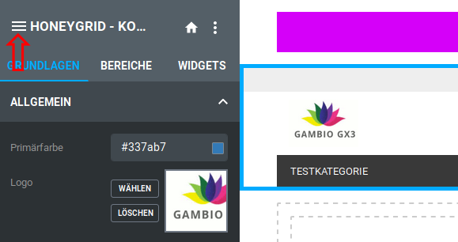

Es wird mindestens ein Theme angezeigt, das im Shop standardmäßig mitgelieferte Honeygrid. Dieses Theme kann bearbeitet werden, es ist jedoch nicht möglich es zu löschen.

!!! danger "Achtung"

	 Wir empfehlen das Original-Theme unverändert zu lassen und alle Änderungen innerhalb einer Kopie des Originals durchzuführen.

!!! danger "Achtung"

	 Beim Duplizieren eines Themes entsteht eine Abhängigkeit zwischen dem ursprünglichen Theme und der Kopie \(Child-Theme\), die Kopie bezieht sich auf das Original, um von dort bestimmte Eigenschaften zu übernehmen.

	 Wenn das ursprüngliche Theme ebenfalls eine Kopie ist, ist die Löschen-Funktion nicht ausgegraut. Wird so ein ursprüngliches Theme \(Parent-Theme\) entfernt, verschwinden u.U. auch die Inhalte, auf die ein Child-Theme sich ggf. bezieht - dies führt zu Problemen mit dem Child-Theme.

	 Aus der Reihenfolge der Themes in der Übersicht lässt sich **nicht** ableiten, welches Child-Theme zu welchem Ursprungs-Theme gehört.

	 Wir empfehlen daher nur Kopien des Originals anzulegen, um ungewollte Abhängigkeiten zu vermeiden.

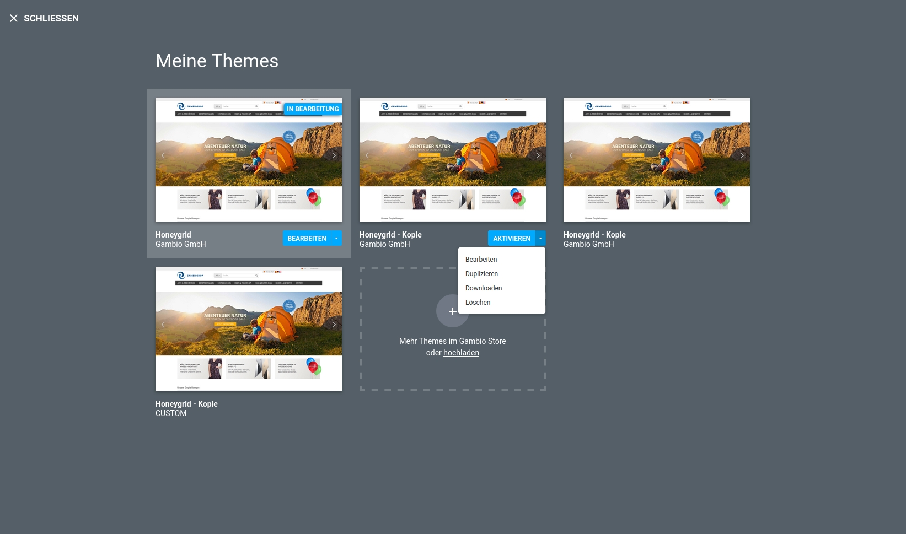

Über die Dropdown-Schaltfläche eines Themes stehen dir folgende Aktionen zur Verfügung:

-   Aktivieren
-   Bearbeiten
-   Duplizieren
-   Downloaden
-   Löschen

Wird ein Theme aktiviert, wird es im Shop verwendet. Der Shop ist also nach außen mit allen Grafik-Einstellungen zu sehen, die im aktiven Theme vorgenomen worden sind.

Mit einem Klick auf _**Bearbeiten**_ wird das StyleEdit 4 aufgerufen und das jeweilige Theme kann darin bearbeitet werden.

## StyleEdit 4 aufrufen

Das StyleEdit 4 kann unter _**Darstellung \> Template-Einstellungen**_ bzw. _**Inhalte \> Template-Einstellungen**_ aufgerufen werden:

Wird nur der Button _**Theme bearbeiten**_ angezeigt, verwendet der Shop ein Theme, sodass im Dropdown _**Templateset \(Theme\)**_im Regelfall der Eintrag _**Honeygrid \(Theme\)**_ bzw. _**Malibu \(Theme\)**_ o.ä. eingestellt ist.

Klicke auf _**Theme bearbeiten**_, um das StyleEdit 4 aufzurufen.

Erhältst du stattdessen die folgende Ansicht, verwendet der Shop die Vorgänger-Oberfläche auf Template-Basis _**Honeygrid \(Template\)**_:

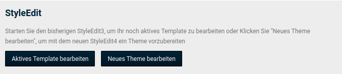

Klicke auf _**Neues Theme bearbeiten**_, um im Hintergrund an der neuen Oberfläche des Shops zu arbeiten, während dein bisheriges Template aktiv bleibt.

### Der erste Aufruf

Beim ersten Aufruf wird nur ein Theme angezeigt, das aktive Honeygrid-Theme. Aktiv bedeutet, dass Änderungen direkt im Shop zu sehen sind.

Wir empfehlen daher eine Kopie des Themes anzulegen.

Klicke hierzu auf das nach unten weisende Dreieck der blauen Schaltfläche und wählen den Eintrag _**Duplizieren**_ aus.

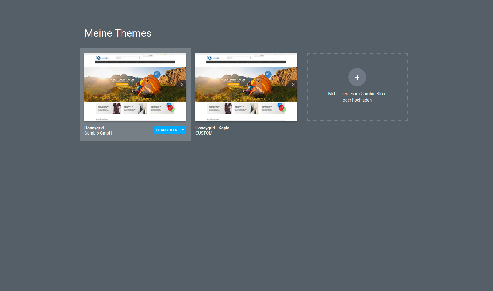

Das neue Theme wird mit dem Zusatz _**Kopie**_ im Namen angezeigt.

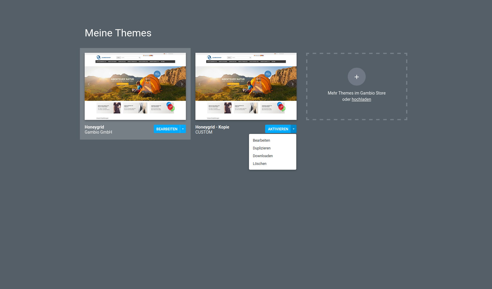

Wähle hier, ebenfalls über das Dropdown in der blauen Schaltfläche, den Eintrag _**Bearbeiten**_ aus. Das StyleEdit 4 wird gestartet, und die Kopie des aktiven Themes geladen.

Nach dem ersten Aufruf gelangst du beim Klick auf den Button _**Theme bearbeiten**_ unter _**Dartstellung \> Template-Einstellungen**_ bzw. _**Inhalte \> Template-Einstellungen**_ direkt zum StyleEdit 4.

Aus dem StyleEdit 4 heraus gelangst du bei Bedarf zurück zur Seite _**Meine Themes**_. Klicke hierzu auf das Icon mit den drei Linien, in der linken, oberen Ecke oder dem daneben angezeigten Theme-Namen. Über den Button _**Beenden**_ am unteren Ende des StyleEdits kannst du den Bearbeitungsmodus beenden und gelangst zurück zum Shop.

!!! note "Hinweis" 
	 Beim nächsten Aufruf gelangst du direkt zum StyleEdit, es wird mit dem Style _**Honeygrid Preview**_ geladen. Um deinen gewünschten Style zu bearbeiten, klicke auf den Namen in der Titelleiste des StyleEdits, um zurück auf die Seite _**Meine Themes**_ zu gelangen.

### Übernahme der Einstellungen des aktiven Template-Styles

Es ist über das StyleEdit 4 möglich die Einstellungen des bisher verwendeten Honeygrid-Templates in das aktuelle Theme zu importieren. Klicke hierzu auf das Symbol in der rechten, oberen Ecke des StyleEdit 4.

Wähle hier den Eintrag _**Einstellungen importieren**_ aus, es öffnet sich ein neues Dialogfenster.

Öffne das Dropdown _**Vorlagenliste**_ und wähle den Eintrag _**Honeygrid: Template\_Style \(Aktiv\)**_ aus.

Klicke auf den Button _**Einführen**_, um den Import vorzunehmen.

## Aufbau des StyleEdit 4

Das StyleEdit lässt sich in vier Bestandteile unterteilen:

-   Titelleiste
-   Menüleiste
-   Einstellungsbereich
-   untere Schaltflächen

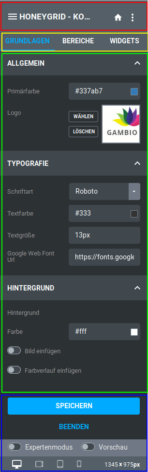

### Titelleiste

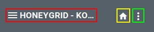

Die Titelleiste verfügt von links nach rechts über die Einstellungen

-   Theme-Übersicht / Theme Name: Aufruf der Seite _**Meine Themes**_
-   Zurück zur Shop-Startseite: Ruft innerhalb des StyleEdits die Startseite des Shops auf
-   Weitere Einstellungen: _**SCSS/CSS bearbeiten**_ ermöglicht das Einfügen eigener Style-Definitionen über SCSS- oder CSS-Codes. _**Einstellungen importieren**_ ermöglicht das Importieren von Einstellungen aus einem anderen Theme oder Style auf Basis des älteren Honeygrid-Templates

### Menüleiste

Über die Menüleiste können die verschiedenen Arten von Einstellungen ausgewählt werden. Der jeweils aktive Menüeintrag wird blau hervorgehoben.

### Einstellungsbereich

Im Einstellungsbereich werden die eigentlichen Einstellungen vorgenommen. Je nachdem, welcher Menüeintrag ausgewählt worden ist, stehen andere Einstellungen zur Verfügung.

### untere Schaltflächen

Im unteren Bereich gibt es verschiedene Buttons:

-   _**Speichern**_: speichert die im Theme vorgenommenen Änderungen ab
-   _**Beenden**_: beendet das StyleEdit 4, sodass du zur Shop-Ansicht zurückkehrst
-   _**Expertenmodus**_: wenn aktiviert, stehen unter _**Bereiche**_ mehr Einstellungen zur Verfügung
-   _**Vorschau**_: aktiviert den Vorschaumodus, sodass der Shop ohne Platzhalter für Widgets und Hervorhebung einzelner Bereiche dargestellt wird

Darunter befindet sich eine Leiste, in der die aktuelle Größe des angezeigten Shopbereichs aufgeführt wird und über die dessen Größe innerhalb des StyleEdits angepasst werden kann. Die Darstellung kann entsprechend der typischen Auflösung bestimmter Endgeräte umgestellt werden:

-   Desktop
-   Tablet Landscape
-   Tablet Portrait
-   Smartphone

## Theme mit StyleEdit 4 bearbeiten

### Menüs des StyleEdit 4

Das StyleEdit 4 ist in drei Menüs gegliedert, auf die verschiedene Arten von Einstellungen aufgeteilt sind:

-   Grundlagen
-   Bereiche
-   Widgets

#### Grundlagen

Das Menü _**Grundlagen**_ beinhaltet die Abschnitte _**Allgemein**_, _**Typografie**_, _**Hintergrund**_ und _**Navigation Menü**_. Die Abschnitte lassen sich über einen Klick auf den Namen auf- und zuklappen.

##### Allgemein

Der Abschnitt _**Allgemein**_ beinhaltet die Einstellungen _**Primärfarbe**_ und _**Logo**_.

Die Primärfarbe wird an verschiedenen Stellen des Shops verwendet. Hierzu zählen

-   Farbe von Links \(ohne Hover\)
-   Hintergrundfarbe der aktiven Kategorie im vertikalen Kategorienmenü in der linken Spalte
-   Hintergrundfarbe von Content-Seiten-Einträgen in der horizontalen Navigationsleiste
-   Trennzeichen _**\>\>**_ in der Breadcrumb
-   Die Hintergrundfarbe der Artikelanzahl des kleinen Warenkorbs

Über die Einstellung _**Logo**_ ist es möglich das Logo auf den Shopseiten zu ändern. Klicke auf _**Wählen**_ bzw. die Vorschau-Ansicht, um die Bilddatei über den Dateimanager auszuwählen oder hochzuladen. Weitere Informationen hierzu findest du im Kapitel _**Dateimanager**_.

Über die Schaltfläche _**Löschen**_ kann die Zuordnung des Logos entfernt werden.

##### Typografie

In diesem Abschnitt können die allgemeine Schriftart, -farbe und -größe festgelegt werden.

|Feldname|Beschreibung|
|--------|------------|
|Schriftart|Wähle hier wahlweise eine der voreingestellten Schriftarten über das Dropdown aus oder trage den Namen der gewünschten Schriftart direkt in das Feld neben dem Dropdown-Symbol ein.|
|Textfarbe|Wähle die gewünschte Textfarbe aus, indem du in das Feld bzw. Vorschau-Symbol klickst oder trage wahlweise den Farbcode direkt ein.|
|Textgröße|Trage in dieses Feld die Schriftgröße für allgemeine Texte ein.|

!!! danger "Achtung"

	 Bei der Angabe der Schriftgröße muss standardmäßig eine Einheit mit angegeben werden. Typischerweise sind dies Pixel, z.B.: 15px

|Feldname|Beschreibung|
|--------|------------|
|Google Web Font Url|Wenn Google Web Fonts verwendet werden, muss eine URL zur der jeweiligen Schriftart bzw. den jeweiligen Schriftarten hinterlegt sein. Standardmäßig ist dies die Schriftart _**Roboto**_ mit der URL: https://fonts.googleapis.com/css?family=Roboto:400,700,300,900|

!!! note "Hinweis"

	 Bitte beachte, dass nach dem Speichern der _**Google Web Font Url**_ das StyleEdit ggf. neu gestartet werden muss, bevor die neue Schriftart ausgewählt werden kann.

##### Hintergrund

Hier können Einstellungen für den Hintergrund vorgenommen werden. Es können wahlweise Hintergrundbilder oder -farben eingerichtet werden. Es können für letztere auch Farbverläufe eingestellt werden.

Es wird hierbei zwischen dem Hintergrund \(der gesamten Seite\) und dem Hintergrund des Containers \(dem Hintergrund der angezeigten Inhalte im zentralen Bereich der Seite\) unterschieden. Ein Beispiel anhand eines Honeygrid-Templates im Boxed Layout:

 und _**Hintergrund des
        Containers**_ (rot)")

Die Hintergrundfarbe unter _**Hintergrund**_ ist blau eingestellt, die Hintergrundfarbe unter _**Hintergrund des Containers**_ rot.

##### Navigation Menü

In diesem Abschnitt kann die Darstellung der horizontalen Menüleiste \(ohne Dropdown\) festgelegt werden. Es stehen Einstellungen für die Hintergrundfarbe, wahlweise als Farbverlauf, die Link-Farbe oder ein Hintergrundbild zur Verfügung.

#### Bereiche

Das Menü _**Bereiche**_ beinhaltet Einstellungen für die einzelnen Bereiche des Shops.

!!! note "Hinweis" 
	 Die Einstellungen in diesem Menü hängen vom eingestellten Modus ab. Um weitere Abschnitte anzuzeigen, aktiviere im unteren Teil des StyleEdits den _**Expertenmodus**_.

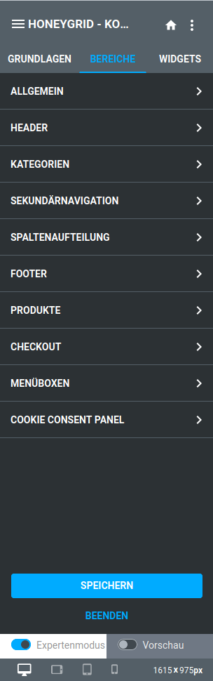

Die enthaltenen Abschnitte werden durch einen Mausklick aufgerufen. Über einen Klick auf das _**✖**_ gelangst du zurück in die Übersicht der Bereiche. Über einen Klick auf _**←**_ gelangst du aus dem Unterabschnitt zurück in der übergeordneten Abschnitt

Manche Abschnitte beinhalten mehr als eine Ebene mit Unterabschnitten.

##### Allgemein

###### Layout

Es stehen folgende Einstellungen zur Verfügung:

|Feldname|Beschreibung|
|--------|------------|
|Eingerahmter Shop|stellt den Shop eingerahmt dar, die Breite der einzelnen Bereiche wird auf die Breite des Hauptbereichs \(Containers\) reduziert.|

!!! note "Hinweis" 
	 Wenn der Shop eingerahmt dargestellt wird, hat die Einstellung _**Kopfzeile fixiert**_ keine Funktion, da die Kopfzeile als Teil des Containers nicht fixiert wird.

|Feldname|Beschreibung|
|--------|------------|
|Top-Navigation zentrieren|Richtet die Sekundärnavigationsleiste am zentralen Bereich \(Container\) aus|
|Kategorieleiste zentrieren|Richtet die horizontale Navigationsleiste am zentralen Bereich \(Container\) aus|
|Kategorien zentrieren|Richtet die Einträge in der horizontalen Navigationsleiste \(Kategorien und Content-Seiten\) zentriert aus|
|Kopfzeile fixiert|Fixiert die Kopfzeile am oberen Ende des Fensters, beim runterscrollen wird die Kopfzeile im Sticky-Modus \(ohne Sekundärnavigation und horizontales Menü\) dargestellt|
|Kopfzeile zentriert|Richtet die Inhalte der Kopfzeile \(Logo, Suche, freigestaltbarer Bereich, kleiner Warenkorb\) zentriert am zentralen Bereich \(Container\) aus|
|Slider zentrieren|Richtet den Teaser-Slider am zentralen Bereich \(Container\) aus|
|Footer zentrieren|Richtet die Inhalte des Footers am zentralen Bereich \(Container\) aus|
|Logo horizontal ausrichten|Zentriert das Logo im dafür vorgesehenen Bereich des Headers|
|Slider unter der Kopfzeile|verschiebt den Slider unter die Elemente der Kopfzeile|
|Maximalbreite|Maximale Breite des Containers|

!!! danger "Achtung"

	 Dieser Wert hat maßgebliche Auswirkung auf die Darstellung des Honeygrids auf einzelnen Endgeräten. Er sollte keinesfalls erhöht und nur in Ausnahmefällen verringert werden

|Feldname|Beschreibung|
|--------|------------|
|Abstand oben|Abstand oberhalb des Shops im Pixeln|
|Abstand unten|Abstand unterhalb des Shops in Pixeln|

###### Farben

!!! note "HInweis" 
	 Dieser Unterabschnitt steht nur im Expertenmodus zur Verfügung.

!!! note "Hinweis"

	 Hovern bzw. Mouseover bezeichnet das Platzieren des Mauszeigers über ein Element, ohne es anzuklicken

Die Hauptfarbe wird an verschiedenen Stellen des Shops verwendet. Hierzu zählen

-   Farbe von Links \(ohne Hover\)
-   Hintergrundfarbe der aktiven Kategorie im vertikalen Kategorienmenü in der linken Spalte
-   Hintergrundfarbe von Content-Seiten-Einträgen in der horizontalen Navigationsleiste
-   Trennzeichen _**\>\>**_ in der Breadcrumb
-   Die Hintergrundfarbe der Artikelanzahl des kleinen Warenkorbs

|Feldname|Beschreibung|
|--------|------------|
|Textfarbe|Wähle die gewünschgte Textfarbe aus, indem du in das Feld bzw. Vorschau-Symbol klickst oder trage wahlweise den Farbcode direkt ein.|
|Linkfarbe|Die Linkfarbe ist über den Platzhalter _**$brand-primary**_ mit der Haupt- bzw. Primärfarbe vorbelegt. Wird dieser Platzhalter entfernt, kann hier ein eigener Farbcode hinterlegt bzw. über die Farbpalette ausgewählt werden.|
|Breadcrumb-Farbe|Hierüber kann die Link/Text-Farbe für die Breadcrumb festgelegt werden. ")|

!!! note "Hinweis" 
	 Die Trennzeichen _**\>\>**_ verwenden die Hauptfarbe

|Feldname|Beschreibung|
|--------|------------|
|Schriftfarbe Keine Bewertungen Hinweis|Farbe des Hinweises _**Leider sind noch keine Bewertungen vorhanden. Seien Sie der Erste, der das Produkt bewertet.**_, der auf der Artikeldetailseite angezeigt wird, wenn für den Artikel noch keine Kundenrezension geschrieben worden ist. Standardmäßig wird über den Platzhalter _**$text-color**_ die Textfarbe verwendet. Dieser Platzahalter kann jedoch bei Bedarf entfernt und durch eine eigene Farbe ersetzt werden.")|

###### Hintergrund

Hier können Einstellungen für den Hintergrund vorgenommen werden. Es können wahlweise Hintergrundbilder oder -farben eingerichtet werden. Es können für letztere auch Farbverläufe eingestellt werden.

Es wird hierbei zwischen dem Hintergrund \(der gesamten Seite\) und dem Hintergrund des Containers \(dem Hintergrund der angezeigten Inhalte im zentralen Bereich der Seite\) unterschieden. Ein Beispiel anhand eines Honeygrid-Templates im Boxed Layout:

 und _**Hintergrund des
        Containers**_ (rot)")

Die Hintergrundfarbe unter _**Hintergrund**_ ist blau eingestellt, die Hintergrundfarbe unter _**Hintergrund des Containers**_ rot.

###### Schrift

Es stehen die folgenden Einstellungen zur Verfügung:

|Feldname|Beschreibung|
|--------|------------|
|Google-Webfonts-Url|URL zu Google Web Fonts, standardmäßig ist ein Verweis auf die Schriftart _**Roboto**_ hinterlegt: https://fonts.googleapis.com/css?family=Roboto:400,700,300,900|
|Schriftgröße|Allgemeine Schriftgröße für die im Shop verwendeten Texte.|
|Schriftgröße H1|Schriftgröße für Überschriften erster Ordnung, z.B. Artikelname auf Artikelseite, Kategoriename auf Kategorieseite, usw.|
|Schriftgröße H2|Schriftgröße für Überschriften zweiter Ordnung, z.B. Überschrift _**Kundenrezensionen**_ auf der Artikelseite|
|Schriftgröße H3|Schrfitgröße für Überschriften dritter Ordnung, z.B. Anzeige der Summe im Warenkorb|
|Schriftgröße H4|Schriftgröße für Überschriften vierter Ordnung|
|Schriftgröße H5|Schriftgröße für Überschriften fünfter Ordnung|
|Schriftgröße H6|Schriftgröße für Überschriften sechster Ordnung|
|Überschriftenfarbe|Schriftfarbe der Überschriften, wird standardmäßig über den Platzhalter _**$text-color**_ mit der Textfarbe belegt. Nach Entfernen des Platzhalters kann bei Bedarf eine eigene Farbe eingetragen werden.|
|Überschriftenstärke|Legt die Stäkre der Überschriften fest|

!!! note "Hinweis"

	 Bitte beachte, dass nach dem Speichern der _**Google Web Font Url**_ das StyleEdit ggf. neu gestartet werden muss, bevor die neue Schriftart ausgewählt werden kann.

###### Abgerundete Ecken

Es stehen die folgenden Einstellungen zur Verfügung, um den Radius der im Honeygrid verwendeten Ecken anzupassen:

")

-   _**Eckenradius normal**_, z.B. für das Warenkorb-Dropdown
-   _**Eckenradius groß**_, z.B. für Sucheingabefeld im Header
-   _**Eckenradius klein**_
-   _**Eckenradius des eingerahmten Shops**_
-   _**Eckenradius des horizontalen Kategoriemenüs**_
-   _**Eckenradius der Warenkorb-Summenbox**_

###### Teaser-Slider

Hier kann an- und abgeschaltet werden, ob der Teaser-Slider für bestimmte Ausgabegeräte angezeigt werden soll.

!!! note "Hinweis" 
	 Die Teaser-Slider-Bilder müssen weiterhin für alle Ausgabegrößen separat festgelegt werden

###### Page-Up-Button

, Hintergrundfarbe
        schwarz (#000000), links ausgerichtet")

|Feldname|Beschreibung|
|--------|------------|
|Schriftfarbe|Farbe des 'nach oben'-Symbols im Page-Up-Button, es wird standardmäßig die Hauptfarbe über den Platzhalter _**$brand-primary**_ hinterlegt. Wird der Platzhalter entfernt, kann eine eigene Farbe eingestellt werden|
|Schriftfarbe Hover|Farbe des 'nach oben'-Symbols im Page-Up-Button, wenn der Mauszeiger darüber bewegt wird, es wird standardmäßig die Hauptfarbe über den Platzhalter _**$brand-primary**_ hinterlegt. Wird der Platzhalter entfernt, kann eine eigene Farbe eingestellt werden|
|Hintergrundfarbe|Hintergrundfarbe des Page-Up-Buttons|
|Hintergrundfarbe Hover|Hintergrundfarbe des Page-Up-Buttons, wenn der Mauszeiger darüber bewegt wird|
|Button links ausrichten|Page-Up-Button wird in der linken unteren statt der rechten unteren Ecke angezeigt|
|Vertikaler Abstand|Abstand zum unteren Rand des Browserfensters|

!!! note "Hinweis"

	 Hovern bzw. Mouseover bezeichnet das Platzieren des Mauszeigers über ein Element, ohne es anzuklicken

###### Buttons

!!! note "Hinweis" 
	 Es wird in den Einstellungen zwischen _**Primary-Button**_, _**Default-Button**_ und _**Kaufen-Button**_ unterschieden.

	 Primary-Buttons sind z.B. _**Filtern**_ in der Filter-Box, _**Senden**_ im Kontaktformular, _**Anmelden**_ in der Newsletter-Box, _**Weiter**_ im Bestellvorgang.

	 Default-Buttons sind z.B. _**Zurücksetzen**_ in der Filter-Box, _**Zurück**_ auf Content-Seiten oder im Bestell-Vorgang, _**Adresse ändern**_ im Bestellvorgang, sowie die Schaltflächen zur Pagination \(Kachelansicht, Listenansicht, _**Sortieren nach**_, _**... pro Seite**_\), etwa auf Kategorie-Seiten.

	 Kaufen-Buttons sind die Schaltflächen _**in den Warenkorb**_ und _**zum Artikel**_.

|Feldname|Beschreibung|
|--------|------------|
|Abgerundete Ecken|Ecken-Radius der Schaltflächen im Shop, Angabe erfolgt zusammen mit einer Einheit, z.B.: 10px|
|Texttransformation|Ändert Groß- und Kleinschreibung der Beschriftung der Buttons|
|  |_**none**_: Text wird so ausgegeben, wie er im Shop \(z.B. _**Toolbox \> Texte anpassen**_ bzw. _**Inhalte \> Texte anpassen**_\) hinterlegt ist
|  |_**uppercase**_: Text wird in Großbuchstaben ausgegeben
|  |_**lowercase**_: Text wird in Kleinbuchstaben ausgegeben
|  |_**capitalize**_: Jedes Wort beginnt mit einem Großbuchstaben|
|Farbe Primary-Button|Schriftfarbe für die Primary-Buttons, standardmäßig mit dem Platzhalter _**$btn-primary-color**_ belegt, kann nachträglich geändert werden|
|Hintergrund Primary-Button|
|Farbe|Hintergrundfarbe für die Primary-Buttons, standardmäßig nicht belegt|
|Bild einfügen|Legt ein Hintergrundbild für die Primary-Buttons fest|
|Farbverlauf einfügen|Legt einen Farbverlauf als Hintergrund der Primary-Buttons fest|
|Rahmenfarbe Primary-Button|Legt die Rahmenfarbe der Primary-Buttons fest, standardmäßig mit dem Platzhalter _**$btn-primary-border**_ vorbelegt, kann nachträglich geändert werden|
|Farbe Default-Button|Schriftfarbe der Default-Buttons, standardmäßig mit dem Platzhalter _**$btn-default-color**_ vorbelegt, kann nachträglich geändert werden|
|Hintergrund Default-Button|
|Farbe|Hintergrundfarbe für die Default-Buttons, standardmäßig nicht belegt|
|Bild einfügen|Legt ein Hintergrundbild für die Default-Buttons fest|
|Farbverlauf einfügen|Legt einen Farbverlauf als Hintergrund der Default-Buttons fest|
|Rahmenfarbe Default-Button|Legt die Rahmenfarbe der Default-Buttons fest, standardmäßig mit dem Platzhalter _**$btn-default-border**_ vorbelegt, kann nachträglich geändert werden|
|Farbe Kaufen-Button|Schriftfarbe der Kaufen-Buttons|
|Hintergrund Kaufen-Button|
|Farbe|Hintergrundfarbe für die Kaufen-Buttons|
|Bild einfügen|Legt ein Hintergrundbild für die Kaufen-Buttons fest|
|Farbverlauf einfügen|Legt einen Farbverlauf als Hintergrund der Default-Buttons fest|
|Rahmenfarbe Kaufen-Button|Legt die Rahmenfarbe der Kaufen-Buttons fest, ist standardmäßig mit dem Wert _**darken\($gx-btn-calltoaction-bg-color, 5%\)**_ vorbelegt, kann nachträglich geändert werden|

###### Trennlinien

Hier können die Farben der verschiedenen Trennlinien geändert werden:

-   Linienfarbe Überschriften
-   Rahmenfarbe Footer-Boxen
-   Linienfarbe Überschriften im Checkout
-   Rahmenfarbe Pagination
-   Rahmenfarbe Produktlisten und Kacheln
-   Farbe der Trennlinien Produktdetails-Box

Die Felder sind zum Teil mit Platzhaltern befüllt, diese können bei Bedarf durch eine eigene Farbangabe ersetzt werden.

###### Hinweise

Im Shop werden an verschiedenen Stellen farblich hervorgehobene Warnungen, Fehlermeldungen, allgemeine Hinweise und Informationen angezeigt. In diesem Abschnitt können die zugehörigen Schrift-, Rahmen und Hintergrundfarben angepasst werden. Für die Hintergründe können bei Bedarf auch Bilder und Farbverläufe eingestellt werden.

Die einzelnen Farbeinstellungen sind jeweils mit Platzhaltern für die Standardfarben befüllt, die bei Bedarf durch eigene Farbwerte ersetzt werden können.

###### QR-Codes

In diesem Abschnitt können Farbe und Hintergrundfarbe der im Shop verwendeten QR-Codes eingestellt werden.

###### Modal-Fenster

Modal-Fenster werden oberhalb der eigentlichen Shop-Oberfläche angezeigt und können verschiedene Aufgaben haben. Für sie kann in diesem Unterabschnitt eine Hintergrundfarbe, ein Hintergrundbild oder Farbverlauf als Hintergrund festgelegt werden.

##### Header

###### Varianten

Hier können die einzelnen Varianten des Headers ausgewählt werden. Im Honeygrid steht die Variante _**Standard**_ zur Verfügung.

!!! danger "Achtung"

	 Für die einzelnen Bestandteile des Headers \(Logo, Suche, Freigestaltbarer Bereich, kleiner Warenkorb\) wie auch den Header selbst gibt es eigene Höhen-Einstellungen. Diese Einstellungen sollten unbedingt gleichmäßig vorgenommen werden, d.h., wenn die Höhe des Logo-Bereichs von 80px um 40px auf 120px erhöht wird, muss auch im Unterabschnitt _**Allgemein**_ die Höhe des Headers um diese 40px, von standardmäßig 150px auf 190px vergrößert werden, da es sonst zu einer Verschiebung der Inhalte kommt.
	 
###### Standard

**Allgemein**

Im diesem Unterabschnitt kann der Hintergrund des Headers \(Farbe, Farbverlauf oder Hintergrundbild\) sowie dessen Höhe für die verschiedenen Größen \(ohne Größeneinschränkung, Mobil, Sticky\) festgelgt werden.

!!! note "Hinweis"

	 Sticky bezeichnet die reduzierte Form des Headers, die verwendet wird, wenn mit fixierter Kopfzeile nach unten gescrollt wird.

|Feldname|Beschreibung|
|--------|------------|
|Hintergrund|
|Farbe|Hintergrundfarbe des Headers auf Desktop-Computern und Tablets|
|Bild einfügen|Hintergrundbild des Headers auf Desktop-Computern und Tablets|
|Farbverlauf einfügen|Farbverlauf als Hintergrund des Headers auf Desktop-Computern und Tablets|
|Hintergrund Mobil|
|Farbe|Hintergrundfarbe des Headers auf Smartphones|
|Bild einfügen|Hintergrundbild des Headers auf Smartphones|
|Farbverlauf einfügen|Farbverlauf als Hintergrund des Headers auf Smartphones|
|Hintergrund Sticky|
|Farbe|Hintergrundfarbe des Sticky Headers|
|Bild einfügen|Hintergrundbild des Sticky Headers|
|Farbverlauf einfügen|Farbverlauf als Hintergrund des Sticky Headers|
|Höhe|Höhe des Headers auf Desktop-Computern und Tablets|
|Höhe Mobil|Höhe des Headers auf Smartphones|
|Höhe Sticky|Höhe des Sticky Headers|
|Farbe des Menü-Icons Mobile|Farbe des Menü-Icons auf Smartphones|

**Logo**

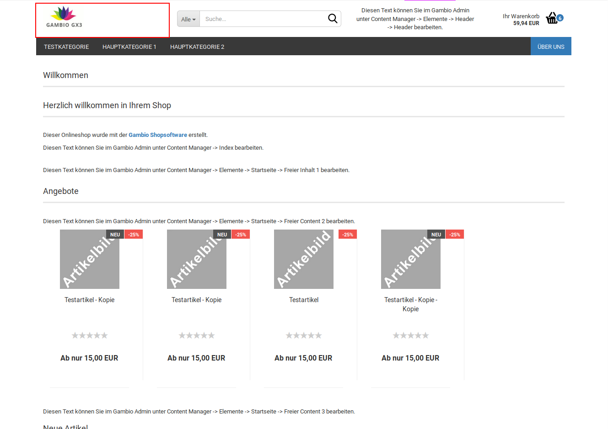

Für das Logo können die folgenden Einstellungen vorgenommen werden:

|Feldname|Beschreibung|
|--------|------------|
|Logo im Header ausblenden|blendet den Logo-Bereich im Header aus \(verringert die Zahl der verwendeten Grid-Spalten\)|
|Grid-Spalten Klein|Anzahl der Grid-Spalten des Logo-Bereichs für kleine Darstellung, typischerweise Tablet im Portrait/Hoch-Format|
|Grid-Spalten Medium|Anzahl der Grid-Spalten des Logo-Bereichs für mittelgroße Darstellung, typischerweise Tablet im Landscape/Quer-Format|
|Grid-Spalten Groß|Anzahl der Grid-Spalten des Logo-Bereichs für große Darstellung, typischerweise Desktop-Computer|
|Logo Höhe|Höhe des Logo-Bereichs, Angabe standardmäßig in Pixeln z.B. 80px|
|Logo Max-Breite Mobil|maximale Breite des Logo-Bereichs in der Smartphone-Ansicht, Angabe standardmäßig in Pixeln z.B. 80px|
|Logo Höhe Sticky|Höhe des Logo-Bereichs im Sticky-Header, Angabe standardmäßig in Pixeln z.B. 60px|

!!! note "Hinweis"

	 Die grafische Oberfläche des Shops wird in der Breite in 12 sogenannte Grid-Spalten aufgeteilt. Für jede Größe \(groß, medium, klein\) gibt es eine eigene Einstellung. Die Summe aller Einstellungen einer Größe, die nicht ausgeblendet werden, muss 12 ergeben. Weitere Informationen hierzu sind im Kapitel _**Grid-Spalten**_ aufgeführt.

!!! note "Hinweis"

	 Sticky bezeichnet die reduzierte Form des Headers, die verwendet wird, wenn mit fixierter Kopfzeile nach unten gescrollt wird.

**Suche**

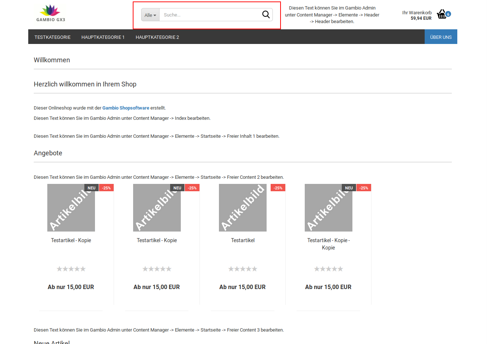

|Feldname|Beschreibung|
|--------|------------|
|Suche in Top-Navigation anzeigen|aktiviert den Eintrag _**Suchen**_ in der Sekundärnavigation|
|Suche im Header ausblenden|blendet den Such-Bereich im Header aus \(verringert die Zahl der verwendeten Grid-Spalten\)|
|Farbe des Suche-Icons Mobile|Farbe des Suchen-Icons auf Smartphones|
|Suche Höhe|Höhe des Such-Bereichs, Angabe standardmäßig in Pixeln z.B. 80px|
|Suche Höhe Sticky|Höhe des Such-Bereichs im Sticky-Header, Angabe standardmäßig in Pixeln z.B. 60px|
|vertikaler Abstand|Abstand des Suchfensters zur oberen und unteren Kante des Such-Bereichs, Angabe standardmäßig in Pixeln z.B. 22px|
|vertikaler Abstand Sticky|Abstand des Suchfensters zur oberen und unteren Kante des Such-Bereichs im Sticky-Header, Angabe standardmäßig in Pixeln z.B. 12px|
|vertikaler äußerer Abstand|Abstand des Such-Bereichs zur oberen und unteren Kantes des Headers|
|ertikaler äußerer Abstand Sticky|Abstand des Such-Bereichs zur oberen und unteren Kantes des Sticky-Headers|
|Grid-Spalten Klein|Anzahl der Grid-Spalten des Such-Bereichs für kleine Darstellung, typischerweise Tablet im Portrait/Hoch-Format|
|Grid-Spalten Medium|Anzahl der Grid-Spalten des Such-Bereichs für mittelgroße Darstellung, typischerweise Tablet im Landscape/Quer-Format|
|Grid-Spalten Groß|Anzahl der Grid-Spalten des Such-Bereichs für große Darstellung, typischerweise Desktop-Computer|

!!! note "Hinweis"

	 Sticky bezeichnet die reduzierte Form des Headers, die verwendet wird, wenn mit fixierter Kopfzeile nach unten gescrollt wird.

!!! note "Hinweis"

	 Die grafische Oberfläche des Shops wird in der Breite in 12 sogenannte Grid-Spalten aufgeteilt. Für jede Größe \(groß, medium, klein\) gibt es eine eigene Einstellung. Die Summe aller Einstellungen einer Größe, die nicht ausgeblendet werden, muss 12 ergeben. Weitere Informationen hierzu sind im Kapitel _**Grid-Spalten**_ aufgeführt.

**Freigestaltbarer Bereich**

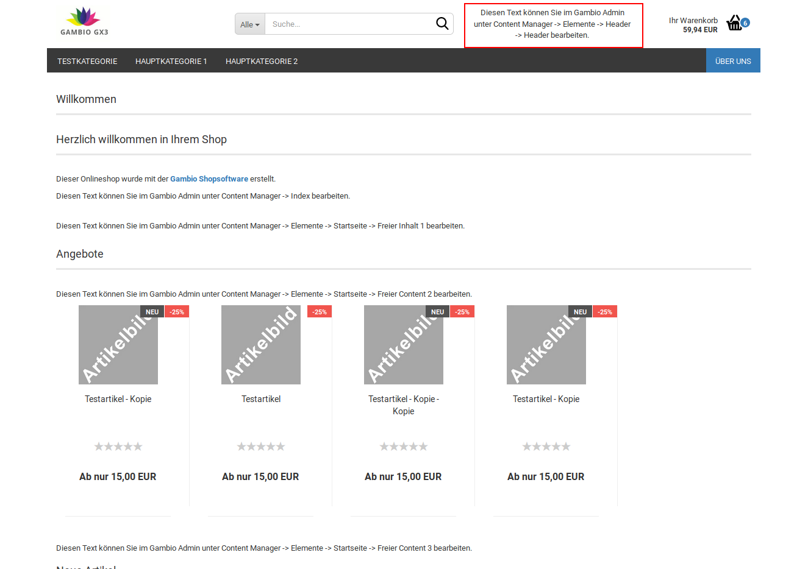

|Feldname|Beschreibung|
|--------|------------|
|Frei gestaltbaren Bereich im Header ausblenden|blendet den Bereich im Header aus \(verringert die Zahl der verwendeten Grid-Spalten\)|
|Höhe|Höhe des Bereichs, Angabe standardmäßig in Pixeln z.B. 80px|
|Höhe Sticky|Höhe des Bereichs im Sticky-Header, Angabe standardmäßig in Pixeln z.B. 60px|
|Grid-Spalten Klein|Anzahl der Grid-Spalten des Bereichs für kleine Darstellung, typischerweise Tablet im Portrait/Hoch-Format|
|Grid-Spalten Medium|Anzahl der Grid-Spalten des Bereichs für mittelgroße Darstellung, typischerweise Tablet im Landscape/Quer-Format|
|Grid-Spalten Groß|Anzahl der Grid-Spalten des Bereichs für große Darstellung, typischerweise Desktop-Computer|

!!! note "Hinweis"

	 Sticky bezeichnet die reduzierte Form des Headers, die verwendet wird, wenn mit fixierter Kopfzeile nach unten gescrollt wird.

!!! note "Hinweis"

	 Die grafische Oberfläche des Shops wird in der Breite in 12 sogenannte Grid-Spalten aufgeteilt. Für jede Größe \(groß, medium, klein\) gibt es eine eigene Einstellung. Die Summe aller Einstellungen einer Größe, die nicht ausgeblendet werden, muss 12 ergeben. Weitere Informationen hierzu sind im Kapitel _**Grid-Spalten**_ aufgeführt.

**Kleiner Warenkorb**

|Feldname|Beschreibung|
|--------|------------|
|Warenkorb im Header ausblenden|blendet den Warenkorb-Bereich im Header aus \(verringert die Zahl der verwendeten Grid-Spalten\)|
|Farbe des Icons|Farbe des Warenkorb-Symbols|
|Farbe des Icons Sticky|Farbe des Warenkorb-Symbols im Sticky-Header|
|Farbe des Icons Mobile|Farbe des Warenkorb-Symbols in der mobilen Ansicht|
|Textfarbe|Farbe des Textes _**Ihr Warenkorb**_ und des Betrags|
|Textfarbe Sticky|Farbe des Textes _**Ihr Warenkorb**_ und des Betrags im Sticky-Header|
|Höhe|Höhe des Warenkorb-Bereichs im Header|
|Höhe Sticky|Höhe des Warenkorb-Bereichs im Sticky-Header|
|Vertikaler Abstand|Abstand des Warenkorb-Icons und Schriftzugs von der Oberkante und Unterkante des Warenkorb-Bereichs|
|Vertikaler Abstand Sticky|Abstand des Warenkorb-Icons und Schriftzugs von der Oberkante und Unterkante des Warenkorb-Bereichs im Sticky-Header|
|Vertikaler äußerer Abstand|Abstand des Warenkorb-Bereichs zu Ober- und Unterkante des umgebenden Headers|
|Vertikaler äußerer Abstand Sticky|Abstand des Warenkorb-Bereichs zu Ober- und Unterkante des umgebenden Sticky-Headers|
|Grid-Spalten Klein|Anzahl der Grid-Spalten des Warenkorb-Bereichs für kleine Darstellung, typischerweise Tablet im Portrait/Hoch-Format|
|Grid-Spalten Medium|Anzahl der Grid-Spalten des Warenkorb-Bereichs für mittelgroße Darstellung, typischerweise Tablet im Landscape/Quer-Format|
|Grid-Spalten Groß|Anzahl der Grid-Spalten des Warenkorb-Bereichs für große Darstellung, typischerweise Desktop-Computer|

!!! note "Hinweis"

	 Sticky bezeichnet die reduzierte Form des Headers, die verwendet wird, wenn mit fixierter Kopfzeile nach unten gescrollt wird.

!!! note "Hinweis"

	 Die grafische Oberfläche des Shops wird in der Breite in 12 sogenannte Grid-Spalten aufgeteilt. Für jede Größe \(groß, medium, klein\) gibt es eine eigene Einstellung. Die Summe aller Einstellungen einer Größe, die nicht ausgeblendet werden, muss 12 ergeben. Weitere Informationen hierzu sind im Kapitel _**Grid-Spalten**_ aufgeführt.
	 
##### Kategorien

###### Allgemein

|Feldname|Beschreibung|
|--------|------------|
|Höhe|Höhe des inneren Bereichs der horizontalen Navigationsleiste, ist mit dem Platzhalter _**$navbar-height**_ vorbelegt|
|Höhe Sticky|Höhe des inneren Bereichs der horizontalen Navigationsleiste im Sticky-Header, ist standardmäßig mit 0 vorbelegt|
|Übergänge|sanfteres Einblenden des Mega-Dropdown, wenn der Mauszeiger über eine Kategorie mit Unterkategorien bewegt wird|
|Höhe außen|Höhe des äußeren Bereichs der horizontalen Navigationsleiste|
|Abstand unten|Unterer Abstand zur Kategorieleiste, ist mit dem Platzhalter _**$line-height-computed**_ vorbelegt|

!!! note "Hinweis"

	 Sticky bezeichnet die reduzierte Form des Headers, die verwendet wird, wenn mit fixierter Kopfzeile nach unten gescrollt wird.

###### Menüpunkte 

Kategorien, rechts Einträge zu Content-Seiten")

|Feldname|Beschreibung|
|--------|------------|
|horizontaler Abstand|linker Abstand der Einträge der Sekundärnavigation, vorbelegt mit _**floor\(\($grid-gutter-width/2\)\)**_|
|vertikaler Abstand|Abstand oberhalb und unterhalb der Einträge für Hauptkategorien|
|Hintergrund|
|Farbe|Hintergrundfarbe der horizontalen Menüleiste \(ohne Content-Einträge\)|
|Bild einfügen|Hintergrundbild der horizontalen Menüleiste \(ohne Content-Einträge\)|
|Farbverlauf einfügen|Farbverlauf für den Hintergrund der horizontalen Menüleiste \(ohne Content-Einträge\)|
|Hintergrund außen|Hintergrundfarbe, die in der Fortführung der horizontalen Menüleiste links und rechts angezeigt wird")|
|Schriftfarbe|Schriftfarbe der Hauptkategorien \(ohne Unterkategorien und Content-Einträge\) in der horizontalen Menüleiste|
|Schriftfarbe Custom|Schriftfarbe der Content-Einträge in der horizontalen Menüleiste|
|Schriftfarbe Hover|Schriftfarbe der Hauptkategorien \(ohne Unterkategorien und Content-Einträge\) in der horizontalen Menüleiste, beim Hovern mit dem Mauszeiger, ohne dass Unterkategorien aufgeklappt werden|
|Schriftfarbe Hover Custom|Schriftfarbe der Content-Einträge in der horizontalen Menüleiste, beim Hovern mit dem Mauszeiger|
|Schriftfarbe Aktiv|Schriftfarbe der Hauptkategorie in der horizontalen Menüleiste, die aktuell angezeit wird|
|Schriftfarbe Aktiv Custom|Schriftfarbe der Content-Seite in der horizontalen Menüleiste, die aktuell angezeigt wird|
|Texttransformation|Ändert Groß- und Kleinschreibung der Beschriftung der Hauptkategorie in der horizontalen Menüleistenone:| 
|  |**none**: Text wird so ausgegeben, wie er im Shop als Kategoriename hinterlegt ist|
|  |**uppercase**: Text wird in Großbuchstaben ausgegeben|
|  |**lowercase**: Text wird in Kleinbuchstaben ausgegeben|
|  |**capitalize**: Jedes Wort beginnt mit einem Großbuchstaben|
|Schriftgröße|Schriftgröße der Hauptkategorien in der horizontalen und vertikalen Menüleiste|
|Hintergrund Hover|Hintergrundfabre der Hauptkategorien in der horlzontalen Menüleiste beim Hovern mit der Maus, vorbelegt mit _**darken\($gx-cat-navbar-bg-color, 6.5%\)**_|
|Hintergrund Aktiv|Hintergrundfarbe der aktuell angezeigten Hauptkategorie in der horizontalen Kategoriemeleiste, vorbelegt mit _**darken\($gx-cat-navbar-bg-color, 6.5%\)**_|
|Hintergrund Custom|Hintergrundfarbe der Content-Einträge in der horizontalen Menüleiste, vorbelegt mit _**$brand-primary**_|
|Hintergrund Hover Custom|Hintergrundfarbe der Content-Einträge in der horizontalen Menüleiste, beim Hovern mit der Maus, vorbelegt mit _**darken\($gx-custom-bg-color, 10%\)**_|
|Hintergrund Aktiv Custom|Hintergrundfarbe des Content-Eintrags in der horizontalen Menüleiste, der aktuell angezeit wird, vorbelegt mit _**darken\($gx-custom-bg-color, 10%\)**_|

!!! note "Hinweis"

	 Hovern bzw. Mouseover bezeichnet das Platzieren des Mauszeigers über ein Element, ohne es anzuklicken

###### Kategorien Mobil

|Feldname|Beschreibung|
|--------|------------|
|Mobil-Menü Höhe|Höhe des mobilen Menüs|
|Höhe|Höhe der Menü-Einträge|
|Vertikaler Abstand|Abstand des Namens zur oberen Kante des Menüeintrags|
|Heller Farbmodus|Umschalten zwischen hellem Farbmodus \(weißer Hintergrund, dunkle Schrift\) und dunklem Farbmodus \(dunkler Hintergrund, weiße Schrift\)|
|Icons anzeigen|Icons im mobilen Menü anzeigen ja/nein|

###### Mega-Dropdown

|Feldname|Beschreibung|
|--------|------------|
|Schriftgröße Überschriften|Schriftgröße der Einträge im Dropdown des Kategoriemenüs|
|Schriftfarbe|Schriftfarbe der Einträge im Dropdown des Kategoriemenüs, vorbelegt mit _**$text-color**_|
|Rahmenfarbe|Farbe der Rahmenelemente der Einträge im Dropdown des Kategoriemenüs im Mega-Dropdown")|
|Block-Breite|Breite der Unterkategorie-Blöcke im Mega-Dropdown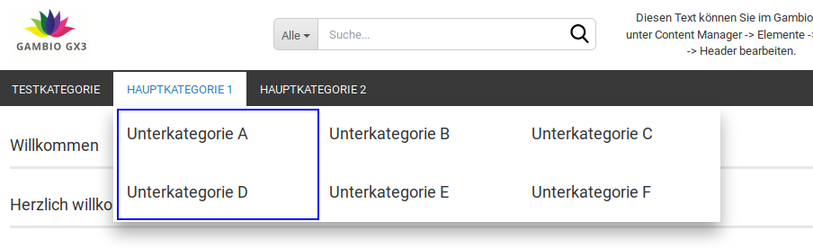|
|Anzahl Blöcke|Anzahl der nebeneinander angezeigten Blöcke im Mega-Dropdown|
|Tab-Verschiebung|innerer Abstand der einzelnen Menüeinträge, vorbelegt mit 2px|
|Hintergrund|
|Farbe|Hintergrundfarbe des Mega-Dropdowns|
|Bild einfügen|Hintergrundbild des Mega-Dropdowns|
|Farbverlauf einfügen|Verwenden eines Farbverlaufs für den Hintergrund des Mega-Dropdowns|
|Schriftfarbe Alle Anzeigen|Schriftfarbe des Buttons _**Alle Anzeigen**_, vorbelegt mit _**$text-color**_|
|Hintergrund Alle Anzeigen|
|Farbe|Hintergrundfarbe des Buttons _**Alle Anzeigen**_, vorbelegt mit _**$gray-lighter**_|
|Bild einfügen|Hintergrundbild des Buttons _**Alle Anzeigen**_|
|Farbverlauf einfügen|Farbverlauf als Hintergrundbild des Buttons _**Alle Anzeigen**_|

###### Vertikales Kategoriemenü

|Feldname|Beschreibung|
|--------|------------|
|Schriftfarbe|Schriftfarbe des vertikalen Kategoriemenüs, mit _**$text-color**_ vorbelegt|
|Schriftfarbe Hover|Schriftfarbe des vertikalen Kategoriemenüs beim Hovern, mit _**$text-color**_ vorbelegt|
|Schriftfarbe Aktiv|Schriftfarbe der aktuell angezeigten Kategorie im vertikalen Kategoriemenü|
|Schriftfarbe geöffnet|Schriftfartbe der aufgeklappten Kategorien im vertikalen Kategoriemenü, vorbelegt mit _**$text-color**_|
|Hintergrund|
|Farbe|Hintergrundfarbe des vertikalen Kategoriemenüs im vertikalen Kategoriemenü")|
|Bild einfügen|Hintergrundbild des vertikalen Kategoriemenüs im vertikalen Kategoriemenü")|
|Farbverlauf einfügen|Farbverlauf als Hintergrund im vertikalen Kategoriemenü nach blau (#0000FF)")|
|Hintergrund Hover|
|Farbe|Hintergrundfarbe des Untermenüeintrags im vertikalen Kategoriemenü beim Hovern mit der Maus|
|Bild einfügen|Hintergrundbild des Menüeintrags im vertikalen Kategoriemenü beim Hovern mit der Maus|
|Farbverlauf einfügen|Farbverlauf als Hintergrund des Menüeintrags im vertikalen Kategoriemenü beim Hovern mit der Maus|
|Hintergrund Aktiv|
|Farbe|Hintergrundfarbe der aktuell angezeigten Kategorie im vertikalen Kategoriemenü, vorbelegt mit _**$brand-primary**_|
|Bild einfügen|Hintergrundbild der aktuell angezeigten Kategorie im vertikalen Kategoriemenü|
|Farbverlauf einfügen|Farbverlauf als Hintergrund der angezeigten Kategorie im vertikalen Kategoriemenü|
|Hintergrund geöffnet|
|Farbe|Hintergrundfarbe der aktuell aufgeklappten Hauptkategorie als Hintergrund hat")|
|Bild einfügen|Hintergrundbild der Hauptkategorien im vertikalen Kategoriemenü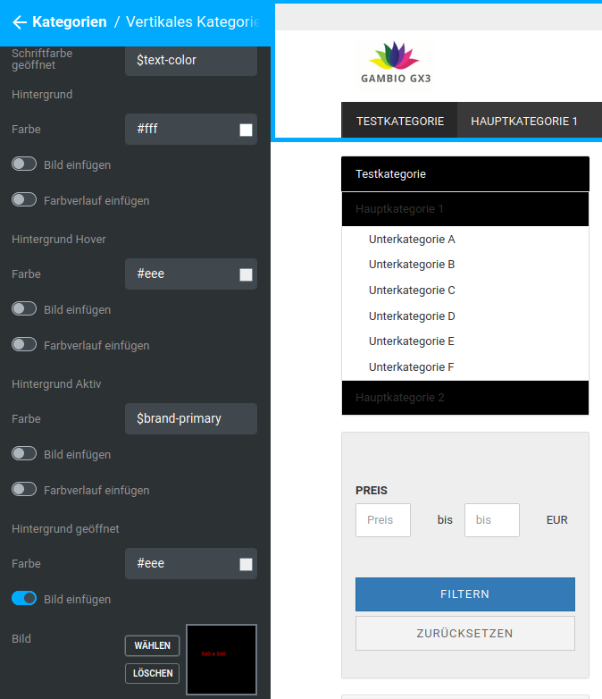|
|Farbverlauf einfügen|Farbverlauf als Hintergrund der Hauptkategorien im vertikalen Kategoriemenü nach gelb (#fdc300) eingestellt")|

!!! note "Hinweis"

	 Hovern bzw. Mouseover bezeichnet das Platzieren des Mauszeigers über ein Element, ohne es anzuklicken
	 
##### Sekundärnavigation

###### Allgemein

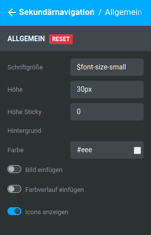

|Feldname|Beschreibung|
|--------|------------|
|Schriftgröße|Schriftgröße der Menüeinträge in der Sekundärnavigation, mit _**$font-size-small**_ vorbelegt|
|Höhe|Höhe der Einträge der Sekundärnavigation|
|Höhe Sticky|Höhe der Einträge der Sekundärnavigation in der Sticky-Ansicht|
|Hintergrund|
|Farbe|Hintergrundfarbe der Sekundärnavigationsleiste|
|Bild einfügen|Hintergrundbild der Sekundärnavigationsleiste|
|Farbverlauf einfügen|Farbverlauf als Hintergrund der Sekundärnavigationsleiste|

!!! note "Hinweis"

	 Sticky bezeichnet die reduzierte Form des Headers, die verwendet wird, wenn mit fixierter Kopfzeile nach unten gescrollt wird.

!!! note "Hinweis"

	 Hovern bezeichnet das Platzieren des Mauszeigers über ein Element, ohne es anzuklicken

###### Menüpunkte

|Feldname|Beschreibung|
|--------|------------|
|Schriftfarbe|Schriftfarbe der Menüeinträge in der Sekundärnavigation, abzüglich Gambio Admin-Button|
|Scriftfarbe Hover|Schriftfarbe der Menüeinträge in der Sekundärnavigation beim Hovern, abzüglich Gambio Admin-Button|
|Schriftfarbe Aktiv|Schriftfarbe der Menüeinträge in der Sekundärnavgiation, beim Ausklappen eines Dropdowns als _**Schriftfarbe Aktiv**_")|
|Hintergrund|
|Farbe|Hintergrundfarbe der Menüeinträge der Sekundärnavigation, abzüglich Gambio Admin-Button, mit _**transparent**_ vorbelegt|
|Bild einfügen|Hintergrundbild der Menüeinträge der Sekundärnavigation|
|Farbverlauf einfügen|Farbverlauf als Hintergrund der Menüeinträge der Sekundärnavigation|
|Hintergrund Hover|
|Farbe|Hintergrundfarbe der Menüeinträge der Sekundärnavigation beim Hovern mit der Maus, abzüglich Gambio Admin-Button|
|Bild einfügen|Hintergrundbild der Menüeinträge der Sekundärnavigation beim Hovern mit der Maus|
|Farbverlauf einfügen|Farbverlauf als Hintergrund der Menüeinträge der Sekundärnavigation beim Hovern mit der Maus|
|Hintergrund Aktiv|
|Farbe|Hintergrundfarbe der Menüeinträge in der Sekundärnavgiation, beim Ausklappen eines Dropdowns als _**Farbe**_ für _**Hintergrund Aktiv**_")|
|Bild einfügen|Hintergrundbild der Menüeinträge in der Sekundärnavgiation, beim Ausklappen eines Dropdowns|
|Farbverlauf einfügen|Farbverlauf als Hintergrund der Menüeinträge der Sekundärnavigation beim Ausklappen eines Dropdowns|
|Link Abstand|innerer Abstand des Textes nach oben und unten bzw. links und rechts zum Rand des Buttons, vorbelegt mit 6px 15px|

!!! note "Hinweis"

	 Hovern bezeichnet das Platzieren des Mauszeigers über ein Element, ohne es anzuklicken

###### Kategorien Mobil

Diese Einstellungen haben derzeit keine Funktion und werden in einer zukünftigen Version entfernt.

##### Spaltenaufteilung

Über den Bereich _**Spaltenaufteilung**_ kann das Seitenverhältnis der einzelnen Bereiche im Shop festgelegt werden. Hierbei wird der Hauptbereich des Shops in 12 gleich breite Spalten unterteilt.

!!! danger "Achtung"

	 Die Summe der Spalteneinstellungen für eine Größe \(z.B. 'Gross \(Desktops\)'\) muss immer 12 ergeben, ansonsten kommt es zu Fehlern in der Darstellung.

Für die Desktop-Ansicht ist standardmäßig eine Aufteilung von 3 Spalten für den linken Teil der Seite und 9 Spalten für den mittleren Teil voreingestellt.

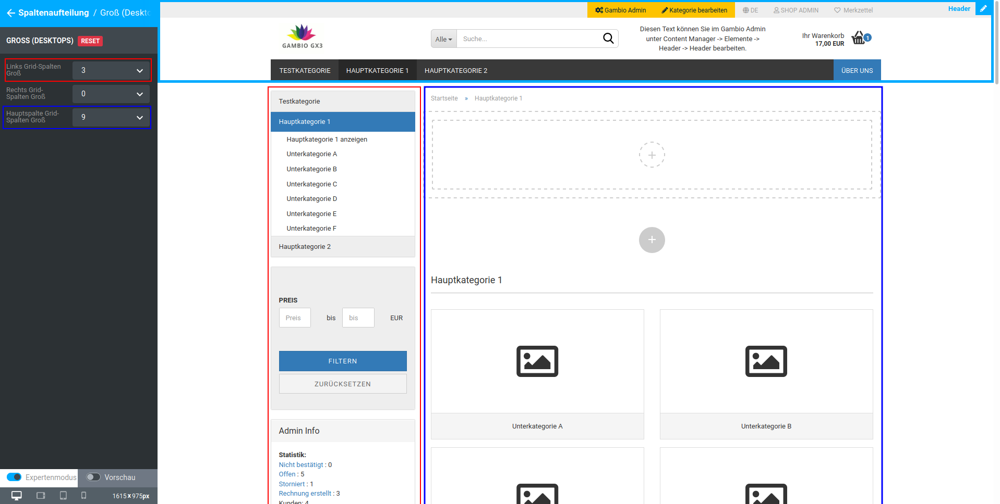

Bei der Einstellung der Unterkategorien wird die Anzahl der in einer Reihe angezeigten Kategorien wie folgt festgelegt:

12 / Gridspalten Unterkategorien = Anzahl der Unterkategorien pro Reihe

##### Footer

###### Varianten

Hier können die einzelnen Varianten des Footers ausgewählt werden. Im Honeygrid steht die Variante _**Standard**_ zur Verfügung.

###### Standard

**Footer Header**

Der Footer Header ist die durchgehende Zeile oberhalb der Spalten des Footers.

")

|Feldname|Beschreibung|
|--------|------------|
|Mindesthöhe|minimale Höhe, die vom Footer Header in Anspruch genommen wird, auch wenn der Platz vom zugehörigen Inhalt nicht benötigt wird|
|Schriftfarbe|Schriftfarbe, die standardmäßig im Footer Header verwendet wird, vorbelegt mit _**$gx-footer-color**|

!!! note "Hinweis"

	 Der in diesem Bereich angezeigte Content hat eigene Farbeinstellungen, diese haben eine höhere Priorität als die Grundeinstellung des StyleEdits. Wir empfehlen die allgemeine Einstellung mit dem StyleEdit vorzunehmen und bei Bedarf nur Teile des Inhalts über den Content Manager bzw. CK-Editor anders einzufärben.

	 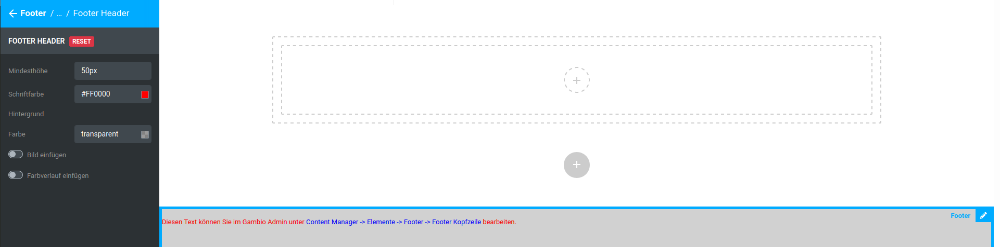

|Feldname|Beschreibung|
|--------|------------|
|Hintergrund|
|Farbe|Hintergrundfarbe des Footer Headers, mit _**transparent**_ vorbelegt|
|Bild einfügen|Hintergrundbild des Footer Headers|
|Farbverlauf einfügen|Farbverlauf als Hintergrund des Footer Headers|

**Footer Body**

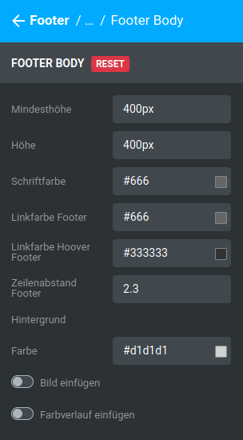

|Feldname|Beschreibung|
|--------|------------|
|Mindesthöhe|minimale Höhe des Footer Bodys|
|Höhe|Höhe des Footer Bodys|

!!! note "Hinweis"

	 Die Höhe des Footers sollte die Mindesthöhe nicht unterschreiten

	 

|Feldname|Beschreibung|
|--------|------------|
|Schriftfarbe|Schriftfarbe des Footers insgesamt, ohne Links")|
|Linkfarbe Footer|Linkfarbe innerhalb des Footers, außer Footer Header")|
|Linkfarbe Hover Footer|Linkfarbe innerhalb des Footers beim Hovern \(darübergehen mit der Maus\), außer Footer Header|
|Zeilenabstand Footer|Zeilenabstand von Absätzen innerhalb der Footer Spalten|
|Hintergrund|
|Farbe|Hintergrundfarbe des Footers|
|Bild einfügen|Hintergrundbild des Footers|
|Farbverlauf einfügen|Farbverlauf als Hintergrund des Footers|

!!! note "Hinweis"

	 Hovern bzw. Mouseover bezeichnet das Platzieren des Mauszeigers über ein Element, ohne es anzuklicken

**Footer Spalte N**

Dieser Abschnitt beschreibt die Einstellungen für Footer Spalte 1 bis Footer Spalte 4.

")

|Feldname|Beschreibung|
|--------|------------|
|Spalte 1 ausblenden|blendet die Spalte innerhalb des Footers aus|
|Grid-Spalten Klein|Anzahl der Grid-Spalten für diese Spalte des Footers bei kleinen Ausgabegeräten \(z.B. Smartphone\)|
|Grid-Spalten Medium|Anzahl der Grid-Spalten für diese Spalte des Footers bei mittelgroßen Ausgabegeräten \(z.B. Tablets\)|
|Grid-Spalten Groß|Anzahl der Grid-Spalten für diese Spalte des Footers bei großen Ausgabegeräten \(z.B. Desktop-Computern\)|

!!! note "Hinweis"

	 Die grafische Oberfläche des Shops wird in der Breite in 12 sogenannte Grid-Spalten aufgeteilt. Für jede Größe \(groß, medium, klein\) gibt es eine eigene Einstellung. Die Summe aller Einstellungen einer Größe, die nicht ausgeblendet werden, muss 12 ergeben. Weitere Informationen hierzu sind im Kapitel _**Grid-Spalten**_ aufgeführt.

	 Hierbei ist zu beachten, dass die Spalten des Footers auf kleineren Bildschirmen auch untereinander dargestellt werden. Es gilt

	 12 / Anzahl der Grid-Spalten = Anzahl der Footer-Spalten die nebeneinander angezeigt werden
	 
##### Produkte

###### Artikelbild

|Feldname|Berschreibung|
|--------|-------------|
|Höhe|Höhe des Artikelbildbereichs auf der Artikeldetailseite|
|Höhe Mobil|Höhe des Artikelbildbereichs in der mobilen Ansicht \(Tablet und Smartphone\)|
|Höhe Lightbox|Höhe des Artikelsbildbereichs in der Lightbox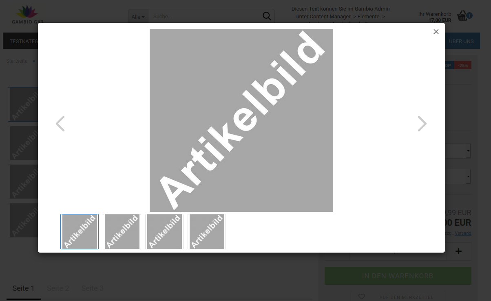|
|Höhe Lightbox Mobil|Höhe des Artikelbildbereichs in der Lightbox in der mobilen Ansicht \(Tablet\)|
|Breite der Thumbnails|Breite des Artikelbildbereichs der kleinen Vorschaubilder|
|Breite der Thumbnails Mobil|Breite des Artikelbildbereichs der kleinen Vorschaubilder in der mobilen Ansicht|
|Hintergrund|
|Farbe|Hintergrundfarbe des Artikelbildbereichs, vorbelegt mit transparent")|
|Bild einfügen|Hintergrundbild des Artikelbildbereichs|
|Farbverlauf einfügen|Farbverlauf als Hintergrund des Artikelbildbereichs|

!!! note "Hinweis"

	 Der Artikelbildbereich legt fest, wie viel Platz dem jeweiligen Artikelbild zur Verfügung steht. Da bei der Änderung einer Dimension \(Höhe oder Breite\) die jeweils andere entsprechend skaliert wird, kann der Bildbereich nicht unbegrenzt vergrößert werden.

###### Produktliste

Produktlisten können sowohl Kategorien als auch andere Produktseiten sein, wie z.B. die Auflistung der Sonderangebote

|Feldname|Beschreibung|
|--------|------------|
|Hintergrund|
|Farbe|Hintergrundfarbe des Produkts in der Produktliste in gekachelter Ansicht") in gelisteter Ansicht")|
|Bild einfügen|Hintergrundbild des Produkts in der Produktliste|
|Farbverlauf einfügen|Farbverlauf als Hintergrund des Produkts in der Produktliste|
|Hintergrund der Galerie|
|Farbe|Hintergrundfarbe des Galeriebereichs bei Artikellisten in gekachelter Ansicht in gekachelter Ansicht")|
|Bild einfügen|Hintergrundbild des Galeriebereichs bei Artikellisten in gekachelter Ansicht|
|Farbverlauf einfügen|Farbverlauf als Hintergrund des Galeriebereichs|
|Grid-Spalten Mobil|Anzahl der Spalten bei gekachelter Ansicht der Artikelliste, Smartphone-Ansicht|
|Grid-Spalten Klein|Anzahl der Spalten bei gekachelter Ansicht der Artikelliste, Tablet Portrait-Ansicht|
|Grid-Spalten Medium|Anzahl der Spalten bei gekachelter Ansicht der Artikelliste, Tablet Landscape-Ansicht|
|Grid-Spalten Groß|Anzahl der Spalten bei gekachelter Ansicht der Artikelliste, Desktop-Ansicht|
|Höhe des Produktnamens in der Kachel|Höhe des Bereichs der Produktkachel, in dem der Produktname angezeigt wird|
|Höhe des Preises in der Kachel|Höhe des Bereichs der Produktkachel, in dem der Preis angezeigt wird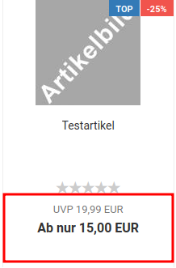|
|Abstand zwischen Ribbons und Artikelbild|vertikaler Abstand, vorbelegt mit 0|
|Höhe des Produktbildes Kachel|Höhe des Bildbereichs in der gekachelten Ansicht|
|Höhe des Produktbildes Kachel mobil|Höhe des Bildbereichs in der gekachelten Ansicht \(Smartphone\)|
|Höhe des Galeriebildes Flyover|Höhe des Bildbereichs in der Galerie der gekachelten Ansicht \(Mouseover/Hover\)|
|Breite der Galerie|Breite des Galeriebereichs der gekachelten Ansicht \(Mouseover/Hover\)|
|Lieferzeit in Kachel immer anzeigen|Lieferzeit wird durchgängig angezeigt, nicht nur beim Mouseover|

!!! note "Hinweis"

	 Hovern bzw. Flyover bezeichnet das Platzieren des Mauszeigers über ein Element, ohne es anzuklicken.

###### Produktdetails Box

|Feldname|Beschreibung|
|--------|------------|
|Hintergrund|
|Farbe|Hintergrundfarbe der Produktdetailbox|
|Bild einfügen|Hintergrundbild der Produktdetailbox|
|Farbverlauf einfügen|Farbverlauf als Hintergrund der Produktdetailbox|
|Schriftfarbe|Schriftfarbe in der Produktdetailbox, vorbelegt mit _**$text-color**_|
|Hinweis Schriftfarbe|Schriftfarbe für Preis-, Steuer- und Versandkostenhinweis, vorbelegt mit _**$gray-light**_")|
|Rahmenbreite|Breite des Rahmens um die Produktdetailbox, vorbelegt mit 0|
|Rahmenstil|Stil des Rahmens um die Produktdetailbox, vorbelegt mit _**none**_|
|Rahmenfarbe|Farbe des Rahmens um die Produktdetailbox, vorbelegt mit _**transparent**_")|
|Button Schriftfarbe|Schriftfarbe der Buttons unterhalb des Warenkorb-Buttons ")|
|Button Schriftfarbe Hover|Schriftfarbe der Buttons unterhalb des Warenkorb-Buttons beim Mouseover/Hover, vorbelegt mit _**darken\($gx-product-info-button-color, 10%\)**_|
|Button Hintergrundfarbe|Hintergrundfarbe der Buttons unterhalb des Warenkorb-Buttons, vorbelegt mit _**transparent**_|
|Button Hintergrundfarbe Hover|Hintergrundfarbe der Buttons unterhalb des Warenkorb-Buttons beim Mouseover/Hover, vorbelegt mit _**transparent**_|
|Button Rahmenfarbe|Rahmenfarbe der Buttons unterhalb des Warenkorb-Buttons")|
|Button Rahmenfarbe Hover|Rahmenfarbe der Buttons unterhalb des Warenkorb-Buttons beim Mouseover/Hover|
|Preisbox mitscrollen|soll die Produktdetailbox mitscrollen?|

!!! note "Hinweis"

	 Hovern bezeichnet das Platzieren des Mauszeigers über ein Element, ohne es anzuklicken.

###### Tabs

|Feldname|Beschreibung|
|--------|------------|
|Schriftfarbe|Schriftfarbe der Tab-Überschriften, außer aktiver Tab|
|Schriftfarbe aktiver Tab|Schriftfarbe der Überschrift des aktiven Tabs, vorbelegt mit _**$text-color**_|
|Rahmenfarbe|Farbe der unteren Abgrenzung der Tab-Überschriften, vorbelegt mit _**transparent**_")|
|Rahmenfarbe aktiver Tab|Farbe der unteren Abgrenzung des aktiven Tabs|
|Rahmenfarbe Tab Container|Farbe der Abgrenzung zwischen Überschriften und Tabinhalten gesetzt")|
|Hintergrund|
|Farbe|Hintergrundfarbe der Tab-Überschriften, außer aktiver Tab, vorbelegt mit transparent")|
|Bild einfügen|Hintergrundbild der Tab-Überschriften, außer aktiver Tab|
|Farbverlauf einfügen|Farbverlauf als Hintergrund der Tab-Überschriften, außer aktiver Tab|
|Hintergrund aktiver Tab|
|Farbe|Hintergrundfarbe der Überschrift des aktiven Tabs|
|Bild einfügen|Hintergrundbild der Überschrift des aktiven Tabs|
|Farbverlauf einfügen|Farbverlauf als Hintergrund der Überschrift des aktiven Tabs|

###### Ribbons

 und _**Angebot**_ auf der Artikeldetailseite")

 und _**Angebot**_ in der Kachelansicht (Produktliste)")

 und  _**Angebot**_ in der Listenansicht (Produktliste)")

|Feldname|Beschreibung|
|--------|------------|
|Ribbon anzeigen|Ribbon wird für passende Artikel verwendet|
|Hintergrundfarbe|Hintergrundfarbe des Ribbons|
|Schriftfarbe|Schriftfarbe des Ribbons|

##### Checkout

###### Allgemein

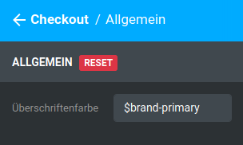

|Feldname|Beschreibung|
|--------|------------|
|Überschriftenfarbe|Überschriftenfarbe der einzelnen Unterabschnitte innerhalb der Seiten des Checkouts, vorbelegt mit _**$brand-primary**_")|

###### Warenkorb teilen

|Feldname|Beschreibung|
|--------|------------|
|Rahmenfarbe|Farbe der oberen und unteren Abgrenzung der Artikeltabelle des Warenkorbs im Warenkorb")|
|Schriftfarbe Tabellenkopf|Schriftfarbe der Tabellenüberschriften im Warenkorb")|
|Schriftfarbe Tabelle|Schriftfarbe der Artikeltabelle des Warenkorbs, ohne Produktinformationen, vorbelegt mit _**$text-color**_")|
|Schriftfarbe Produktinformationen|Schriftfarbe der Produktinformationen in der Artikeltabelle des Warenkorbs, vorbelegt mit _**$gray**_")|

###### Warenkorb Zusammenfassungsbox

|Feldname|Beschreibung|
|--------|------------|
|Schriftfarbe|Schriftfarbe in der Zusammenfassungsbox, vorbelegt mit _**$text-color**_")|
|Rahmenfarbe|Farbe der horizontalen Trennlinien der Warenkorb Zusammenfassungsbox")|
|Hintergrund oben|
|Farbe|Hintergrundfarbe des oberen Teils der Zusammenfassungsbox, vorbelegt mit _**$gx-panel-bg-color**_")|
|Bild einfügen|Hintergrundbild des oberen Teils der Zusammenfassungsbox|
|Farbverlauf einfügen|Farbverlauf als Hintergrund des oberen Teils der Zusammenfassungsbox|
|Hintergrund unten|
|Farbe|Hintergrundfarbe des unteren Teils der Zusammenfassungsbox")|
|Bild einfügen|Hintergrundbild des unteren Teils der Zusammenfassungsbox|
|Farbverlauf einfügen|Farbverlauf als Hintergrund des unteren Teils der Zusammenfassungsbox|

###### Checkout Zusammenfassungstabelle

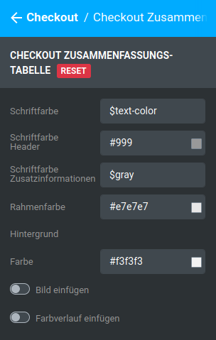

|Feldname|Beschreibung|
|--------|------------|
|Schriftfarbe|Schriftfarbe, vorbelegt mit _**$text-color**_")|
|Schriftfarbe Header|Schriftfarbe des Headers der Zusammenfassungstabelle")|
|Schriftfarbe Zusatzinformationen|Schriftfarbe der Zusatzinformationen, vorbelegt mit _**$gray**_")|
|Rahmenfarbe|Farbe der horizontalen Trennlinien zwischen den einzelnen Einträgen der Zusammenfassungstabelle")|
|Hintergrund|
|Farbe|Hintergrundfarbe der Zusammenfassungstabelle")|
|Bild einfügen|Hintergrundbild der Zusammenfassungstabelle|
|Farbverlauf einfügen|Farbverlauf als Hintergrund der Zusammenfassungstabelle|

###### Listenelemente

|Feldname|Beschreibung|
|--------|------------|
|Schriftfarbe|Schriftfarbe der Listenelemente, außer aktive Auswahl, vorbelegt mit _**$text-color**_")|
|Schriftfarbe aktive Auswahl|Schriftfarbe des aktuell ausgewählten Listenelements, vorbelegt mit _**$text-color**_")|
|Linkfarbe|Linkfarbe, außer aktive Auswahl, vorbelegt mit _**$brand-primary**_|
|Linkfarbe aktive Auswahl|Linkfarbe der aktiven Auswahl, vorbelegt mit _**$brand-primary**_|
|Rahmenfarbe|Rahmenfarbe der einzelnen Listeneinträge, ohne aktive Auswahl, vorbelegt mit _**$gray-lighter**_")|
|Rahmenfarbe aktive Auswahl|Rahmenfarbe des aktuell ausgewählten Listenelements")|
|Hintergrund|
|Farbe|Hintergrundfarbe der Listenelemente, außer aktive Auswahl, vorbelegt mit _**transparent**_")|
|Bild einfügen|Hintergrundbild der Listenelemente, außer aktive Auswahl|
|Farbverlauf einfügen|Farbverlauf als Hintergrund der Listenelemente, außer aktive Auswahl|
|Hintergrund aktive Auswahl|
|Farbe|Hintergrundfarbe des aktuell ausgewählten Listenelements")|
|Bild einfügen|Hintergrundbild des aktuell ausgewählten Listenelements|
|Farbverlauf einfügen|Farbverlauf als Hintergrund des aktuell ausgewählten Listenelements|
|Hintergrund Formular|
|Farbe|Hintergrundfarbe von Formularen der Listeneinträge")|
|Bild einfügen|Hintergrundbild von Formularen der Listeneinträge|
|Farbverlauf einfügen|Farbverlauf als Hintergrund von Formularen der Listeneinträge|

###### AGB und Widerruf-Checkboxen

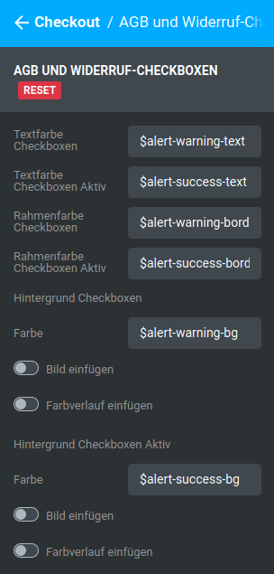

|Feldname|Beschreibung|
|--------|------------|
|Textfarbe Checkboxen|Textfarbe der Checkbox-Beschreibung, außer angehakte Checkboxen, vorbelegt mit _**$alert-warning-text**_")|
|Textfarbe Checkboxen Aktiv|Textfarbe der Checkbox-Beschreibung von angehakten Checkboxen, vorbelegt mit _**$alert-success-text**_")|
|Rahmenfarbe Checkboxen|Rahmenfarbe des Blocks aus Checkbox und Beschreibung, außer angehakte Checkboxen, vorbelegt mit _**$alert-warning-border**_")|
|Rahmenfarbe Checkboxen Aktiv|Rahmenfarbe des Blocks aus Checkbox und Beschreibung bei angehakten Checkboxen, vorbelegt mit _**$alert-success-border**_")|
|Hintergrund Checkboxen|
|Farbe|Hintergrundfarbe des Blocks aus Checkbox und Beschreibung, außer angehakte Checkboxen, vorbelegt mit _**$alert-warning-bg**_")|
|Bild einfügen|Hintergrundbild des Blocks aus Checkbox und Beschreibung, außer angehakte Checkboxen|
|Farbverlauf einfügen|Farbverlauf als Hintergrund des Blocks aus Checkbox und Beschreibung, außer angehakte Checkboxen|
|Hintergrund Checkboxen Aktiv|
|Farbe|Hintergrundfarbe des Blocks aus Checkbox und Beschreibung bei angehakten Checkboxen, vorbelegt mit _**$alert-success-bg**_")|
|Bild einfügen|Hintergrundbild des Blocks aus Checkbox und Beschreibung bei angehakten Checkboxen|
|Farbverlauf einfügen|Farbverlauf als Hintergrund des Blocks aus Checkbox und Beschreibung bei angehakten Checkboxen|

##### Menüboxen

###### Kopfzeile

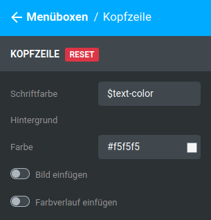

|Feldname|Beschreibung|
|--------|------------|
|Schriftfarbe|Schriftfarbe der Kopfzeile, vorbelegt mit _**$text-color**_")|
|Hintergrund|
|Farbe|Hintergrundfarbe der Kopfzeile")|
|Bild einfügen|Hintergrundbild der Kopfzeile|
|Farbverlauf einfügen|Farbverlauf als Hintergrund der Kopfzeile|

###### Inhaltsbereich

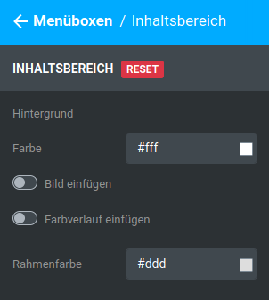

|Feldname|Beschreibung|
|--------|------------|
|Hintergrund|
|Farbe|Hintergrundfarbe des Inhaltsbereichs")|
|Bild einfügen|Hintergrundbild des Inhaltsbereichs|
|Farbverlauf einfügen|Farbverlauf als Hintergrund des Inhaltsbereichs|
|Rahmenfarbe|Rahmenfarbe der Menübox")|

###### Seiten mit Menüboxspalte

Die Anzeige der Menüboxen kann für die einzelnen Seiten bzw. Seitenarten des Shops an- und abgeschaltet werden. Aktiviere \(Schalter blau\) bzw. deaktiviere \(Schalter grau\) hierzu die gewünschten Einstellungen. Für folgende Seiten können die Menüboxen im Honeygrid aktiviert werden:

-   Startseite
-   Suchergebnis-Seite
-   Contentmanager Seite
-   Artikelseiten
-   Kategorien und Produktlisten
-   Warenkorb
-   Merkzettel
-   Checkout
-   Kundenkontoseiten
-   Kontoerstellung
-   Newsletteranmeldung

###### Auswahl und Positionen

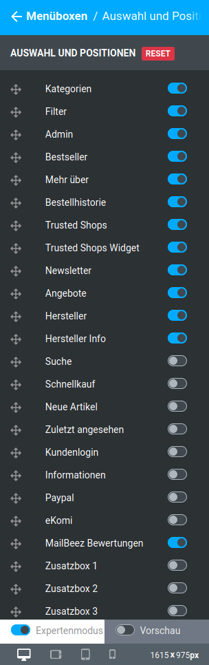

In diesem Bereich sind die Menüboxen des Shops aufgelistet. Durch Aktivieren \(Schalter blau\) und Deaktivieren \(Schalter grau\) der einzelnen Einstellungen kannst du die jeweiligen Menüboxen im Shop an- und abschalten.

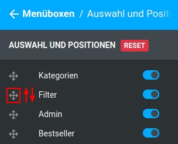

Um die Reihenfolge der Menüboxen zu verändern, bewege den Mauszeiger über das Pfeilkreuz-Symbol, links neben dem Namen der Box, die du an eine andere Position verschieben möchtest. Mache einen Linksklick auf das Symbol und halte die Maustaste geprückt. Ziehe nun den Eintrag nach oben oder unten, um seine Reihenfolge zu ändern. Lasse die Maustaste wieder los, wenn er sich an der gewünschten Position befindet.

##### Cookie Consent Panel

###### General

|Feldname|Beschreibung|
|--------|------------|
|Background Color|Hintergrundfarbe von Cookie Consent-Panel und Cookie-Preference-Center, Cookie Consent-Panel")|
|Opacity|Undurchsichtigkeit, wie stark soll der Bereich hinter dem Panel durchscheinen?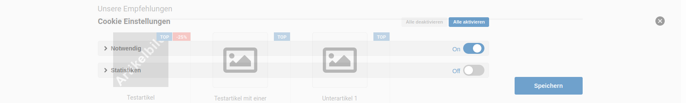|
|Switchers Color|Aktuell keine Funktion, wird in der kommenden Version entfernt|
|Buttons Color|Hintergrundfarbe der Schalter und Schaltflächen, vorbelegt mit _**$brand-primary**_")|
|Buttons Hover Color|Hover-Hintergrundfarbe der Schaltflächen, vorbelegt mit _**$brand-primary**_, Mauszeiger befindet sich über der Schaltfläche _**Alle aktivieren**_")|
|Box Shadow|Schattenverlauf des Panels, vorbelegt mit _**0 -8px 20px 0 rgba\(0,0,0,.2\)**_|

!!! note "Hinweis"

	 Diese Zeile verwendet CSS-Code als Eingabe. Beispiele und Erklärungen findest du z.B. auf den Seiten von selfhtml:

	 https://wiki.selfhtml.org/wiki/CSS/Eigenschaften/%C3%A4u%C3%9Fere\_Gestaltung/box-shadow

	 https://wiki.selfhtml.org/wiki/Referenz:CSS/Eigenschaften/box-shadow

|Feldname|Beschreibung|
|--------|------------|
|Headline Font Size|Schriftgröße der Überschrift|
|Headline Font Family|Schriftart der Überschrift|
|Description Font Size|Schriftgröße des Beschreibungstextes des Cookie Consent-Panels|
|Description Font Family|Schriftart des Beschreibungstextes des Cookie Consent-Panels|

!!! note "Hinweis"

	 Hovern bzw. Mouseover bezeichnet das Platzieren des Mauszeigers über ein Element, ohne es anzuklicken
	 
#### Widgets

Widgets sind in vorgesehenen Bereichen frei platzierbare Inhalte. Derzeit gibt es die folgenden Widgets:

##### Text

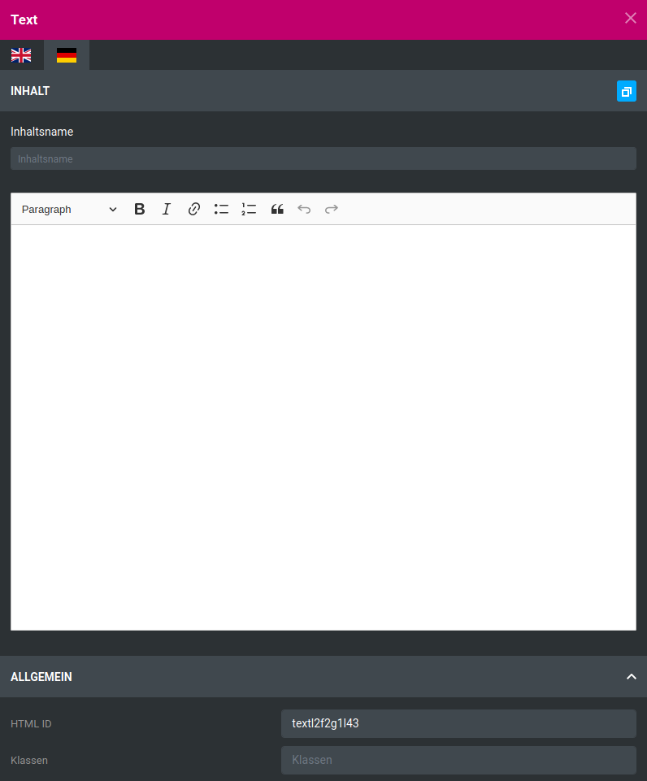

Text-Widgets erlauben das Platzieren von Texten. Über die Flaggen-Symbole kann die jeweilige Sprache ausgewählt werden die blaue Schaltfläche rechts oben erlaubt das Kopieren des aktuell angezeigten Textes in die Eingabefelder für die anderen Sprachen.

Der _**Inhaltsname**_ legt den Namen des jeweiligen Textes fest, er wird auch im Content Manager verwendet.

Von links nach rechts stehen im Editor folgende Einstellungen zur Verfügung:

-   Paragraph/Heading: legt fest, ob die aktuell ausgewählte\(n\) Zeile\(n\) ein Absatz \(_**Paragraph**_\) oder eine Überschrift erster bis dritter Ordnung \(_**Heading 1**_ bis _**Heading 3**_\) ist bzw. sind.

!!! note "Hinweis"

	 Eine einzelne Zeile kann durch Setzen des Cursors ausgewählt werden. Mehrere Zeilen durch Markieren der Textstellen. Hierbei werden immer ganze Zeilen ausgewählt.

-   Bold \(fett\)
-   Italic \(kursiv\)
-   Link \(es wird ein Eingabefenster für die Linkadresse angezeigt\)

!!! note "Hinweis"

	 Die Einstellungen _**Bold**_, _**Italic**_ und _**Link **_wirken sich nur auf markierte Textstellen aus.

-   Unordered List \(ausgewählte Zeile\(n\) als Aufzählung mit Bullet Points festlegen\)
-   Ordered List \(ausgewählte Zeile\(n\) als Aufzählung mit arabischen Ziffern festlegen\)
-   Block Quote \(ausgewählte Zeile\(n\) als Zitat festlegen\)
-   Undo \(letzten Schritt rückgängig machen\)
-   Redo \(zuletzt rückgängig gemachten Schritt nochmals ausführen\)

Unter dem Editor wird die _**HTML ID**_ ausgegeben. Sie wird zur eindeutigen Identifizierung des Inhalts innerhalb des HTML-Codes verwendet. Änderungen sind optional. Über das Feld _**Klassen**_ erhält das Element auf HTML-Ebene eine sogenannte Klasse. Für mehrere Elemente mit der gleichen Klasse können z.B. über CSS-Code eigene Style-Einstellungen vorgenommen werden. Die Verwendung ist optional.

##### Bild

|Feldname|Beschreibung|
|--------|------------|
|Bild|Auswahl der Bilddatei|
|Name|Name des Bildes|
|Link|Link, der beim Klick auf das Bild aufgerufen werden soll|
|Target|Wo soll der Link aufgerufen werden?|

|Feldname|Beschreibung|
|--------|------------|
|Breite|Breite des Bildes in der eingestellten Einheit|
|Höhe|Höhe des Bildes in der eingestellten Einheit|
|Bild responsive anpassen|soll das Bild responsiv dargestellt werden?|

!!! note "Hinweis"

	 Durch Klick auf _**px**_, _**em**_ oder _**%**_ kann die jeweilige Größeneinheit eingestellt werden

|Feldname|Beschreibung|
|--------|------------|
|ID|HTML-ID des Widgets, zur Auszeichnung des Elements im Quellcode|
|Klassen|HTML-Klasse des Widgets, zur Auszeichnung des Elements im Quellcode|

!!! note "Hinweis"

	 IDs und Klassen werden auf HTML-Ebene verwendet. Änderungen sind optional.

##### Überschrift

Überschriften können frei platziert werden, ohne einem anderen Widget zugeordnet werden zu müssen.

|Feldname|Beschreibung|
|--------|------------|
|Inhalt|Text der Überschrift|
|ID|HTML-ID der Überschrift, Änderung optional|
|Type|Ordnung der Überschrift, _**Heading 1**_ bis _**Heading 6**_|

|Feldname|Beschreibung|
|--------|------------|
|Schrift individuell anpassen|Aktiviert die Schrift-Einstellungen der Überschrift|
|Text Farbe|Schriftfarbe der Überschrift|
|Text Ausrichtung|Ausrichtung der Überschrift \(_**Left**_: linksbündig, _**Center**_: zentriert, _**Right**_: rechtsbündig, _**Justify**_: Blocksatz, _**Initial**_: Standardwert, _**Inherit**_: Einstellung des übergeordneten Elements verwenden\)|
|Schriftart|Schriftart der Überschrift|
|Schriftgröße|Schriftgröße der Überschrift in der eingestellten Einheit|
|Schriftstil|Schriftstil der Überschrift \(_**normal**_, _**italic**_: kursive Darstellung entsprechend der Schriftart, _**oblique**_: kursive Darstellung auch ohne kursive Variante der Schriftart, _**initial**_: Standardwert, _**inherit**_: Einstellung des übergeordneten Elements\)|
|Text unterstrichen|Überschrift wird unterstrichen dargestellt|
|Text in Großbuchstaben|Überschrift wird in Großbuchstaben dargestellt|

!!! note "Hinweis"

	 Aktiviere die Einstellung _**Schrift individuell anpassen**_, um Einstellungen vornehmen zu können

!!! note "Hinweis"

	 Durch Klick auf _**px**_, _**em**_ oder _**%**_ kann die jeweilige Größeneinheit eingestellt werden

!!! note "Hinweis"

	 IDs und Klassen werden auf HTML-Ebene verwendet. Änderungen sind optional.

##### Button

Buttons sind Schaltflächen, die mit einem Link versehen werden können.

|Feldname|Beschreibung|
|--------|------------|
|Inhalt|Beschriftung der Schaltfläche|
|Link|Link, der von der Schaltfläche aus aufgerufen werden soll|
|Target|Zielseite, in der der Link geöffnet werden soll|
|Klassen|HTML-Klasse der Schaltfläche|
|ID|HTML-ID der Schaltfläche|

!!! note "Hinweis"

	 IDs und Klassen werden auf HTML-Ebene verwendet. Änderungen sind optional.

Im Bereich _**Button Size**_ wird die allgemeine Größe der Schaltfläche eingestellt. Unter _**Button Type**_ kann die Schrift- und Hintergrundfarbe entsprechend der eingestellten Standardfarbschemata \(_**Default**_, _**Primary**_, _**Success**_, _**Info**_, _**Warning**_, _**Danger**_\) umgestellt werden.

##### HTML

HTML-Widgets erlauben das Platzieren von HTML-Codes. Über die Flaggen-Symbole kann die jeweilige Sprache ausgewählt werden die blaue Schaltfläche rechts oben erlaubt das Kopieren des aktuell angezeigten Textes in die Eingabefelder für die anderen Sprachen.

Der _**Inhaltsname**_ legt den Namen des jeweiligen HTML-Codes fest, er wird auch im Content Manager verwendet.

Unter dem Editor wird die _**HTML ID**_ ausgegeben. Sie wird zur eindeutigen Identifizierung des Inhalts innerhalb des HTML-Codes verwendet. Änderungen sind optional. Über das Feld _**Klassen**_ erhält das Element auf HTML-Ebene eine sogenannte Klasse. Für mehrere Elemente mit der gleichen Klasse können z.B. über CSS-Code eigene Style-Einstellungen vorgenommen werden. Die Verwendung ist optional.

##### Trennzeichen

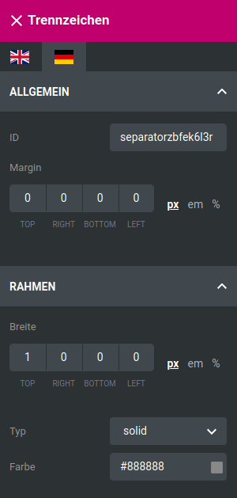

Das Trennzeichen-Widget platziert eine horizontale Trennlinie.

|Feldname|Beschreibung|
|--------|------------|
|ID|HTML-ID der Trennlinie|
|Margin|Äußerer Abstand zur Trennlinie in der eingestellten Einheit. Es können verschiedene Abstände \(_**TOP**_: darüber, _**RIGHT**_: rechts, _**BOTTOM**_: darunter, _**LEFT**_: links\) festgelegt werden|

|Feldname|Beschreibung|
|--------|------------|
|Breite|legt die Dicke der Grenzlinie in die verschiedenen Richtungen \(_**TOP**_: darüber, _**RIGHT**_: rechts, _**BOTTOM**_: darunter, _**LEFT**_: links\) in der eingestellten Einheit fest|
|Typ|Art der Trennlinie: _**solid**_ \(duchgängig\), _**hidden**_ \(unsichtbar\), _**dotted**_ \(gepunktet\), _**dashed**_ \(gestrichelt\), _**double**_ \(doppelt\), _**groove**_ \(gerillt\), _**ridge**_ \(kammförmig\), _**inset**_ \(eingefügt, hintergründig\), _**outset**_ \(hervorgehoben, vordergründig\), _**initial**_ \(Standardwert\), _**inherit**_ \(Wert des übergeordneten Elements\)|
|Farbe|Farbe der Trennlinie|

!!! note "Hinweis"

	 Durch Klick auf _**px**_, _**em**_ oder _**%**_ kann die jeweilige Größeneinheit eingestellt werden

!!! note "Hinweis"

	 IDs und Klassen werden auf HTML-Ebene verwendet. Änderungen sind optional.

##### Produkt

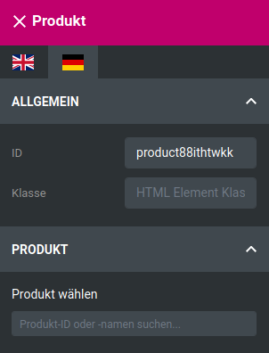

Über das Produkt-Widget kann eine einzelne Artikel-Kachel platziert werden.

Unter _**Allgemein**_ können _**ID**_ und _**Klasse**_ der Artikelkachel festgelegt werden.

!!! note "Hinweis"

	 IDs und Klassen werden auf HTML-Ebene verwendet. Änderungen sind optional.

Unter _**Produkt**_ kann der Artikel für die Artikelkachel ausgewählt werden. Im Feld _**Produkt wählen**_ kann hierzu ein Suchbegriff eingegeben und der Artikel aus den in einem Dropdown angezeigten Werten ausgewählt werden.

##### Produktliste

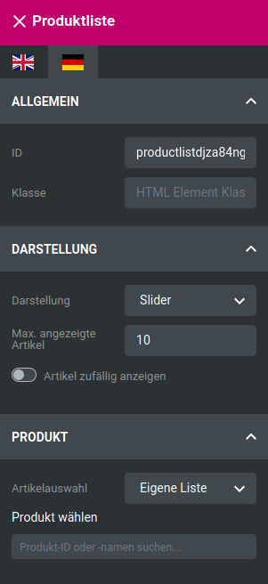

Über das Produktlisten-Widget kann eine Liste von Artikeln platziert werden.

Unter _**Allgemein**_ können _**ID**_ und _**Klasse**_ der Artikelliste festgelegt werden.

!!! note "Hinweis"

	 IDs und Klassen werden auf HTML-Ebene verwendet. Änderungen sind optional.

|Feldname|Beschreibung|
|--------|------------|
|Darstellung|Soll die Produktliste als _**Liste**_ oder als _**Slider**_ angezeigt werden?|
|Max. angezeigte Artikel|begrenzt die Anzahl der maximal angezeigten Artikel|
|Artikel zufällig anzeigen|Reihenfolge der Artikel ist zufallsgeneriert|

Unter _**Produkt**_ können die Artikel für die Liste ausgewählt werden. Über _**Artikelauswahl**_ kann wahlweise eine der vordefinierten Auflistungen des Shops \(Kategorien, Angebote, empfohlene Artikel, Ankündigungen, neue Artikel\) oder eine eigene Liste ausgewählt werden.

Bei Kategorien und eigenen Listen kann über das Feld _**Kategorie wählen**_ bzw. _**Produkt wählen**_ nach Kategorien oder Artikeln gesucht und die Ergebnisse aus einem Dropdown ausgewählt werden.

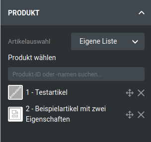

Bei der eigenen Liste können Artikel durch Ziehen und Halten des Pfeilkreuz-Symbols nach oben oder unten verschoben werden, um deren Reihenfolge zu ändern. Über das X kann ein Artikel aus der eigenen Liste entfernt werden.

### Vornehmen von Einstellungen

#### Farbeinstellungen

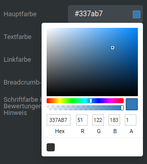

Um eine Farbe zu ändern, klicke wahlweise auf den im hellgrauen Feld angezeigten Farbwert oder die quadratische Farbanzeige. Es öffnet sich der Dialog mit einer Farbpalette.

Die einzelnen Bereichen sind von oben nach unten und links nach rechts wie folgt

-   Farbauswahl: über das große Feld kann die gewünschte Farbe ausgewählt werden
-   Farbskala: wählt den Bereich des Farbspektrums aus, der in der Farbauswahl angezeigt wird
-   Transparenz: legt den Alpha-Wert der Farbe fest, von durchsichtig bis voll deckend
-   Vorschaufenster: stelt den ausgewählten Farbwert in einer Vorschau dar
-   Hex-Wert: Eingabefeld mit Farbwert in hexadezimaler Schreibweise
-   R: Rot-Anteil der Farbe, von 0 bis 255
-   G: Grün-Anteil der Farbe, von 0 bis 255
-   B: Blau-Anteil der Farbe, von 0 bis 255
-   A: Alpha-Wert / Deckkraft der Farbe, von 0 bis 1

#### Farbverlaufeinstellungen

Über die Einstellung _**Farbverlauf anzeigen**_ werden die Einstellungen zum Anlegen eines Farbverlaufs angezeigt. Bei einem Farbverlauf findet ein Übergang von einer zu einer anderen Farbe statt.

 nach blau (#0000FF)")

|Feldname|Beschreibung|
|--------|------------|
|1 Farbe|Ausgangsfarbe des Farbverlaufs|
|2 Farbe|Zielfarbe des Farbverlaufs|
|Typ|Typ des Farbverlaufs \(_**linear**_ oder _**radial**_\)|
|Winkel|Winkel des Farbverlaufs bei Typ _**linear**_|

!!! note "Hinweis"

	 Wenn ein Feld für eine Farbeinstellung leer ist, lässt sich die Farbpalette nicht über einen Mausklick aufrufen. Hier hilft es, einfach einen beliebigen Farbwert, z.B. \#000000 oder \#FFFFFF in das Feld einzutragen und in einen beliebigen Bereich des Shops zu klicken. Das StyleEdit aktualisiert dann die Einstellung und es erscheint die kleine, quadratische Vorschau-Box.

	 

Der lineare Farbverlauf findet über die Länge einer unsichtbaren Linie statt, die von einer Kante bzw. Ecke des Elements zu einer anderen läuft. Die Linie verläuft hierbei in einem Winkel, der sich in 45 Grad-Schritten einstellen lässt. Hierbei kann man sich an einer Kompassrose orientieren:

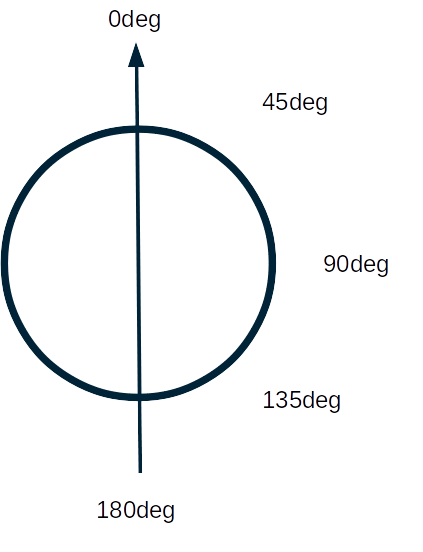

Im Beispiel sieht man, dass der Verlauf an einer \(gedachten\) Linie von unten links nach oben rechts ausgerichtet ist.

!!! note "Hinweis"

	 Im Dropdown _**Winkel**_ ist üblicherweise ein Wert von _**0deg**_ voreingestellt. Angezeigt wird jedoch beim ersten Einrichten ein Verlauf mit _**90deg**_.

 nach blau (#0000FF) in
        einem stark vergrößerten Header")

Bei einem radialen Farbverlauf geht dieser vom Mittelpunkt des jeweiligen Elements nach außen. Gut zu erkennen ist, dass der Verlauf sich gleichmäßig über die gesamte Distanz von Mittelpunkt zum äußersten Rand aufteilt. Bei einem Element mit unterschiedlichen Kantenlängen entsteht hierbei entsprechend eine "Ei-Form" statt einer Kugel.

#### Bildeinstellungen

Über den Button _**Wählen**_ oder einen Klick auf das Vorschau-Fenster wird der Dateimanager aufgerufen. Hierüber kann ein Bild hochgeladen und/oder ausgewählt werden. Weitere Informationen hierzu findest du im Kapitel _**Bilder einbinden**_.

Das Vorschau-Fenster hat eine Hover-Funktion, um Bereiche anzuzeigen, die außerhalb der Vorschau liegen. Bewege hierzu den Mauszeiger über das Vorschau-Fenster.

Über _**Löschen**_ kann das Bild wieder aus der Auswahl entfernt werden.

#### Hintergrundbildeinstellungen

Hintergrundbilder können wie reguläre Bilder eingerichtet werden. Es gibt jedoch zusätzliche Einstellungsmöglichkeiten.

|Feldname|Beschreibung|
|--------|------------|
|Position|relative Position, an der das Bild angezeigt wird \(_**left top**_: links oben, _**left center**_: links mittig, _**left bottom**_: links unten, _**right top**_: rechts oben, _**right center**_: rechts mittig, _**right bottom**_: rechts unten, _**center top**_: mitte oben, _**center center**_: mittig, _**center bottom**_: mitte unten\)|
|Verankerung|soll das Hintergrundbild mitscrollen \(_**scroll**_\) oder fixiert \(_**fixed**_\) dargestellt werden?|
|Wiederholung|soll das Hintergrundbild wiederholt werden? \(_**repeat**_: Wiederholen in horizontale und vertikale Richtung; _**repeat-x**_: wiederholen in horizontale Richtung; _**repeat-y**_: wiederholen in vertikale Richtung; _**space**_: wiederholt das Bild in beide Richtungen, so oft es hineinpasst, mit Abständen; _**round**_: wiederholt das Bild in beide Richtungen, so oft es hinein passt, passt die Bildgröße an; _**initial**_: verwendet die Standard-Einstellung; _**inherit**_: verwendet die Einstellung des übergeordneten Elements\)|
|Größe|soll die Größe des Hintergrundbilds angepasst werden? \(_**auto**_: Anzeige in Originalgröße; _**cover**_: vergrößern zur Abdeckung des gesamten Bereichs; _**contain**_: vergrößern, sodass das gesamte Bild sichtbar bleibt; _**initial**_: verwendet die Standard-Einstellung; _**inherit**_: verwendet die Einstellung des übergeordneten Elements\)|

#### Widgets

Das Honeygrid-Theme verfügt über mehrere Bereiche, in denen Widgets platziert werden können. Sie werden mit gestrichelten Linien dargestellt. Der äußere Bereich dieser Boxen ist die sogenannte _**Sektion**_. Sie beinhaltet mindestens eine _**Spalte**_, in der Widgets platziert werden können.

Bewegt man den Mauszeiger über die Sektion, werden von links nach rechts die Symbole für _**Bearbeiten**_, _**Verschieben**_ und _**Löschen**_ angezeigt. Beim Bearbeiten gibt es verschiedene Einstellungen:

Unter _**Aufteilung**_ kann festgelegt werden, wie viele Spalten die Sektion enthalten soll und wie diese verteilt sind. Unter _**Inhalt**_ können die Container bei Bedarf zentriert werden. Zudem kann der Container unter _**Responsive**_ auf verschiedenen Endgeräten ausgeblendet werden.

Schlussendlich kann der Sektion eine _**ID**_ und eine _**Klasse**_ zugeordnet werden.

!!! note "Hinweis"

	 IDs und Klassen werden auf HTML-Ebene verwendet. Änderungen sind optional.

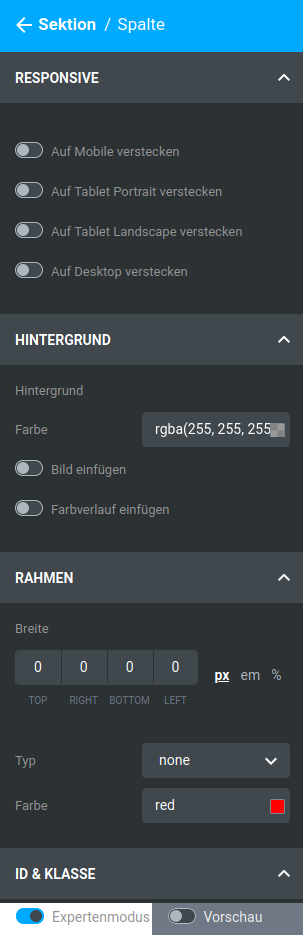

Für jede Spalte können über das Bleistift-Symbol ebenfalls Einstellungen vorgenommen werden. Hierzu zählen das Ausblenden der Spalte auf bestimmten Endgeräten, das Festlegen eines Hintergrunds und eines Rahmens.

|Feldname|Beschreibung|
|--------|------------|
|Breite|legt die Dicke der Grenzlinie in die verschiedenen Richtungen \(_**TOP**_: darüber, _**RIGHT**_: rechts, _**BOTTOM**_: darunter, _**LEFT**_: links\) in der eingestellten Einheit fest|
|Typ|Art der Trennlinie: _**solid**_ \(duchgängig\), _**hidden**_ \(unsichtbar\), _**dotted**_ \(gepunktet\), _**dashed**_ \(gestrichelt\), _**double**_ \(doppelt\), _**groove**_ \(gerillt\), _**ridge**_ \(kammförmig\), _**inset**_ \(eingefügt, hintergründig\), _**outset**_ \(hervorgehoben, vordergründig\), _**initial**_ \(Standardwert\), _**inherit**_ \(Wert des übergeordneten Elements\)|
|Farbe|Farbe der Trennlinie|

!!! note "Hinweis"

	 Durch Klick auf _**px**_, _**em**_ oder _**%**_ kann die jeweilige Größeneinheit eingestellt werden

Schlussendlich können auch hier ID und Klasse eingetragen werden.

!!! note "Hinweis"

	 IDs und Klassen werden auf HTML-Ebene verwendet. Änderungen sind optional.

Um ein Widget zu platzieren, klicke es mit der linken Maustaste an, halte diese gedrückt und ziehe es auf die gewünschte Spalte. Lasse die Maustaste wieder los, um das Widget einzubinden.

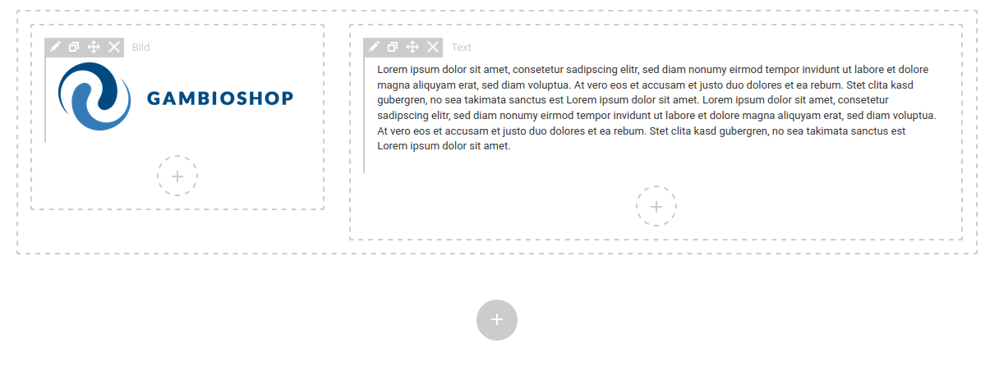

Sind die Widgets platziert, können diese mit einem Klick auf das Bleistift-Symbol bearbeitet werden. Zudem stehen von links nach rechts die Optionen _**Kopieren**_, _**Verschieben**_ und _**Löschen**_ zur Verfügung.

Unterhalb der angezeigten Sektionen kann über einen Klick auf das in der Abbildung hervorgehobene Plus-Zeichen eine weitere Sektion hinzugefügt werden. Innerhalb der Spalten wird mit einem Klick auf das entsprechende Plus der Widget-Bereich des StyleEdits aufgerufen.

## Bereiche und Einstellungen für das Malibu Theme

Das Malibu-Theme basiert auf dem Honeygrid-Theme, daher ist der Aufbau des StyleEdit 4 mit seinen Einstellungen größtenteils identisch. Es gibt jedoch einzelne Bereiche die anders aufgeteilt sind. Zudem sind verschiedene Varianten für bestimmte Komponenten des Malibus \(z.B. Header, Footer, Produktdetailseite\) mit zusätzlichen Optionen hinzugekommen, die für das Honeygrid nicht zur Verfügung stehen.

### Unterschiede in bestehenden Menüs

Einzelne Bereiche sind im StyleEdit 4 bei der Bearbeitung des Malibus anders aufgeteilt als es beim Honeygrid der Fall ist.

 und Malibu (rechts)")

#### Allgemein

 und Malibu (rechts)")

 und Malibu
 rechts)")

 und Malibu (rechts)")

#### Header

 und Malibu (rechts)")

#### Footer

 und Malibu (rechts)")

#### Produkte

 und Malibu (rechts)")

### Neu hinzugekommene Menüs

Durch die weiterreichenden Einstellungsmöglichkeiten sind in den einzelnen Bereichen verschiedene Optionen hinzugekommen.

#### Header

!!! note "Hinweis"

	 Die Einstellungsmöglichkeiten für den Header ändern sich mit der Auswahl der _**Header-Variante**_.

	 Die nachfolgend für _**Header 1**_ gezeigten Aufteilungen und Einstellungen sind analog für die Variante _**Header 2**_ .

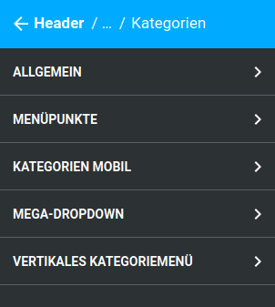

|Feldname|Beschreibung|
|--------|------------|
|Höhe|Höhe des inneren Bereichs der horizontalen Navigationsleiste, ist mit dem Platzhalter _**$navbar-height**_ vorbelegt|
|Höhe Sticky|Höhe des inneren Bereichs der horizontalen Navigationsleiste im Sticky-Header, ist standardmäßig mit 0 vorbelegt|
|Übergänge|sanfteres Einblenden des Mega-Dropdown, wenn der Mauszeiger über eine Kategorie mit Unterkategorien bewegt wird|
|Höhe außen|Höhe des äußeren Bereichs der horizontalen Navigationsleiste|
|Abstand unten|Unterer Abstand zur Kategorieleiste, ist mit dem Platzhalter _**$line-height-computed**_ vorbelegt|

!!! note "Hinweis"

	 Sticky bezeichnet die reduzierte Form des Headers, die verwendet wird, wenn mit fixierter Kopfzeile nach unten gescrollt wird.

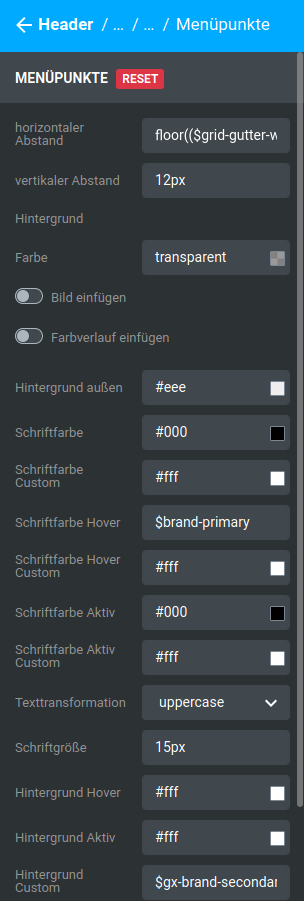

|Feldname|Beschreibung|
|--------|------------|
|horizontaler Abstand|linker Abstand der Einträge der Sekundärnavigation, vorbelegt mit _**floor\(\($grid-gutter-width/2\)\)**_|
|vertikaler Abstand|Abstand oberhalb und unterhalb der Einträge für Hauptkategorien|
|Hintergrund|
|Farbe|Hintergrundfarbe der horizontalen Menüleiste \(ohne Content-Einträge\), vorbelegt mit _**transparent**_|
|Bild einfügen|Hintergrundbild der horizontalen Menüleiste \(ohne Content-Einträge\)|
|Farbverlauf einfügen|Farbverlauf für den Hintergrund der horizontalen Menüleiste \(ohne Content-Einträge\)|
|Hintergrund außen|Hintergrundfarbe, die in der Fortführung der horizontalen Menüleiste links und rechts angezeigt wird|

!!! note "Hinweis"

	 Die hier eingestellte Farbe verläuft auf der Breite der kompletten Kategorieleiste. Sie ist auch in der Mitte der Leiste zu sehen, wenn die Einstellung _**Farbe**_ unter _**Hintergrund**_ auf _**transparent**_ gesetzt ist.

|Feldname|Beschreibung|
|--------|------------|
|Schriftfarbe|Schriftfarbe der Hauptkategorien \(ohne Unterkategorien und Content-Einträge\) in der horizontalen Menüleiste|
|Schriftfarbe Custom|Schriftfarbe der Content-Einträge in der horizontalen Menüleiste|
|Schriftfarbe Hover|Schriftfarbe der Hauptkategorien \(ohne Unterkategorien und Content-Einträge\) in der horizontalen Menüleiste, beim Hovern mit dem Mauszeiger, ohne dass Unterkategorien aufgeklappt werden, vorbelegt mit _**$brand-primary**_|
|Schriftfarbe Hover Custom|Schriftfarbe der Content-Einträge in der horizontalen Menüleiste, beim Hovern mit dem Mauszeiger|
|Schriftfarbe Aktiv|Schriftfarbe der Hauptkategorie in der horizontalen Menüleiste, die aktuell angezeigt wird|
|Schriftfarbe Aktiv Custom|Schriftfarbe der Content-Seite in der horizontalen Menüleiste, die aktuell angezeigt wird|
|Texttransformation|Ändert Groß- und Kleinschreibung der Beschriftung der Hauptkategorie in der horizontalen Menüleiste|
|  |**none**: Text wird so ausgegeben, wie er im Shop als Kategoriename hinterlegt ist|
|  |**uppercase**: Text wird in Großbuchstaben ausgegeben|
|  |**lowercase**: Text wird in Kleinbuchstaben ausgegeben|
|  |**capitalize**: Jedes Wort beginnt mit einem Großbuchstaben|
|Schriftgröße|Schriftgröße der Hauptkategorien in der horizontalen und vertikalen Menüleiste|
|Hintergrund Hover|Hintergrundfarbe der Hauptkategorien in der horlzontalen Menüleiste beim Hovern mit der Maus|
|Hintergrund Aktiv|Hintergrundfarbe der aktuell angezeigten Hauptkategorie in der horizontalen Kategorieleiste|
|Hintergrund Custom|Hintergrundfarbe der Content-Einträge in der horizontalen Menüleiste, vorbelegt mit _**$gx-brand-secondary**_|
|Hintergrund Hover Custom|Hintergrundfarbe der Content-Einträge in der horizontalen Menüleiste, beim Hovern mit der Maus, vorbelegt mit _**lighten\($gx-custom-bg-color, 10%\)**_|
|Hintergrund Aktiv Custom|Hintergrundfarbe des Content-Eintrags in der horizontalen Menüleiste, der aktuell angezeigt wird, vorbelegt mit _**lighten\($gx-custom-bg-color, 10%\)**_|

!!! note "Hinweis"

	 Hovern bzw. Mouseover bezeichnet das Platzieren des Mauszeigers über ein Element, ohne es anzuklicken

|Feldname|Beschreibung|
|--------|------------|
|Mobil-Menü Höhe|Höhe des mobilen Menüs|
|Höhe|Höhe der Menü-Einträge|
|Vertikaler Abstand|Abstand des Namens zur oberen Kante des Menüeintrags|
|Icons anzeigen|Icons im mobilen Menü anzeigen ja/nein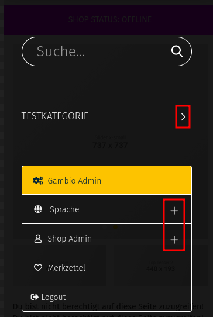|

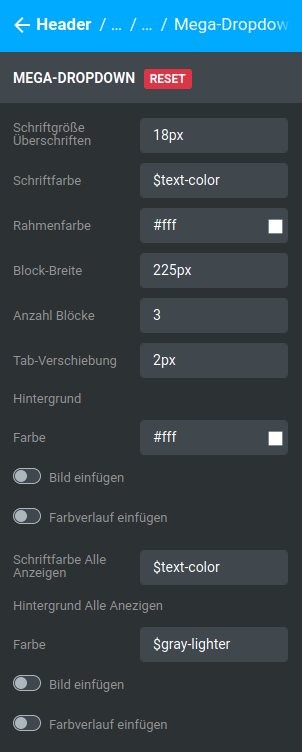

|Feldname|Beschreibung|
|--------|------------|
|Schriftgröße Überschriften|Schriftgröße der Einträge im Dropdown des Kategoriemenüs|
|Schriftfarbe|Schriftfarbe der Einträge im Dropdown des Kategoriemenüs, vorbelegt mit _**$text-color**_|
|Rahmenfarbe|Farbe der Rahmenelemente der Einträge im Dropdown des Kategoriemenüs|
|Block-Breite|Breite der Unterkategorie-Blöcke im Mega-Dropdown|
|Anzahl Blöcke|Anzahl der nebeneinander angezeigten Blöcke im Mega-Dropdown|
|Tab-Verschiebung|innerer Abstand der einzelnen Menüeinträge, vorbelegt mit 2px|
|Hintergrund|
|Farbe|Hintergrundfarbe des Mega-Dropdowns|
|Bild einfügen|Hintergrundbild des Mega-Dropdowns|
|Farbverlauf einfügen|Verwenden eines Farbverlaufs für den Hintergrund des Mega-Dropdowns|
|Schriftfarbe Alle Anzeigen|Schriftfarbe des Buttons _**Alle Anzeigen**_, vorbelegt mit _**$text-color**_|
|Hintergrund Alle Anzeigen|
|Farbe|Hintergrundfarbe des Buttons _**Alle Anzeigen**_, vorbelegt mit _**$gray-lighter**_|
|Bild einfügen|Hintergrundbild des Buttons _**Alle Anzeigen**_|
|Farbverlauf einfügen|Farbverlauf als Hintergrundbild des Buttons _**Alle Anzeigen**_|

|Feldname|Beschreibung|
|--------|------------|
|Schriftfarbe|Schriftfarbe des vertikalen Kategoriemenüs, mit _**$text-color**_ vorbelegt|
|Schriftfarbe Hover|Schriftfarbe des vertikalen Kategoriemenüs beim Hovern, mit _**$text-color**_ vorbelegt|
|Schriftfarbe Aktiv|Schriftfarbe der aktuell angezeigten Kategorie im vertikalen Kategoriemenü|
|Schriftfarbe geöffnet|Schriftfartbe der aufgeklappten Kategorien im vertikalen Kategoriemenü, vorbelegt mit _**$text-color**_|
|Hintergrund|
|Farbe|Hintergrundfarbe des vertikalen Kategoriemenüs  im vertikalen Kategoriemenü")|
|Bild einfügen|Hintergrundbild des vertikalen Kategoriemenüs|
|Farbverlauf einfügen|Farbverlauf als Hintergrund im vertikalen Kategoriemenü|
|Hintergrund Hover|
|Farbe|Hintergrundfarbe des Untermenüeintrags im vertikalen Kategoriemenü beim Hovern mit der Maus|
|Bild einfügen|Hintergrundbild des Menüeintrags im vertikalen Kategoriemenü beim Hovern mit der Maus|
|Farbverlauf einfügen|Farbverlauf als Hintergrund des Menüeintrags im vertikalen Kategoriemenü beim Hovern mit der Maus|
|Hintergrund Aktiv|
|Farbe|Hintergrundfarbe der aktuell angezeigten Kategorie im vertikalen Kategoriemenü, vorbelegt mit _**$brand-primary**_|
|Bild einfügen|Hintergrundbild der aktuell angezeigten Kategorie im vertikalen Kategoriemenü|
|Farbverlauf einfügen|Farbverlauf als Hintergrund der angezeigten Kategorie im vertikalen Kategoriemenü|
|Hintergrund geöffnet|
|Farbe|Hintergrundfarbe der aktuell aufgeklappten Hauptkategorie  als Hintergrund hat")|
|Bild einfügen|Hintergrundbild der Hauptkategorien im vertikalen Kategoriemenü|
|Farbverlauf einfügen|Farbverlauf als Hintergrund der Hauptkategorien im vertikalen Kategoriemenü|

!!! note "Hinweis"

	 Hovern bzw. Mouseover bezeichnet das Platzieren des Mauszeigers über ein Element, ohne es anzuklicken

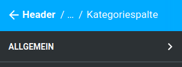

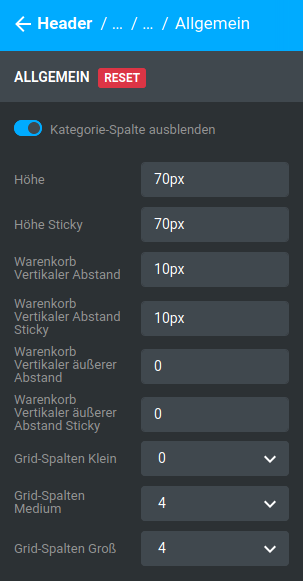

|Feldname|Beschreibung|
|--------|------------|
|Kategorie-Spalte ausblenden|blendet die Anzeige der Kategorien als zusätzlichen Bereich im Header ein bzw. aus")|
|Höhe|Höhe der Kategoriespalte im Header|
|Höhe Sticky|Höhe der Kategoriespalte im Sticky Header|
|Warenkorb Vertikaler Abstand|Abstand der Kategorieeinträge nach oben und unten|
|Warenkorb Vertikaler Abstand Sticky|Abstand der Kategorieeinträge nach oben und unten im Sticky Header|
|Warenkorb Vertikaler äußerer Abstand|äußerer Abstand der Kategorieeinträge nach oben und unten|
|Warenkorb Vertikaler äußerer Abstand Sticky|äußerer Abstand der Kategorieeinträge nach oben und unten im Sticky Header|
|Grid-Spalten Klein|Anzahl der Grid-Spalten des Kategoriespalten-Bereichs für kleine Darstellung, typischerweise Tablet im Portrait/Hoch-Format|
|Grid-Spalten Medium|Anzahl der Grid-Spalten des Kategoriespalten-Bereichs für mittelgroße Darstellung, typischerweise Tablet im Landscape/Quer-Format|
|Grid-Spalten Groß|Anzahl der Grid-Spalten des Kategoriespalten-Bereichs für große Darstellung, typischerweise Desktop-Computer|

!!! note "Hinweis"

	 Sticky bezeichnet die reduzierte Form des Headers, die verwendet wird, wenn mit fixierter Kopfzeile nach unten gescrollt wird.

!!! note "Hinweis"

	 Die grafische Oberfläche des Shops wird in der Breite in 12 sogenannte Grid-Spalten aufgeteilt. Für jede Größe \(groß, medium, klein\) gibt es eine eigene Einstellung. Die Summe aller Einstellungen einer Größe, die nicht ausgeblendet werden, muss 12 ergeben. Weitere Informationen hierzu sind im Kapitel _**Grid-Spalten**_ aufgeführt.

|Feldname|Beschreibung|
|--------|------------|
|Schriftgröße|Schriftgröße der Menüeinträge in der Sekundärnavigation, mit _**$font-size-small**_ vorbelegt|
|Höhe|Höhe der Einträge der Sekundärnavigation|
|Höhe Sticky|Höhe der Einträge der Sekundärnavigation in der Sticky-Ansicht|
|Hintergrund|
|Farbe|Hintergrundfarbe der Sekundärnavigationsleiste|
|Bild einfügen|Hintergrundbild der Sekundärnavigationsleiste|
|Farbverlauf einfügen|Farbverlauf als Hintergrund der Sekundärnavigationsleiste|

!!! note "Hinweis"

	 Sticky bezeichnet die reduzierte Form des Headers, die verwendet wird, wenn mit fixierter Kopfzeile nach unten gescrollt wird.

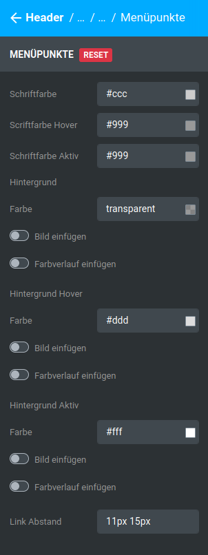

|Feldname|Beschreibung|
|--------|------------|
|Schriftfarbe|Schriftfarbe der Menüeinträge in der Sekundärnavigation, abzüglich Gambio Admin-Button|
|Scriftfarbe Hover|Schriftfarbe der Menüeinträge in der Sekundärnavigation beim Hovern, abzüglich Gambio Admin-Button|
|Schriftfarbe Aktiv|Schriftfarbe der Menüeinträge in der Sekundärnavgiation, beim Ausklappen eines Dropdowns als _**Schriftfarbe Aktiv**_")|
|Hintergrund|
|Farbe|Hintergrundfarbe der Menüeinträge der Sekundärnavigation, abzüglich Gambio Admin-Button, mit _**transparent**_ vorbelegt|
|Bild einfügen|Hintergrundbild der Menüeinträge der Sekundärnavigation|
|Farbverlauf einfügen|Farbverlauf als Hintergrund der Menüeinträge der Sekundärnavigation|
|Hintergrund Hover|
|Farbe|Hintergrundfarbe der Menüeinträge der Sekundärnavigation beim Hovern mit der Maus, abzüglich Gambio Admin-Button|
|Bild einfügen|Hintergrundbild der Menüeinträge der Sekundärnavigation beim Hovern mit der Maus|
|Farbverlauf einfügen|Farbverlauf als Hintergrund der Menüeinträge der Sekundärnavigation beim Hovern mit der Maus|
|Hintergrund Aktiv|
|Farbe|Hintergrundfarbe der Menüeinträge in der Sekundärnavgiation, beim Ausklappen eines Dropdowns als _**Farbe**_ für _**Hintergrund Aktiv**_")|
|Bild einfügen|Hintergrundbild der Menüeinträge in der Sekundärnavgiation, beim Ausklappen eines Dropdowns|
|Farbverlauf einfügen|Farbverlauf als Hintergrund der Menüeinträge der Sekundärnavigation beim Ausklappen eines Dropdowns|
|Link Abstand|innerer Abstand des Textes nach oben und unten bzw. links und rechts zum Rand des Buttons, vorbelegt mit _**11px 15px**_|

!!! note "Hinweis"

	 Hovern bzw. Mouseover bezeichnet das Platzieren des Mauszeigers über ein Element, ohne es anzuklicken

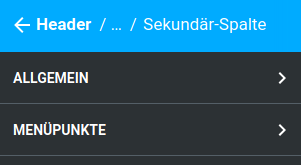

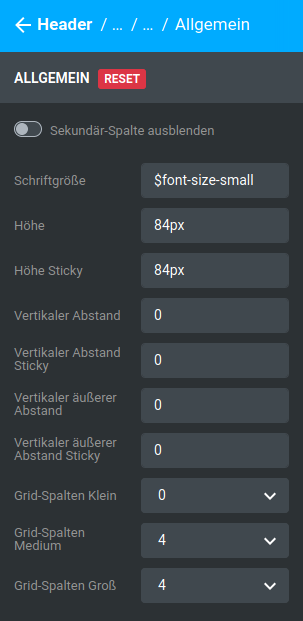

|Feldname|Beschreibung|
|--------|------------|
|Sekundär-Spalte ausblenden|Blendet die Sekundär-Spalte zur Verwendung im Header aus, dies verringert die Anzahl der verwendeten Grid-Spalten.|
|Schriftgröße|Schriftgröße der verwendeten Icons, vorbelegt mit _**$font-size-small**_|
|Höhe|Höhe der Sekundär-Spalte|
|Höhe Sticky|Höhe der Sekundär-Spalte im Sticky-Header|
|Vertikaler Abstand|Abstand der einzelnen Icons nach oben und unten, vorbelegt mit 0|
|Vertikaler Abstand Sticky|Abstand der einzelnen Icons nach oben und unten im Sticky-Header, vorbelegt mit 0|
|Vertikaler äußerer Abstand|Äußerer Abstand der einzelnen Icons, vorbelegt mit 0|
|Vertikaler äußerer Abstand Sticky|Äußerer Abstand der einzelnen Icons im Sticky-Header, vorbelegt mit 0|
|Grid-Spalten Klein|Anzahl der Grid-Spalten des Sekundär-Spalten-Bereichs für kleine Darstellung, typischerweise Tablet im Portrait/Hoch-Format|
|Grid-Spalten Medium|Anzahl der Grid-Spalten des Sekundär-Spalten-Bereichs für mittelgroße Darstellung, typischerweise Tablet im Landscape/Quer-Format|
|Grid-Spalten Groß|Anzahl der Grid-Spalten des Sekundär-Spalten-Bereichs für große Darstellung, typischerweise Desktop-Computer|

!!! note "Hinweis"

	 Sticky bezeichnet die reduzierte Form des Headers, die verwendet wird, wenn mit fixierter Kopfzeile nach unten gescrollt wird.

!!! note "Hinweis"

	 Die grafische Oberfläche des Shops wird in der Breite in 12 sogenannte Grid-Spalten aufgeteilt. Für jede Größe \(groß, medium, klein\) gibt es eine eigene Einstellung. Die Summe aller Einstellungen einer Größe, die nicht ausgeblendet werden, muss 12 ergeben. Weitere Informationen hierzu sind im Kapitel _**Grid-Spalten**_ aufgeführt.

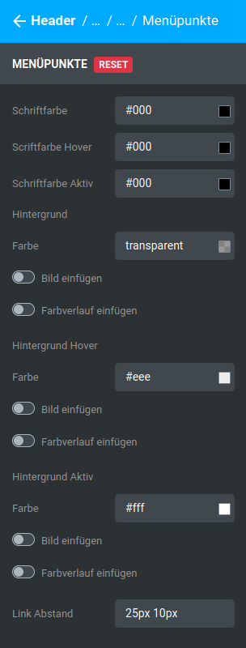

|Feldname|Beschreibung|
|--------|------------|
|Schriftfarbe|Schriftfarbe der Icons in der Sekundär-Spalte|
|Scriftfarbe Hover|Schriftfarbe der Icons in der Sekundär-Spalte beim Hovern|
|Schriftfarbe Aktiv|Schriftfarbe der Icons in der Sekundär-Spalte, nach dem Anklicken|
|Hintergrund|
|Farbe|Hintergrundfarbe der Icons der Sekundär-Spalte, mit _**transparent**_ vorbelegt|
|Bild einfügen|Hintergrundbild der Icons der Sekundär-Spalte|
|Farbverlauf einfügen|Farbverlauf als Hintergrund der Icons der Sekundär-Spalte|
|Hintergrund Hover|
|Farbe|Hintergrundfarbe der Icons der Sekundär-Spalte beim Hovern mit der Maus|
|Bild einfügen|Hintergrundbild der Icons der Sekundär-Spalte beim Hovern mit der Maus|
|Farbverlauf einfügen|Farbverlauf als Hintergrund der Icons der Sekundär-Spalte beim Hovern mit der Maus|
|Hintergrund Aktiv|
|Farbe|Hintergrundfarbe der Icons in der Sekundär-Spalte, beim Anklicken|
|Bild einfügen|Hintergrundbild der Icons in der Sekundär-Spalte, beim Anklicken|
|Farbverlauf einfügen|Farbverlauf als Hintergrund der Icons der Sekundär-Spalte beim Anklicken|
|Link Abstand|innerer Abstand des Icons nach oben und unten bzw. links und rechts zum Rand des Buttons, vorbelegt mit _**25px 10px**_|

!!! note "Hinweis"

	 Hovern bzw. Mouseover bezeichnet das Platzieren des Mauszeigers über ein Element, ohne es anzuklicken

#### Footers

|Feldname|Beschreibung|
|--------|------------|
|Footer wrappen|Richtet die Footer-Spalten an den äußeren Abmessungen des Footer Headers aus|

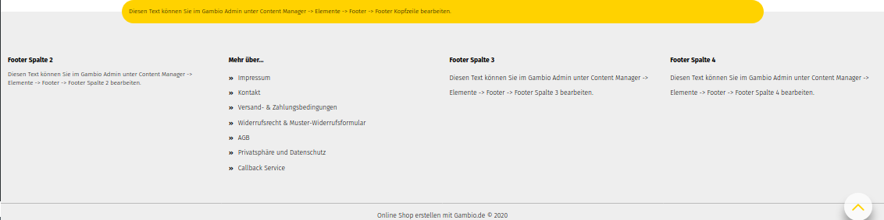

#### Layout

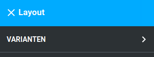

Unter _**Bereiche / Layout / Varianten**_ kann das Layout des Themes umgestellt werden. Es stehen die folgenden Varianten zur Verfügung:

-   Full Screen
-   Boxed
-   Hero

#### Teaser-Slider

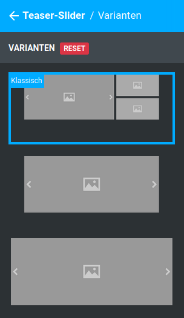

Es stehen folgende Varianten für den Teaser-Slider zur Auswahl:

-   Klassisch
-   Boxed
-   Full width

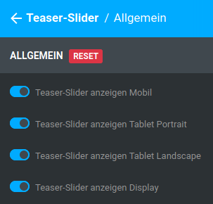

#### Produktseite

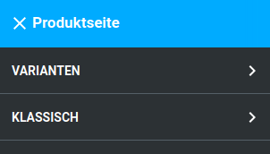

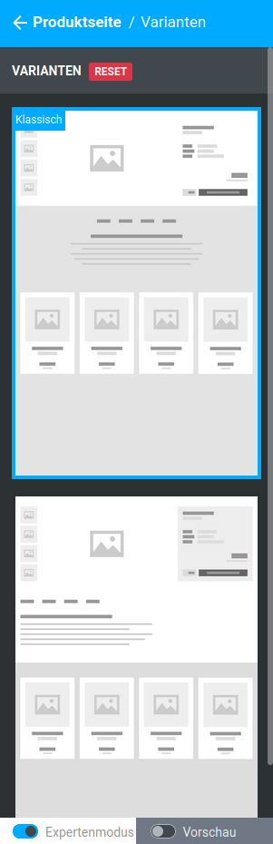

Es können die folgenden Varianten für die Produktseite gewählt werden:

-   Klassisch
-   Links ausrichten

!!! note "Hinweis"

	 Die Einstellungen für die Produktseite ändern sich mit der Auswahl der Produktseiten-Variante

|Feldname|Beschreibung|
|--------|------------|
|Hintergrund|
|Farbe|Hintergrundfarbe der Produkt-Detailbox / Preisbox |
|Bild einfügen|Hintergrundbild der Produkt-Detailbox / Preisbox|
|Farbverlauf einfügen|Farbverlauf als Hintergrund der Produkt-Detailbox / Preisbox|
|Schriftfarbe|Schriftfarbe der Produkt-Detailbox / Preisbox, vorbelegt mit _**$text-color**_|
|Hinweis Schriftfarbe|Schriftfarbe des Preis-, Steuer- und Versandkostenhinweises, vorbelegt mit _**$gray-light**_|
|Rahmebreite|Breite des Rahmens um die Produkt-Detailbox / Preisbox, vorbelegt mit 0|
|Rahmenstil|Stil des Rahmens um die Produkt-Detailbox / Preisbox. Mögliche Auswahlwerte: _**solid**_ \(duchgängig\), _**hidden**_ \(unsichtbar\), _**dotted**_ \(gepunktet\), _**dashed**_ \(gestrichelt\), _**double**_ \(doppelt\), _**groove**_ \(gerillt\), _**ridge**_ \(kammförmig\), _**inset**_ \(eingefügt, hintergründig\), _**outset**_ \(hervorgehoben, vordergründig\), _**initial**_ \(Standardwert\), _**inherit**_ \(Wert des übergeordneten Elements\), vorbelegt mit _**none**_|
|Rahmenfarbe|Farbe des Rahmens um die Produkt-Detailbox / Preisbox, vorbelegt mit _**transparent**_|
|Mengenfeld ausblenden|Ausblenden des Mengeneingabefelds|

|Feldname|Beschreibung|
|--------|------------|
|Hintergrund|
|Farbe|Hintergrundfarbe der Produkt-Detailbox / Preisbox|
|Bild einfügen|Hintergrundbild der Produkt-Detailbox / Preisbox|
|Farbverlauf einfügen|Farbverlauf als Hintergrund der Produkt-Detailbox / Preisbox|
|Schriftfarbe|Schriftfarbe in der Produkt-Detailbox / Preisbox, vorbelegt mit _**$text-color**_|
|Hinweis Schriftfarbe|Schriftfarbe für Preis-, Steuer- und Versandkostenhinweis, vorbelegt mit _**$gray-light**_|
|Rahmenbreite|Breite des Rahmens um die Produkt-Detailbox / Preisbox, vorbelegt mit 0|
|Rahmenstil|Stil des Rahmens um die Produkt-Detailbox / Preisbox, vorbelegt mit _**none**_|
|Rahmenfarbe|Farbe des Rahmens um die Produkt-Detailbox / Preisbox, vorbelegt mit _**transparent**_|
|Button Schriftfarbe|Schriftfarbe der Buttons unterhalb des Warenkorb-Buttons|
|Button Schriftfarbe Hover|Schriftfarbe der Buttons unterhalb des Warenkorb-Buttons beim Mouseover/Hover, vorbelegt mit _**darken\($gx-product-info-button-color, 10%\)**_|
|Button Hintergrundfarbe|Hintergrundfarbe der Buttons unterhalb des Warenkorb-Buttons, vorbelegt mit _**transparent**_|
|Button Hintergrundfarbe Hover|Hintergrundfarbe der Buttons unterhalb des Warenkorb-Buttons beim Mouseover/Hover, vorbelegt mit _**transparent**_|
|Button Rahmenfarbe|Rahmenfarbe der Buttons unterhalb des Warenkorb-Buttons|
|Button Rahmenfarbe Hover|Rahmenfarbe der Buttons unterhalb des Warenkorb-Buttons beim Mouseover/Hover|
|Preisbox mitscrollen|soll die Produktdetailbox mitscrollen?|

!!! note "Hinweis"

	 Hovern bzw. Mouseover bezeichnet das Platzieren des Mauszeigers über ein Element, ohne es anzuklicken
	 
