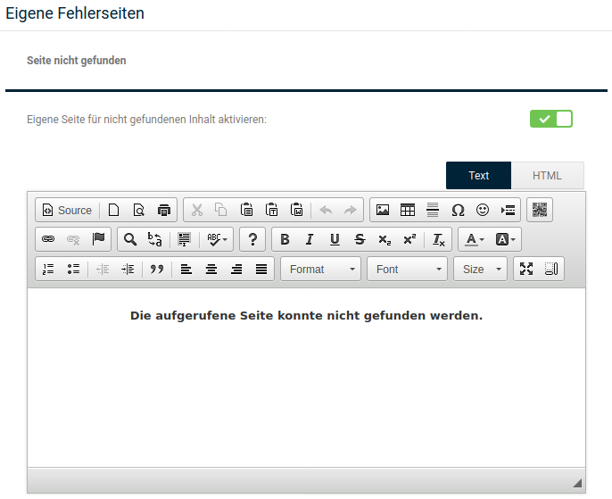

# Eigene Fehlerseiten

Unter _**Darstellung \> Eigene Fehlerseiten**_ bzw. _**Inhalte \> Eigene Fehlerseiten**_ können Inhaltsseiten für den Fall definiert werden, dass bei der Benutzung des Shops ein Fehler auftritt.

Der Inhalt der Seite kann jeweils über den CK-Editor oder alternativ einen HTML-Editor, umschaltbar über die Schaltflächen _**Text**_ und _**HTML**_, festgelegt werden. Der _**CK-Editor**_ ist im gleichnamigen Kapitel des Handbuchs beschrieben.

## Seite nicht gefunden

Wenn Besucher versuchen eine Seite aufzurufen, die so nicht \(mehr\) im Shop vorhanden ist, kommt es zu einem sogenannten _**Error 404 'not found'**_. Ohne eigene Fehlerseite erfolgt dann eine Weiterleitung auf die Seite _**Erweiterte Suche**_.

Setzen den Haken _**Eigene Seite für nicht gefundenen Inhalt aktivieren**_ und bestätige dies mit einem Klick auf _**Speichern**_, wenn du die eigene Fehlerseite für nicht gefundene Seiten verwenden möchtest.

## Unerwarteter Fehler

Neben dem Aufruf einer nicht \(mehr\) vorhandenen Seite kann es auch zu anderen Fehlermeldungen aus verschiedenen Ursachen kommen. Um hier eine eigene Fehlerseite zu verwenden, setze den Haken für _**Fehlerseite für unerwartete Fehler aktivieren**_ und bestätige dies mit einem Klick auf _**Speichern**_.

!!! note "Hinweis"

	 Über den Platzhalter _**\#\#ERROR\_CODE\#\#**_ kannst du den Fehlercode des aufgetretenen Fehlers auf der eigenen Seite anzeigen lassen.

