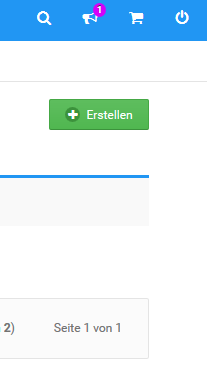
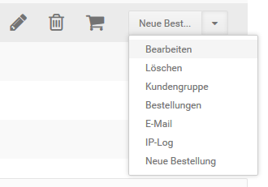

# Kundenkonten verwalten

Im Gambio Admin unter _**Kunden \> Kunden**_ verwaltest du die Kundenkonten deiner Kunden.

## Kundenkonto manuell anlegen

Kundenkonten kannst du im Gambio Admin deines Shops unter _**Kunden \> Kunden**_ von Hand erstellen.

1.  Klicke auf _**Erstellen**_ unterhalb der Admin-Info Box
2.  Trage die Kundendaten in der Kunden-Eingabemaske ein, eine Übersicht über die Bedeutung der einzelnen Felder findest du in der Tabelle _**Übersicht über die Kundenkonto-Eingabemaske**_
3.  Wähle unter _**Weitere Optionen**_ aus der Liste _**Kundengruppe**_ die gewünschte Kundengruppe für den neuen Kunden aus
4.  Ändere die Option bei _**E-Mail mit Passwort an Kunden versenden**_ auf _**Nein**_, wenn du deinem Kunden keine Benachrichtigung über das neue Kundenkonto zusenden möchtest
5.  Trage im Feld _**Passwort**_ ein Passwort für das neue Kundenkonto ein, wenn du nicht das voreingestellte Zufallspasswort verwenden möchtest
6.  Trage im Feld _**Zusätzlicher E-Mail-Text**_ eine persönliche Nachricht für die Benachrichtigung an den Kunden ein
7.  Klicke auf _**Einfügen**_, um das neue Kundenkonto zu speichern

")

|Feldname|Beschreibung|
|--------|------------|
|Anrede|Legt die Anrede für den Kunden fest|
|Kundennummer|Feld für die Kundennummer des Kunden|
|Vorname|Feld für den Vornamen des Kunden|
|Nachname|Feld für den Nachnamen des Kunden|
|E-Mail-Adresse|Feld für die E-Mail-Adresse des Kunden|
|Firmenname|Feld für den Firmennamen des Kunden|
|Ust-IdNr.|Feld für die Umsatzsteuer ID-Nummer des Kunden|
|Straße|Feld für die Straße der Kundenanschrift|
|Hausnummer|Feld für Hausnummer der Kundenanschrift|
|Postleitzahl|Feld für die Postleitzahl der Kundenanschrift|
|Stadt|Feld für die Stadt der Kundenanschrift|
|Land|Feld für das Land der Kundenanschrift|
|Telefonnummer|Feld für die Telefonnummer des Kunden|
|Telefaxnummer|Feld für die Faxnummer des Kunden|
|Kundengruppe|Auswahlliste für die Kundennummer des Kunden \(Nur bei manuellem Anlegen eines Kunden\)|
|E-Mail mit Passwort an Kunden versenden|Bei _**ja**_ wird dem Kunden eine Willkommens-Nachricht zugeschickt \(Nur bei manuellem Anlegen eines Kunden\)|
|Nicht erlaubte Zahlungsmodule|Kommagetrennte Liste mit Modulnamen von gesperrten Zahlungsweisen|
|Nicht erlaubte Versandmodule|Kommagetrennte Liste mit Modulnamen von gesperrten Versandarten|
|\(Neues\) Passwort|Feld für das Passwort des Kunden|
|Zusätzlicher E-Mail-Text|Feld für eine persönliche Nachricht in der Willkommens- Nachricht \(Nur bei manuellem Anlegen eines Kunden\)|
|Newsletter|Auswahlliste zum Newsletter-Abonnement-Status des Kunden|
|Memo|Feld für Kundennotizen für den Shopbetreiber|

!!! note "Hinweis" 
	 Die Trennung von Straße und Hausnummer kann unter _**Kunden \> Kunden**_ im Reiter _**Kunden-Details**_ an- und abgeschaltet werden. Ist die Trennung abgeschaltet, steht das Feld _**Hausnummer**_ nicht zur Verfügung.

## Kundenkonto bearbeiten

Die meisten Änderungen an Kundenkonten können direkt vom Kunden im Shopbereich vorgenommen werden. Im Gambio Admin unter _**Kunden \> Kunden**_ kannst du von bestehenden Kundenkonten die Standardanschrift und Kontaktdaten ändern.

1.  Wähle aus der Kundenliste das zu bearbeitende Kundenkonto aus, das aktuell ausgewählte Kundenkonto wird grau hinterlegt
2.  Klicke über den Dropdown-Button auf _**Bearbeiten**_
3.  Ändere die Standardanschrift des Kunden nach Bedarf
4.  Ändere die Kontaktdaten des Kunden nach Bedarf
5.  Schränke das Kundenkonto bei Bedarf ein, wie im Kapitel _**Kundenkonten einschränken**_ beschrieben
6.  Ändere in der Liste _**Newsletter**_ bei Bedarf den Newsletter-Abonnement-Status des Kunden
7.  Füge bei Bedarf eine _**Anmerkung**_ zu diesem Kunden hinzu

    _**Anmerkungen**_ zu Kunden werden auf der Kunden-Detailseite und auf den Detailseiten zu Bestellungen des Kunden angezeigt

8.  Klicke auf _**Aktualisieren**_, um die Änderungen zu speichern

## Kundenkonten einschränken

Im Gambio Admin deines Shops unter _**Kunden \> Kunden**_ kannst du für Kundenkonten einzelner Kunden die erlaubten Zahlungsweisen und Versandarten einschränken.

!!! note "Hinweis" 
	 Wenn du die Kundenkonten mehrerer Kunden mit denselben Einschränkungen versehen möchtest, lege stattdessen eine neue Kundengruppe an, wie im Kapitel _**Kundengruppen**_ beschrieben und weise die Kunden dieser Kundengruppe zu.

1.  Wähle aus der Kundenliste das einzuschränkende Kundenkonto aus

    Das aktuell ausgewählte Kundenkonto wird hellblau hinterlegt

2.  Klicke in der rechten Spalte auf _**Bearbeiten**_
3.  Trage im Feld _**Nicht erlaubte Zahlungsmodule**_ kommagetrennt und ohne Leerzeichen die Modulnamen der Zahlungsweisen ein, die der Kunde nicht verwenden darf

    Den Namen eines Zahlungsmoduls ermittelst du unter _**Module \> Zahlungsweisen**_, der Modulname steht in der Spalte _**Modulname**_

4.  Trage im Feld _**Nicht erlaubte Versandmodule**_ kommagetrennt und ohne Leerzeichen die Modulnamen der Versandarten ein, die der Kunde nicht verwenden darf

    Den Namen eines Versandmoduls ermittelst du unter _**Module \> Versandarten**_, der Modulname steht in der Spalte _**Modulname**_

5.  Klicke auf _**Aktualisieren**_, um die Einschränkungen zu speichern

## Kundenkonto löschen

Wenn ein Kunde im Shopbereich auf _**Kundenkonto löschen**_ klickt, erhältst du eine E-Mail, die dich über den Löschwunsch des Kunden in Kenntnis setzt. Kunden können ihre Konten nicht selbständig löschen, Kundenkonten löscht du im Gambio Admin deines Shops unter _**Kunden \> Kunden**_.

1.  Wähle aus der Kundenliste das zu löschende Kundenkonto aus, indem du den Mauszeiger darüber bewegst

    Das aktuell ausgewählte Kundenkonto ist grau hinterlegt

2.  Klicke in der Zeile des Kundenkontos auf das Mülltonen-Symbol
3.  Überprüfe in der nun angezeigten Sicherheitsabfrage, dass du das korrekte Kundenkonto gewählt hast
4.  Klicke erneut auf _**Löschen**_, um das Kundenkonto unwiderruflich zu löschen

!!! note "Hinweis" 
	 Wenn du ein Kundenkonto löscht, werden nur die Stammdaten des Kunden aus dem System gelöscht. Sämtliche Bestellungen und Artikelbewertungen des Kunden bleiben erhalten.
	 
	 
