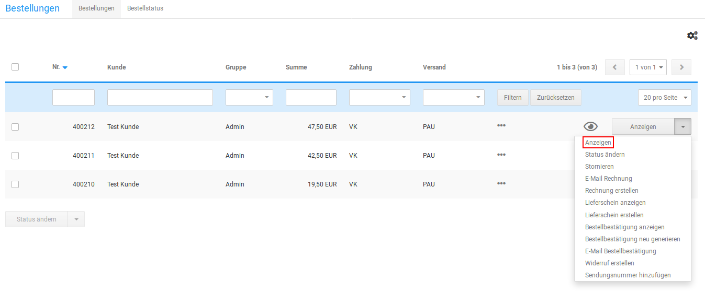

# Bestellung bearbeiten

Änderungen an eine Bestellung kannst du im Gambio Admin deines Shops unter _**Bestellungen \> Bestellungen**_ vornehmen. Wähle aus der Bestellübersicht die zu ändernde Bestellung aus. Die aktuell gewählte Bestellung ist grau hinterlegt. Klicke in der Dropdown-Schaltfläche auf _**Anzeigen**_ und klicke auf der Detailseite der Bestellung auf _**Bearbeiten**_, um die Daten für den jeweiligen Bereich zu ändern

## Kundendaten ändern

Bei einer vorhandenen Bestellung kannst du die Kundendaten, wie die Versand- und Rechnungsadresse, in der Bestell-Eingabemaske ändern. Klicke auf der Detailseite der Bestellung auf _**Bearbeiten**_, um die Bestell-Eingabemaske aufzurufen.

1.  Klicke im Bereich _**Bestellinformation**_ auf _**Bearbeiten**_
2.  Ändere die Kundenadressen bei Bedarf ab

    Die Änderungen an den Kundendaten werden nicht im Kundenkonto gespeichert

3.  Wähle aus dem Dropdown _**Kundengruppe in der Bestellung**_ die Kundengruppe des Kunden aus, die für diese Bestellung gelten soll
4.  Ändere die Felder _**E-Mail**_, _**Telefon**_ und _**USt-IdNr.**_ bei Bedarf ab
5.  Klicke auf _**Übernehmen**_, um die Änderungen an den Kundendaten zu speichern

## Artikel ändern

Einer vorhandenen Bestellung kannst du neue Artikel über die Bestell-Eingabemaske hinzufügen. Klicke auf der Detailseite der Bestellung im Bereich _**Artikel**_ auf _**Bearbeiten**_, um die Bestell-Eingabemaske aufzurufen.

### Artikel hinzufügen

1.  Trage im Feld _**Artikelsuche**_ den Namen oder einen Teil des Namens des hinzuzufügenden Artikels ein, lasse das Feld leer, um alle Artikel anzeigen zu lassen
2.  Klicke auf _**Suchen**_
3.  Trage in das Feld in der Spalte _**Anzahl**_ bei dem hinzuzufügenden Artikel die bestellte Menge des Artikels ein
4.  Klicke auf _**Einfügen**_ neben der Artikelnummer des hinzuzufügenden Artikels, um den Artikel der Liste oberhalb der Artikelsuche hinzuzufügen
5.  Wiederhole die Schritte 2 bis 5, bis die gewünschten Änderungen vorgenommen wurden
6.  Klicke hinter dem jeweiligen Artikel auf _**Speichern**_ um die Änderungen zu speichern

### Artikel-Varianten hinzufügen

Wenn du einen Artikel mit Artikelattributen hinzugefügt hast, musst du die verfügbaren Varianten von Hand eintragen.

1.  Klicke im Bereich _**Artikel**_ auf _**Bearbeiten**_
2.  Klicke in der Zeile des Artikels mit Artikelattributen auf _**Artikeloptionen**_ oder _**Eigenschaften**_
3.  Wähle die jeweiligen Optionswerte oder Kombinationen aus und setze den Haken bei _**Nachbearbeitung beenden und Bestellung neu berechnen.**_ Klicke abschließend auf _**Schließen**_
4.  Die gewählten Optionen sind dem Artikel nun zugewiesen und werden auf der Detailseite der Bestellung ausgegeben

### Artikel-Varianten ändern

1.  Klicke im Bereich _**Artikel**_ auf _**Bearbeiten**_
2.  Klicke in der Zeile des Artikels mit Artikelattributen auf _**Artikeloptionen**_ oder _**Eigenschaften**_
3.  Wähle die jeweiligen Optionswerte oder Kombinationen aus und setze den Haken bei _**Nachbearbeitung beenden und Bestellung neu berechnen.**_ Klicke abschließend auf Schließen
4.  Die gewählten Optionen sind dem Artikel nun zugewiesen und werden auf der Detailseite der Bestellung ausgegeben

### Artikel entfernen

1.  Klicke im Bereich _**Artikel**_ auf _**Bearbeiten**_
2.  Klicke neben dem Artikel, den du löschen möchtest, auf _**Löschen**_
3.  Klicke auf _**Nachbearbeitung beenden und Bestellung neu berechnen.**_ und abschließend auf _**Schließen**_

## Bestellsummen neu erzeugen

Die Bestellsummen kannst du auf der Bestell-Eingabemaske erzeugen. Klicke auf der Detailseite der Bestellung auf _**Bearbeiten**_, um die Bestell-Eingabemaske aufzurufen

### Sprache der Bestellung ändern

1.  Klicke auf _**Bearbeiten**_ und anschließend auf den Reiter_** Versandarten, Zahlungsweisen und Summen**_
2.  Wähle unter _**Sprache**_ die Sprache aus, die in der Bestellbestätigung und auf der Rechnung verwendet wird und klicke auf _**Speichern**_

### Zahlungsweise und Versandart ändern

1.  Klicke auf _**Bearbeiten**_ und anschließend auf den Reiter _**Versandarten, Zahlungsweisen und Summen**_
2.  Wähle unter _**Zahlungsweise**_ aus der Liste _**Neu**_ die gewünschte Zahlungsweise aus und klicke auf _**Speichern**_
3.  Wähle unter _**Versandart**_ aus der Liste _**Neu**_ die gewünschte Versandart aus
4.  Trage die Höhe der Versandkosten in das Feld _**Preis**_ ein
5.  Klicke auf _**Speichern**_, um die Versandkosten zu speichern

Die Versandkosten werden automatisch in die Zusammenfassung eingetragen.

