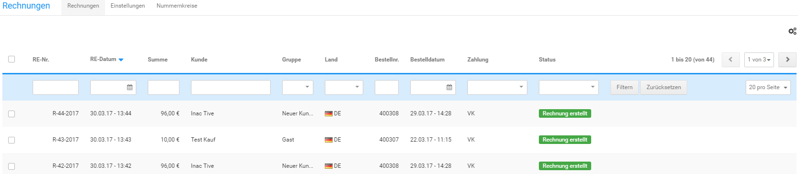
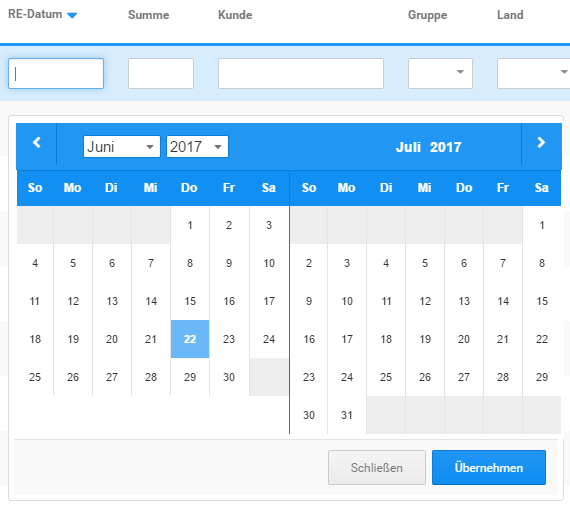
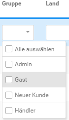
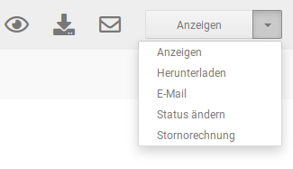
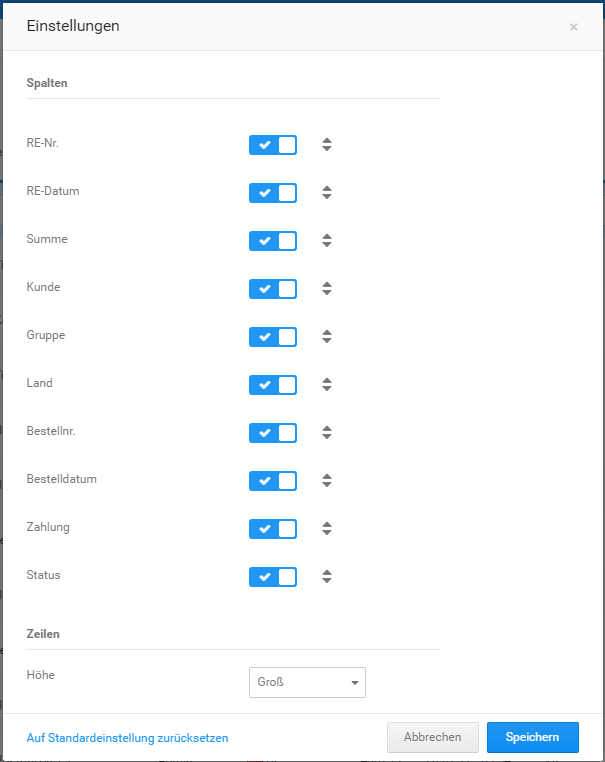

# Rechnungsübersicht

## Übersicht

Die Übersicht der erstellten Rechnungen kann unter _**Bestellungen \> Rechnungen**_ aufgerufen werden. Über die Reiter _**Einstellungen**_ und _**Nummernkreise**_ gelangst du direkt zu den Menüpunkten _**Shop Einstellungen \> Rechnung/Lieferschein**_ bzw. _**Shop Einstellungen \> Nummernkreis**_e \(siehe Kapitel _**Rechnung & Lieferschein konfigurieren**_ respektive _**Nummernkreise**_\).

!!! note "Hinweis"

	 Ab Shopversion 4.3 befinden sich die zugehörigen Menüpunkte unter _**Einstellungen / System / Rechnung & Lieferschein**_ bzw. _**Einstellungen / System / Bestell- und Kundennummer**_ und können dort jeweils über den Button _**aufrufen**_ geöffnet werden.

Die im Shop erstellten Rechnungen werden in Form einer Tabelle aufgelistet. Es stehen die folgenden Spalten zur Verfügung:

-   RE-Nr.
-   RE-Datum
-   Summe
-   Kunde
-   Gruppe
-   Land
-   Bestellnr.
-   Bestelldatum
-   Zahlung
-   Status

## Aktionen

Mit einem Klick auf die Spaltenüberschrift kann die Tabelle nach der jeweiligen Spalte sortiert werden \(ein Klick: aufsteigende Sortierung, erneuter Klick: absteigende Sortierung\). Rechts neben den Spaltenüberschriften befindet sich die Seitenanzeige und die Seitenauswahl. Oberhalb der Seitenauswahl kann über das Zahnrad-Symbol die Einstellungsseite aufgerufen werden \(siehe _**Einstellungen**_\).

Über die blau hevorgehobene Leiste können die Rechnungen nach bestimmten Kriterien gefiltert werden. Hierzu stehen Eingabefelder, Datumsauswahlen und Dropdowns zur Verfügung. Wähle die jeweiligen Filter-Kriterien aus bzw. trage diese ein und klicke anschließend auf die Schaltfläche _**Filtern**_. Über Klick auf _**Zurücksetzen**_ kann der Filter-Vorgang rückgängig gemacht werden. Zudem kann über das Dropdown am rechten Ende der Leiste die Anzahl der Rechnungen pro Seite eingestellt werden.

Wenn du den Mauszeiger in die Zeile einer Rechnung bewegst, werden die möglichen Aktionen als Icons eingeblendet. Von links nach rechts sind dies _**anzeigen**_, _**herunterladen**_ und_** E-Mail**_. Zudem wird eine Dropdown-Schaltfläche angezeigt. Mit _**Status ändern**_ kann der Status der zugehörigen Bestellung angepasst werden. Über _**Stornorechnung**_ kann zu einer bestehenden Rechnung eine Stornorechnung erzeugt werden, wenn die Bestellung storniert werden soll.

## Einstellungen

Öffne das Einstellungsfenster mit einem Klick auf das Zahnrad-Symbol.

Über das Einstellungsfenster können die Spaltenauswahl und -reihenfolge sowie die Zeilenhöhe festgelegt werden. Setze \(✔\) bzw. entferne \(✖\) einen Haken, um die Spalte anzuzeigen bzw. auszublenden.

Klicke mit der Maus die beiden Dreiecke am Ende des Eintrags an und halte die Maustaste gedrückt, um diesen nach oben oder unten zu ziehen. Auf diese Weise änderst du die Reihenfolge der Spalte. Über das Dropdown _**Höhe**_ kann die Zeilenhöhe eingestellt werden. Bestätige die gemachten Änderungen mit einem Klick auf _**Speichern**_. Über _**Abbrechen**_ kann das Einstellungsfenster verlassen werden, ohne die gemachten Änderungen zu übernehmen. Mit Klick auf den Link _**Auf Standardeinstellung zurücksetzen**_ werden die Standardeinstellungen vorausgewählt \(zum Übernehmen bitte auf _**Speichern**_ klicken\).
